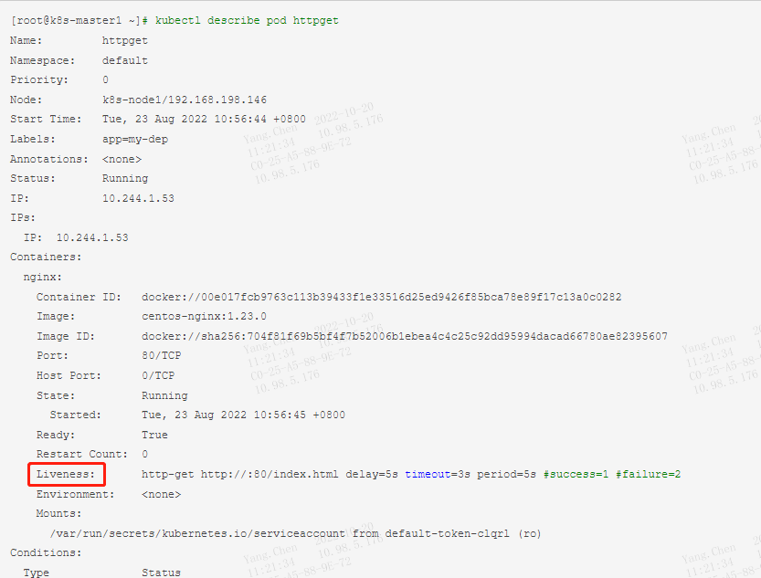

### **1、K8s中对于pod资源对象的健康状态检测，提供了三类probe（探针）来执行对pod的健康监测**

* livenessProbe探针：根据用户自定义规则来判定pod是否健康，如果livenessProbe探针探测到容器不健康，则kubelet会根据其重启策略来决定是否重启，如果一个容器不包含livenessProbe探针，则kubelet会认为容器的livenessProbe探针的返回值永远成功
* ReadinessProbe探针：根据用户自定义规则来判断pod是否健康，如果探测失败，控制器会将此pod从对应service的endpoint列表中移除，从此不再将任何请求调度到此Pod上，直到下次探测成功。
* startupProbe探针：启动检查机制，应用一些启动缓慢的业务，避免业务长时间启动而被上面两类探针kill掉，这个问题也可以换另一种方式解决，就是定义上面两类探针机制时，初始化时间定义的长一些即可。
```
[root@k8s-master1 tanzhen]# cat nginx_pod_httpGet.yaml 
apiVersion: v1 
kind: Pod 
metadata: 
    name: httpget 
    labels: 
        app: my-dep 
spec: 
    containers: 
        - name: nginx 
          image: centos-nginx:1.23.0 
          imagePullPolicy: Never 
          ports: 
            - containerPort: 80 
          livenessProbe: ##健康监测探针
              httpGet: ###监测方法 1、httpget 2、执行命令（exec: command: - cat - /tmp/healthy） 3、TCP
                    path: /index.html 
                    port: 80 
              initialDelaySeconds: 5 
              periodSeconds: 5 
              timeoutSeconds: 3 
              successThreshold: 1 
              failureThreshold: 2
```

