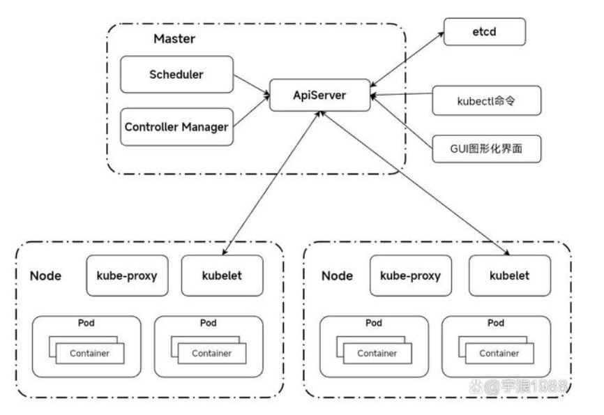
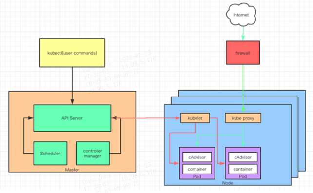
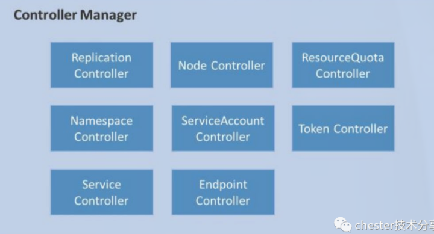
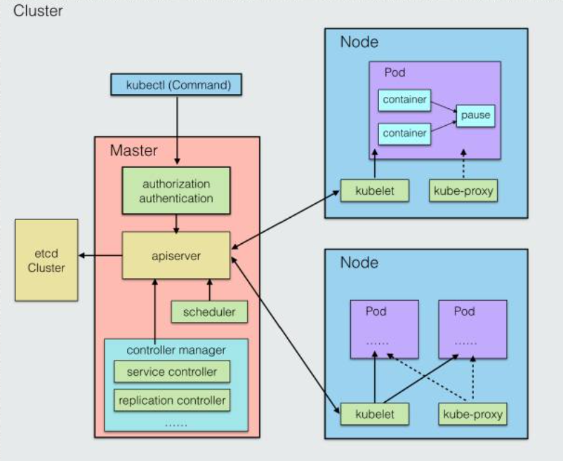
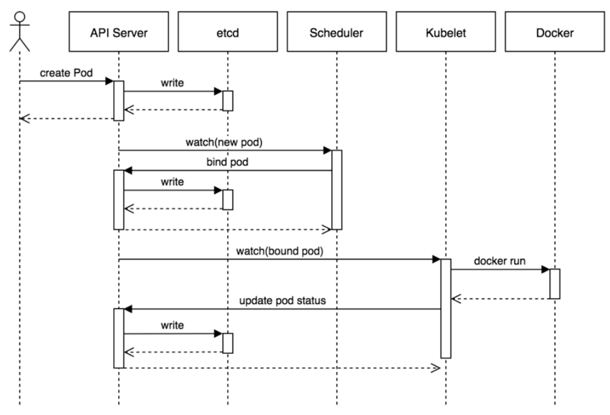

### **1、K8S的优势**

* 使用简单，少量人/小团队可以轻松维护大型分布式系统
* 全面拥抱微服务架构，快速迭代，快速部署
* 移植性高，随时可以将系统搬迁到公有云
* 弹性扩容，轻松应对突发流量
* K8S超强的横扩能力，增加自身竞争力

### **2、K8S集群架构图(架构解析)**

Kubernetes主要由两部分构成：Master节点和Node节点。
* Master节点是整个集群的大脑，负责维护整个集群的状态，任务的调度，并将系统的状态持久化到etcd中。
* Node节点负责执行Master下达的具体工作指令。
Master和Node结点通过其各自包含的核心组件相互协调共同完成应用的容器集群部署和管理。Master节点包含的核心组件有：ApiServer、Scheduler、ControllerManager；Node节点包含的核心组件有：kube-proxy、kubelet、Pod等。

### **3、k8s的核心组件，以及它们的主要功能**

* ApiServer：资源操作的唯一入口，不管是用户对k8s集群下达指令，还是系统组件之间的交互都是通过ApiServer进行的。
* Scheduler：负责资源的调度，比如：我们要创建部署一个应用，Scheduler通过一定的策略把我们的应用调度到相应的机器上。这里的策略比如：负载均衡等。
* Etcd：是k8s集群的持久化组件，k8s集群的所有状态以及配置都会持久化到这里，想要备份和恢复我们的k8s集群就是通过etcd来实现。（该组件可以内置在 K8S 中，也可以外部搭建供 K8S 使用）
* ControllerManager：负责维护集群的状态，比如故障检测、自动扩展、滚动更新等。比如：我们有一个应用，我们想维护它的副本数是3，ControllerManager会实时对该应用的副本数量进行监控，一旦发现副本的数量少于我们配置的数量，会马上为我们创建新的副本（通过与ApiServer接口监听Node的状态，向ApiServer接口发出创建副本的命令）。
* kube-proxy：负责Node节点内部Pod之间的负载均衡和服务发现等。比如：Pod和Pod之间的网络通信就是通过kube-proxy来实现的。
* kubelet：负责容器的生命周期，包括容器的创建等。
* Pod：是k8s集群的最小调度单元、最小的操作单元。也就是说，比如，我们要创建一个应用，首先会把该应用绑定到某个Pod上，然后再容器化部署该应用。

#### 3.1、master是如何跟各个node节点通信的？（K8S内部网络通信、集群架构图）
Master节点上的kube-apiserver进程会与各个node节点的kubelet组件（ 负责向 Master 汇报自身节点的运行情况，如 node节点的注册、终止、定时上报健康状况等，以及接收 Master 发出的命令，创建相应 Pod）通信

#### 3.2、master是如何调度node上的pod的？
整个集群的调度任务都是kube-Scheduler组件来完成的（根据调度策略选择哪个node的哪个pod），通过调用apiserver接口向各个node节点的kubelet组件发起调度任务（或创建pod任务）

#### 3.3、整个集群的状态信息，维护信息存储在哪？
集群上的所有配置信息都存储在了 etcd，为了考虑各个组件的相对独立，以及整体的维护性，对于这些存储数据的增、删、改、查，统一由 kube-apiserver 来进行调用

#### 3.4、外部用户如何访问集群内运行的 Pod ？
**docker的访问**：在容器创建时，会分配一个虚拟 IP，做一层端口映射，将容器内端口与宿主机端口进行映射绑定，外部通过访问宿主机的指定端口，就可以访问到内部容器端口了

**k8s的访问**：servicecontroller 是一组具有相同 label pod 集合的抽象，集群内外的各个服务可以通过 service 进行互相通信，当创建一个 service 对象时也会对应创建一个 endpoint 对象，endpoint 是用来做容器发现的，service 只是将多个 pod 进行关联，实际的路由转发都是由 kubernetes 中的 kube-proxy 组件来实现(endpoint是k8s集群中的一个资源对象，存储在etcd中，用来记录一个service对应的所有pod的访问地址。service配置selector，endpoint controller才会自动创建对应的endpoint对象；否则，不会生成endpoint对象.)
3.5、Pod 如何动态扩容和缩放？
服务的扩容也就意味着 Pod 的扩容。就是在需要时将 Pod 复制多份，在不需要后，将 Pod 缩减至指定份数。K8S 中通过 Replication Controller 来进行管理，为每个 Pod 设置一个期望的副本数，当实际副本数与期望不符时，就动态的进行数量调整，以达到期望值。期望数值可以由我们手动更新，或自动扩容代理来完成。

这个时序图展示了创建pod的流程，基本的流程如下：
1. 用户提交创建Pod的请求，可以通过API Server的REST API ，也可用Kubectl命令行工具，支持Json和Yaml两种格式；
2. API Server 处理用户请求，存储Pod数据到Etcd；
3. Schedule通过和 API Server的watch机制，查看到新的pod，尝试为Pod绑定Node；
4. 过滤主机：调度器用一组规则过滤掉不符合要求的主机，比如Pod指定了所需要的资源，那么就要过滤掉资源不够的主机；
5. 主机打分：对第一步筛选出的符合要求的主机进行打分，在主机打分阶段，调度器会考虑一些整体优化策略，比如把一个Replication Controller的副本分布到不同的主机上，使用最低负载的主机等；
6. 选择主机：选择打分最高的主机，进行binding操作，结果存储到Etcd中；
7. kubelet根据调度结果执行Pod创建操作： 绑定成功后，会启动container, docker run, scheduler会调用API Server的API在etcd中创建一个bound pod对象，描述在一个工作节点上绑定运行的所有pod信息。运行在每个工作节点上的kubelet也会定期与etcd同步bound pod信息，一旦发现应该在该工作节点上运行的bound pod对象没有更新，则调用Docker API创建并启动pod内的容器。

### **4、K8S的内部网路通信**

#### 4.1、pod内部通信
同一Pod中的任何容器都将共享相同的名称空间和本地网络，容器可以很容易地与其他容器在相同的Pod中进行通信，k8s中每个Pod中管理着一组容器，这些容器共享同一个网络命名空间，Pod中的每个容器拥有与Pod相同的IP和port地址空间，并且由于他们在同一个网络命名空间，他们之间可以通过localhost相互访问

#### 4.2、同一个Node节点的Pod之间通信
不同pod之间的通信，就是使用linux虚拟以太网设备或者说是由两个虚拟接口组成的以太网接口对使不同的网络命名空间链接起来，这些虚拟接口分布在多个Pod上，通过网桥把不同的Pod组成为一个以太网，直接进行二层以太网通信。

#### 4.3、不同节点的Pod之间通信
当跨节点通信时，本节点内无法找到目的POD的MAC地址，则会查找三层路由表转发，这需要依靠不同节点间的网路配置来实现，对于如何来配置网络，k8s在网络这块自身并没有实现网络规划的具体逻辑，而是制定了一套CNI接口规范，开放给社区来实现，目前主流的网络配置方案有：Flannel、weave、calico，Macvlan等，其中Flannel和weave方案都采用VXLAN网络模型，calico采用的BGP三层路由网络模型，Macvlan是Linux自带的虚拟网卡实现简单的二层通信。

#### 4.4、外部网络与Pod之间通信
Pod之间通过他们自己的ip地址进行通信，但是pod的ip地址是不持久的，当集群中pod的规模缩减或者pod故障或者node故障重启后，新的pod的ip就可能与之前的不一样的。所以k8s中衍生出来Service来解决这个问题。k8s中 Service管理了一系列的Pods，每个Service有一个虚拟的ip,要访问service管理的Pod上的服务只需要访问你这个虚拟ip就可以了，这个虚拟ip是固定的，当service下的pod规模改变、故障重启、node重启时候，对使用service的用户来说是无感知的，因为他们使用的service的ip没有变。当数据包到达Service虚拟ip后，数据包会通过k8s给该servcie自动创建的负载均衡器kube-proxy路由到背后的pod容器。

### **5、滚动升级**

当kubernetes集群中的某个服务需要升级时，传统的做法是，先将要更新的服务下线，业务停止后再更新版本和配置，然后重新启动并提供服务。如果业务集群规模较大时，这个工作就变成了一个挑战，而且先全部了停止，再逐步升级的方式会导致服务较长时间不可用。kubernetes提供了滚动更新(rolling-update)的方式来解决上述问题。
简单来说，滚动更新就是针对多实例服务的一种不中断服务的更新升级方式。一般情况下，对于多实例服务，滚动更新采用对各个实例逐个进行单独更新而非同一时刻对所有实例进行全部更新的方式。
