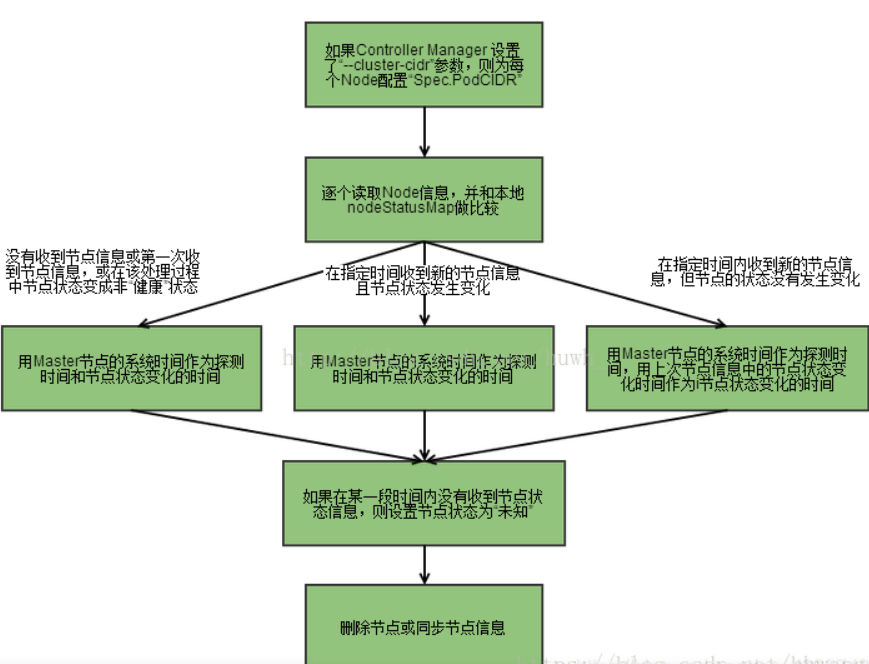

### **1、replication controller副本控制器**

replication controller 的使用场景
* **重新调度**。当发生节点故障或Pod被意外终止运行时，可以重新调度保证集群中仍然运行指定的副本数。
* **弹性伸缩**。通过手动或自动扩容代理修复副本控制器的spec.replicas属性，可以实现弹性伸缩。
* **滚动升级**。创建一个新的RC文件，通过kubectl 命令或API执行，则会新增一个新的副本同时删除旧的副本，当旧副本为0时，删除旧的RC。
ReplicaSet的主要作用是保证一定数量的pod正常运行，它会持续监听这些Pod的运行状态，一旦Pod发生故障，就会重启或重建。同时它还支持对pod数量的扩缩容和镜像版本的升降级。
#### **ReplicaSet 和 ReplicationController 的区别**
replica Set 和 Replication Controller几乎完全相同。它们都确保在任何给定时间运行指定 数量的pod副本。不同之处在于复制pod使用的选择器。Replica Set使用基于集合的选择器， 而Replication Controller使用基于等式的selector选择器。 ReplicaSet的pod标签选择器的表达能力更强。如ReplicaSet能同时匹配两种标签，env=dev和env=pro，ReplicationController不行
发展历程： RC -> RS -> Deployment

### **2、Node Controller节点控制器**

node节点中的kubelet进程启动时，会通过kube-apiServer注册自身的节点信息，并定时向 apiServer汇报状态信息， apiServer接收到信息后将信息更新到etcd中。
node Controller通过apiServer实时获取Node的相关信息(通过kubelet进程获取)，实现管理和监控集群中的各个Node节点的相关控制功能。node接收信息流程：

### **3、endpoint controller控制器**

endpoint controller是k8s集群控制器的其中一个组件，其功能如下：
* 负责生成和维护所有endpoint对象的控制器
* 负责监听service和对应pod的变化
* 监听到service被删除，则删除和该service同名的endpoint对象
* 监听到pod事件，则更新对应的service的endpoint对象，将pod的ip记录到endpoint中
* 监听到service被创建/被更新，则根据更新后的service信息获取相关pod列表，然后创建/更新对应endpoint对象
