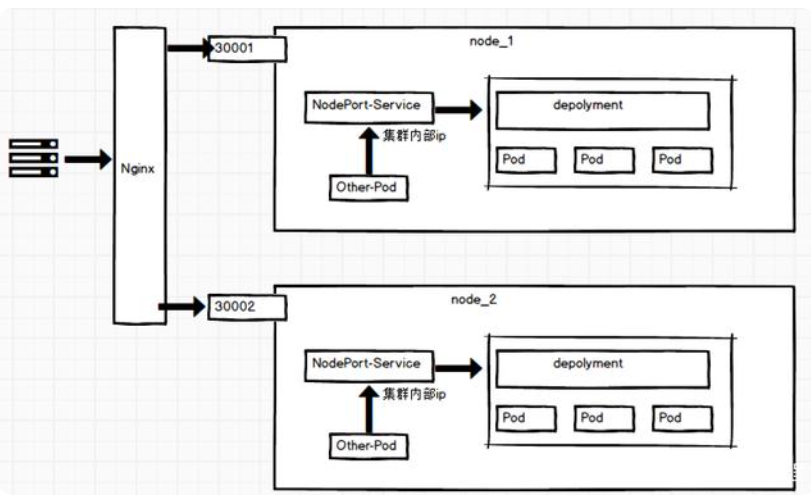
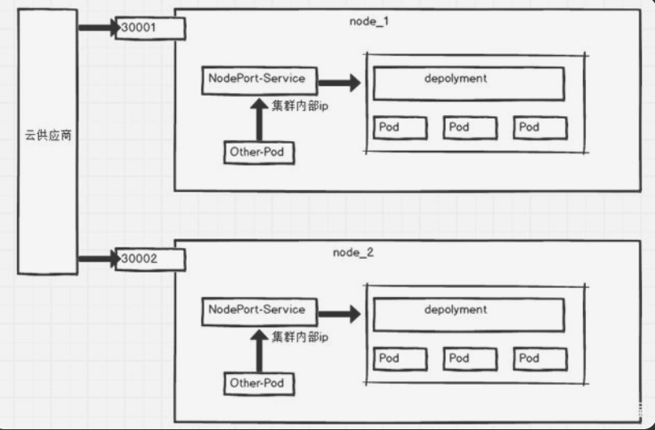
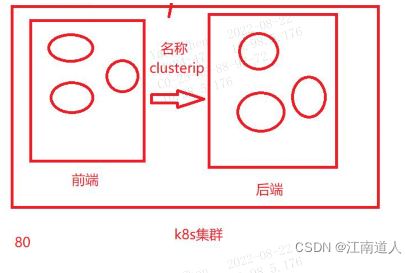
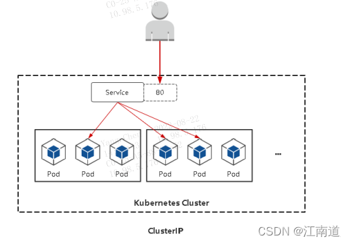

**1. Deployment**
定义：Deployment 是一种控制器，用于管理一组Pod的生命周期。
主要功能：
应用管理：负责创建、更新和删除 Pod，确保指定数量的Pod始终在运行状态。
版本控制：支持滚动更新和回滚功能，使得应用程序的版本管理更加灵活。
Pod模板：定义创建Pod的模板，包括容器镜像、环境变量、端口等。
**2. Service**
定义：Service 是对一组Pod的网络访问策略的抽象。
主要功能：
稳定访问：提供一个稳定的虚拟 IP 地址和 DNS 名称，以便其他组件（如Pod或外部用户）可以访问这些 Pod，而不需要知道具体的Pod IP。
负载均衡：将流量分配到后端 Pod，通常通过选择器（Selector）来确定目标 Pod。
服务发现：使得应用程序能够在动态变化的环境中找到其他服务。
**3. Endpoint**
定义：Endpoint 是与 Service 相关联的一组Pod的网络地址。
主要功能：
流量路由：包含一组 IP 地址和端口，表示可以通过 Service 访问的Pod。
自动管理：当 Service 创建时，Kubernetes 自动生成相应的 Endpoint，并根据Pod的状态动态更新。

#### **1、service解决了什么问题**

当Pod宕机后重新生成时，其IP等状态信息可能会变动，Service会根据Pod的Label对这些状态信息进行监控和变更，保证上游服务不受Pod的变动而影响
* service： 在k8s中，pod之间是通信是一般通过service名称完成的
* endpoint: pod和service之间的关联关系，是通过endpoint实现的。 Endpoints表示了一个Service对应的所有Pod副本的访问地址，而Endpoints Controller负责生成和维护所有Endpoints对象的控制器。它负责监听Service和对应的Pod副本的变化。

#### **2、Service 类型**

① ClusterIp：默认类型，自动分配一个仅Cluster内部可以访问的虚拟IP


② NodePort：在ClusterIP基础上为Service在每台机器上绑定一个端口，可以在集群外部访问。也会分配一个稳定内部集群IP地址。

③ LoadBalancer：在NodePort的基础上，借助Cloud Provider创建一个外部负载均衡器，并将请求转发到NodePort

④ ExternalName：把集群外部的服务引入到集群内部来，在集群内部直接使用。没有任何类型代理被创建，这只有 Kubernetes 1.7或更高版本的kube-dns才支持。
2.1、查看service信息
```mysql
[opadm@cloud-k8s-master01-test ~]$ k describe svc user-center-user-base -n test
Name:              user-center-user-base
Namespace:         test
Labels:            app.kubernetes.io/instance=user-center-user-base
                   app.kubernetes.io/managed-by=Helm
                   app.kubernetes.io/name=backend-apps
                   app.kubernetes.io/version=0.1.0
                   helm.sh/chart=backend-apps-0.4.8
Annotations:       meta.helm.sh/release-name: user-center-user-base
                   meta.helm.sh/release-namespace: test
Selector:          app.kubernetes.io/instance=user-center-user-base,app.kubernetes.io/name=backend-apps
Type:              ClusterIP
IP:                10.97.29.155 #service ip
Port:              http  8080/TCP
TargetPort:        8080/TCP
Endpoints:         10.244.12.41:8080
Session Affinity:  None
Events:            <none>
[opadm@cloud-k8s-master01-test ~]$ k get svc -n test -o wide | grep user-center-user-base
c-user-center-user-base                           ClusterIP   10.98.0.193      <none>        8080/TCP                              133d    app.kubernetes.io/instance=c-user-center-user-bas,app.kubernetes.io/name=backend-apps
user-center-user-base                             ClusterIP   10.97.29.155     <none>        8080/TCP                              293d    app.kubernetes.io/instance=user-center-user-base,app.kubernetes.io/name=backend-apps
```

#### **3、endpoints**

pod和service之间的关联关系，是通过endpoint实现的
3.1、查看endpoints的详细信息
```mysql
[opadm@cloud-k8s-master01-test ~]$ k describe endpoints user-center-user-base -n test
Name:         user-center-user-base
Namespace:    test
Labels:       app.kubernetes.io/instance=user-center-user-base
              app.kubernetes.io/managed-by=Helm
              app.kubernetes.io/name=backend-apps
              app.kubernetes.io/version=0.1.0
              helm.sh/chart=backend-apps-0.4.8
Annotations:  endpoints.kubernetes.io/last-change-trigger-time: 2022-08-19T03:30:45Z
Subsets:
  Addresses:          10.244.12.41
  NotReadyAddresses:  <none>
  Ports:
    Name  Port  Protocol
    ----  ----  --------
    http  8080  TCP
Events:  <none>
//查看pod的ip。跟endpoint的信息一致
[opadm@cloud-k8s-master01-test ~]$ k get pods -n test -o wide | grep user-center-user-base
user-center-user-base-5755457bbb-5hnk5                  0/2     Evicted            0          181d    <none>          cloud-k8s-node06-test   <none>           <none>
user-center-user-base-5755457bbb-bvcth                  2/2     Running            0          5d21h   10.244.12.41    cloud-k8s-node10-test   <none>           <none>
```
