### **1、简介**

Chaos Mesh 是一个开源的云原生混沌工程平台，提供丰富的故障模拟类型，具有强大的故障场景编排能力，方便用户在开发测试中以及生产环境中模拟现实世界中可能出现的各类异常，帮助用户发现系统潜在的问题。

### **2、核心组件**

* Chaos Dashboard：Chaos Mesh 的可视化组件
* Chaos Controller Manager：Chaos Mesh 的核心逻辑组件，主要负责混沌实验的调度与管理。
* Chaos Daemon：Chaos Mesh 的主要执行组件。Chaos Daemon 以 DaemonSet 的方式运行，默认拥有 Privileged 权限（可以关闭）。该组件主要通过侵入目标 Pod Namespace 的方式干扰具体的网络设备、文件系统、内核等。

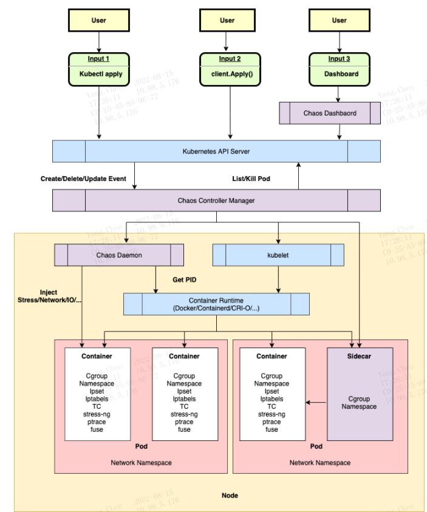

### **3、基本功能**

包括故障注入、混沌实验场景、可视化操作、安全保障
#### **3.1、故障注入**
* 基础资源类型故障：
* PodChaos：模拟 Pod 故障，例如 Pod 节点重启、Pod 持续不可用，以及特定 Pod 中的某些容器故障。
* NetworkChaos：模拟网络故障，例如网络延迟、网络丢包、包乱序、各类网络分区。
* DNSChaos：模拟 DNS 故障，例如 DNS 域名解析失败、返回错误 IP 地址。
* HTTPChaos：模拟 HTTP 通信故障，例如 HTTP 通信延迟。
* StressChaos：模拟 CPU 抢占或内存抢占场景。
* IOChaos：模拟具体某个应用的文件 I/O 故障，例如 I/O 延迟、读写失败。
* TimeChaos：模拟时间跳动异常。
* KernelChaos：模拟内核故障，例如应用内存分配异常。
* 平台类型故障：
* AWSChaos：模拟 AWS 平台故障，例如 AWS 节点重启。
* GCPChaos：模拟 GCP 平台故障，例如 GCP 节点重启。
* 应用层故障：
* JVMChaos：模拟 JVM 应用故障，例如函数调用延迟。
登录到chaos-mesh面板：
https://chaos-mesh.org/zh/docs/manage-user-permissions/
在部署了chaos-mesh环境的机器执行

```
1、复制yaml文件内容到rbac.yaml
2、执行命令
kubectl apply -f rbac.yaml   
3、执行命令
kubectl describe -n default secrets account-default-manager-vfmot
4、得到token如下图
5、根据token贴入面板的登录弹框中。即可登录
```

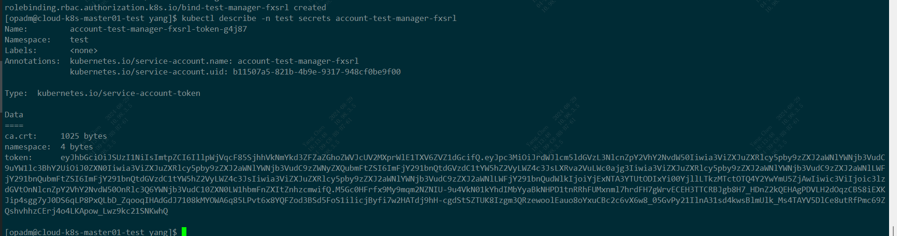

### **4、混沌实验**

#### 4.1、网络故障延迟
```mysql
kind: NetworkChaos
apiVersion: chaos-mesh.org/v1alpha1
metadata:
  namespace: test
  name: network-delay-yang
  annotations:
    experiment.chaos-mesh.org/pause: 'true'
spec:
  selector:
    namespaces:
      - test
    labelSelectors:
      app.kubernetes.io/instance: finance-taxation-steward-finance-ctl
  mode: all
  action: delay
  delay:
    latency: '100ms' # 延迟的时间长度
    correlation: '100' # 表示延迟时间的时间长度与近一次延迟时长的相关性，取值范围[0，100]
    jitter: '0ms' # 表示延迟时间的变化范围
  direction: to
```
查看pod详细信息：
k describe pod -n test finance-taxation-steward-finance-ctl-548f9b49c5-wdbx6
<span style='color:red'>因为网络延迟导致健康检查认为该pod不健康，从而重启</span>


#### 4.2、网络故障-带宽限制：
```mysql
kind: NetworkChaos
apiVersion: chaos-mesh.org/v1alpha1
metadata:
  namespace: test
  name: bandwidth-yang
spec:
  selector:
    namespaces:
      - test
    labelSelectors:
      app.kubernetes.io/instance: finance-taxation-steward-finance-ctl
  mode: all
  action: bandwidth
  bandwidth:
    rate: 100kbps  # 表示带宽限制的速率
    limit: 2971520 # 表示在队列中等待的字节数
    buffer: 1000  # 表示能瞬间发送的最大字节数 
  direction: to
```

#### 1、客户端现象所有http接口504（发送的字节数超过指定的大小）

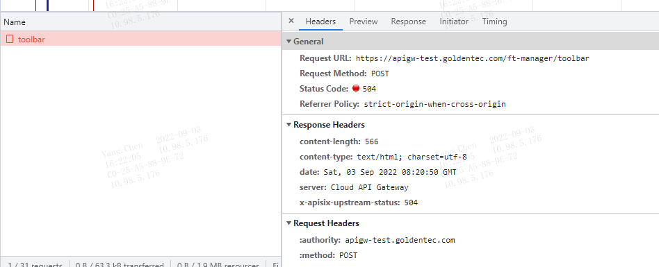
进入pod里面ping 百度正常， 查看pods详情无异常，pod无重启

#### 2、若上述数据只修改buffer：10000， 则客户端现象：偶现部分接口504（瞬时传送数据增加后，大部分接口正常，但响应时间变长，多刷新页面偶尔会全部接口正常）

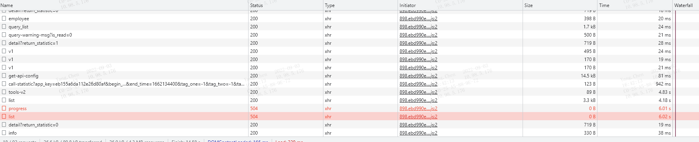
关闭之后查看数据接口大小：
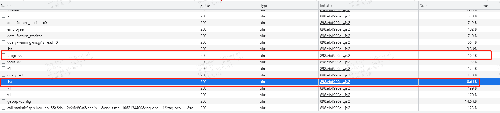

#### **3、再提升带宽限制的速率：修改为1mbps后，启动试验，刷新页面，大部分接口在100ms内响应，偶现有部分接口超过1s**

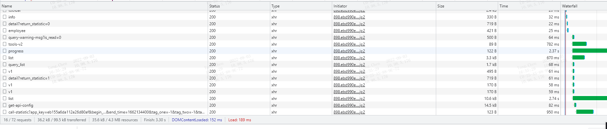

#### **4、再提升带宽限制的速率：修改为1mbps后，启动试验，刷新页面，大部分接口在100ms内响应**

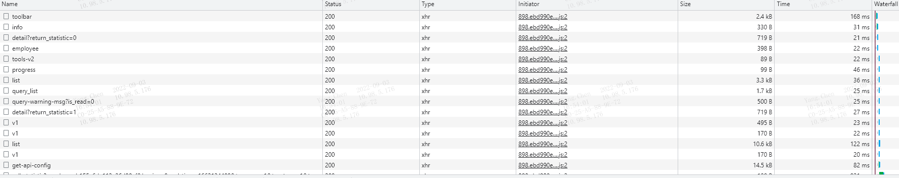
#### 4.4、网络故障-网络分区
```mysql
kind: NetworkChaos
apiVersion: chaos-mesh.org/v1alpha1
metadata:
  namespace: test
  name: partition-yang
spec:
  selector:
    namespaces:
      - test
    labelSelectors:
      app.kubernetes.io/instance: finance-taxation-steward-finance-ctl
  mode: all
  action: partition
  direction: to
```
客户端接口显示跨域：
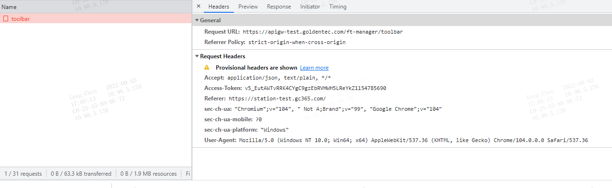
服务端查看pod状态，为不健康。关闭试验后，自动重启，服务恢复
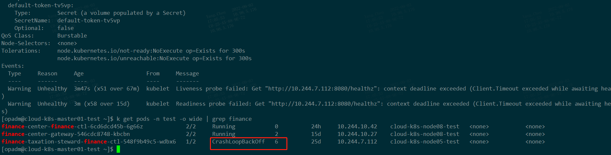

#### 5.1、模拟pod故障
客户端表现：
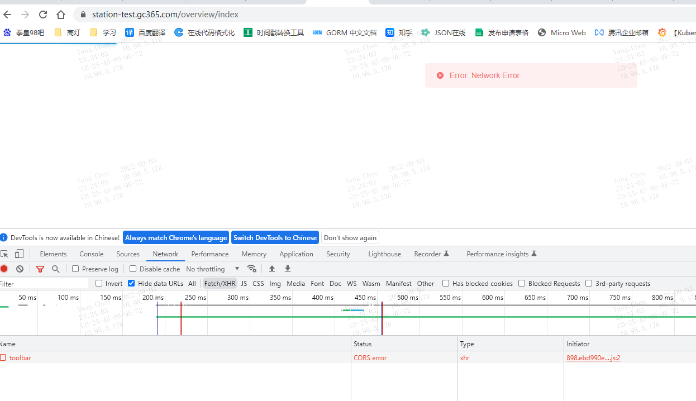
查看pod详情：检测到pod不健康，尝试重启，但是重启的时候拉取镜像失败
查看pod显示：“CrashLoopBackOff”
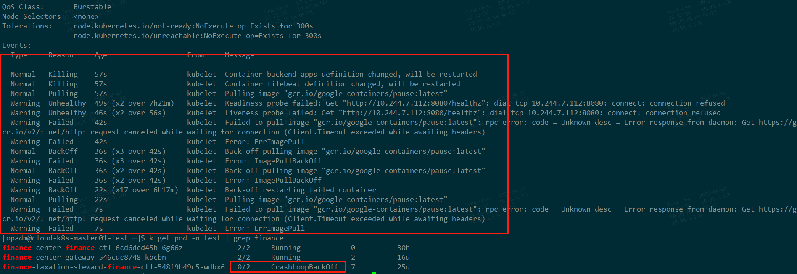
