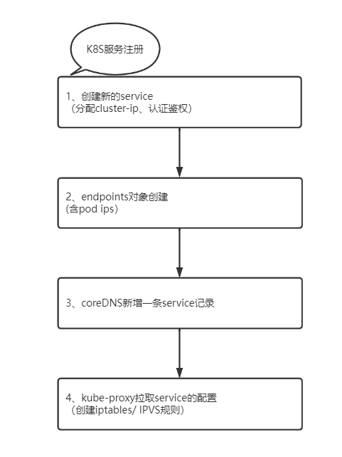
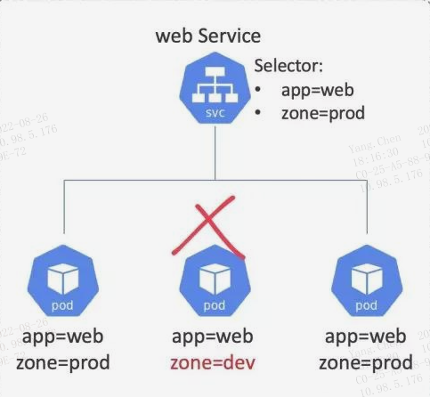
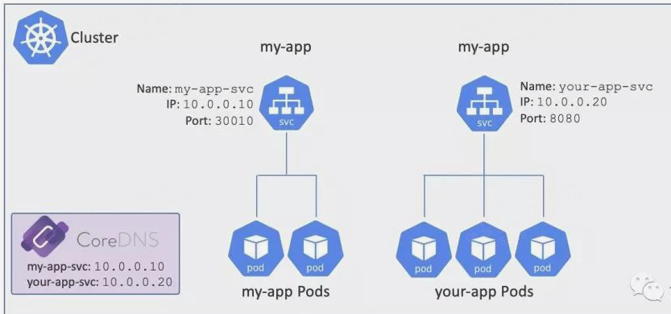
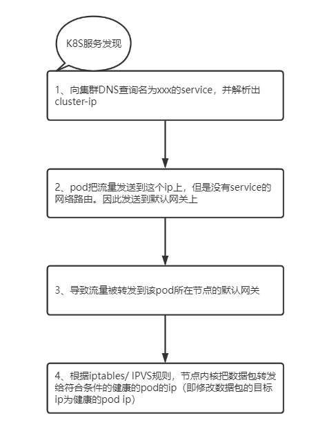

### **1、服务注册（文档）**

服务注册过程指的是在服务注册表中登记一个服务，以便让其它服务发现，Kubernetes 使用 DNS 作为服务注册表。
为了满足这一需要，每个 Kubernetes 集群都会在 kube-system 命名空间中用 Pod 的形式运行一个 DNS 服务，通常称之为集群 DNS。每个 Kubernetes 服务都会自动注册到集群 DNS 之中。
service注册过程大致如下：
* 向 API Server 用 POST 方式提交一个新的 Service 定义；这个请求需要经过认证、鉴权以及其它的准入策略检查过程之后才会放行；
* Service 得到一个 ClusterIP（虚拟 IP 地址），并保存到集群数据仓库etcd；
* 在集群范围内传播 Service 配置；
* 集群 DNS 服务得知该 Service 的创建，据此创建必要的 DNS A 记录。

Service 对象有一个 Label Selector 字段，这个字段是一个标签列表，符合列表条件的 Pod 就会被服务纳入到服务的负载均衡范围之中。参见下图：

Kubernetes 自动为每个 Service 创建 Endpoints 对象。Endpoints 对象的职责就是保存一个符合 Service 标签选择器标准的 Pod 列表，这些 Pod 将接收来自 Service 的流量。

### **2、服务发现**

要使用服务发现功能，每个 Pod 都需要知道集群 DNS 的位置才能使用它。因此每个 Pod 中的每个容器的 /etc/resolv.conf 文件都被配置为使用集群 DNS 进行解析。
如果 my-app 中的 Pod 想要连接到 your-app 中的 Pod，就得向 DNS 服务器发起对域名 your-app-svc 的查询。假设它们本地的 DNS 解析缓存中没有这个记录，则需要把查询提交到集群DNS服务器。会得到 you-app-svc 的 ClusterIP（VIP）。这里有个前提就是 my-app 需要知道目标服务的名称。

pod访问其他service的pod时的服务发现流程：

