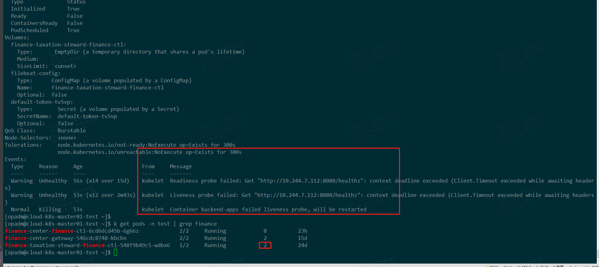

#### **1、查看命名空间**

```
[opadm@cloud-k8s-master01-test ~]$ k get ns
NAME              STATUS   AGE
ambassador        Active   397d
cattle-system     Active   480d
chaos-testing     Active   23d
default           Active   2y124d
dev               Active   2y111d
fleet-system      Active   584d
istio-system      Active   368d
kube-node-lease   Active   2y124d
kube-public       Active   2y124d
kube-system       Active   2y124d
logging           Active   720d
mesh-demo         Active   373d
monitoring        Active   429d
prod              Active   2y111d
prometheus        Active   2y7d
test              Active   2y113d
traefik-v2        Active   2y94d
uat               Active   2y111d
```

#### **2、查看service**

```
[opadm@cloud-k8s-master01-test ~]$ k get svc -n test | grep finance
finance-center-finance-ctl                        ClusterIP   10.102.100.216   <none>        50009/TCP             2y84d
finance-center-gateway                            ClusterIP   10.96.253.144    <none>        8080/TCP              2y84d
finance-taxation-steward-finance-ctl              ClusterIP   10.96.2.211      <none>        8080/TCP              289d
##最后一个为label标签
[opadm@cloud-k8s-master01-test ~]$ k get svc -n test -o wide | grep finance
finance-center-finance-ctl   ClusterIP   10.102.100.216      50009/TCP  2y84d   app.kubernetes.io/instance=finance-center-finance-ctl,app.kubernetes.io/name=backend-apps
finance-center-gateway       ClusterIP   10.96.253.144       8080/TCP   2y84d   app.kubernetes.io/instance=finance-center-gateway,app.kubernetes.io/name=backend-apps
finance-taxation-steward-finance-ctl  ClusterIP 10.96.2.211 8080/TCP    289d    app.kubernetes.io/instance=finance-taxation-steward-finance-ctl,app.kubernetes.io/name=backend-apps
[opadm@cloud-k8s-master01-test ~]$
[opadm@cloud-k8s-master01-test ~]$ k describe svc -n test finance-taxation-steward-finance-ctl    【##查看service详情】
Name:              finance-taxation-steward-finance-ctl
Namespace:         test
Labels:            app.kubernetes.io/instance=finance-taxation-steward-finance-ctl
                   app.kubernetes.io/managed-by=Helm
                   app.kubernetes.io/name=backend-apps
                   app.kubernetes.io/version=0.1.0
                   helm.sh/chart=backend-apps-0.6.0
Annotations:       meta.helm.sh/release-name: finance-taxation-steward-finance-ctl
                   meta.helm.sh/release-namespace: test
Selector:          app.kubernetes.io/instance=finance-taxation-steward-finance-ctl,app.kubernetes.io/name=backend-apps
Type:              ClusterIP
IP:                10.96.2.211
Port:              http  8080/TCP
TargetPort:        8080/TCP
Endpoints:         10.244.7.112:8080
Session Affinity:  None
Events:            <none>
```

#### **3、查看endpoints**

```
[opadm@cloud-k8s-master01-test ~]$ k get endpoints -n test -o wide | grep finance
finance-center-finance-ctl                        10.244.10.42:50009                                                      2y84d
finance-center-gateway                            10.244.10.27:8080                                                       2y84d
finance-taxation-steward-finance-ctl              10.244.7.112:8080                                                       289d
[opadm@cloud-k8s-master01-test ~]$ k describe endpoints -n test finance-taxation-steward-finance-ctl  【##查看endpoints详情】
Name:         finance-taxation-steward-finance-ctl
Namespace:    test
Labels:       app.kubernetes.io/instance=finance-taxation-steward-finance-ctl
              app.kubernetes.io/managed-by=Helm
              app.kubernetes.io/name=backend-apps
              app.kubernetes.io/version=0.1.0
              helm.sh/chart=backend-apps-0.6.0
Annotations:  endpoints.kubernetes.io/last-change-trigger-time: 2022-09-04T05:47:49Z
Subsets:
  Addresses:          10.244.6.213,10.244.7.112  【多个pod的ip地址】
  NotReadyAddresses:  <none>
  Ports:
    Name  Port  Protocol
    ----  ----  --------
    http  8080  TCP
Events:  <none>
```

#### **4、查看pod列表**

```
##查看命名空间为“test” 的pod的列表
[opadm@cloud-k8s-master01-test ~]$ k get pods -n test -o wide| grep finance-taxation-steward-finance-ctl
finance-taxation-steward-finance-ctl-548f9b49c5-wdbx6   2/2     Running            9          25d     10.244.7.112    cloud-k8s-node05-test   <none>           <none>
finance-taxation-steward-finance-ctl-548f9b49c5-xjq6n   1/2     Running            0          16s     10.244.6.213    cloud-k8s-node04-test   <none>           <none>
[opadm@cloud-k8s-master01-test ~]$
```

#### **5、查看pod详情**

```
##查看命名空间为“test” 的pod的详情
k describe pod -n test finance-taxation-steward-finance-ctl-548f9b49c5-wdbx6
```


#### **6、进入pod**

```mysql
[opadm@cloud-k8s-master01-test ~]$ k exec -it finance-taxation-steward-finance-ctl-548f9b49c5-wdbx6 -n test -- bash
Defaulting container name to backend-apps.
Use 'kubectl describe pod/finance-taxation-steward-finance-ctl-548f9b49c5-wdbx6 -n test' to see all of the containers in this pod.
root@finance-taxation-steward-finance-ctl-548f9b49c5-wdbx6:/work#
```

#### **7、pod的扩容/缩容(自动扩容文档)**

```
[opadm@cloud-k8s-master01-test ~]$ kubectl scale deployment/finance-taxation-steward-finance-ctl  --replicas=2  -n test            【手动扩容/缩容】
deployment.apps/finance-taxation-steward-finance-ctl scaled   部署成功
[opadm@cloud-k8s-master01-test ~]$
[opadm@cloud-k8s-master01-test ~]$ k get pods -n test -o wide| grep finance-taxation-steward-finance-ctl
finance-taxation-steward-finance-ctl-548f9b49c5-wdbx6   2/2     Running            9          25d     10.244.7.112    cloud-k8s-node05-test   <none>           <none>
finance-taxation-steward-finance-ctl-548f9b49c5-xjq6n   1/2     Running            0          16s     10.244.6.213    cloud-k8s-node04-test   <none>           <none>
[opadm@cloud-k8s-master01-test ~]$ kubectl autoscale deployment/finance-taxation-steward-finance-ctl --min=2 --max=5 --cpu-percent=50 -n test
horizontalpodautoscaler.autoscaling/finance-taxation-steward-finance-ctl autoscaled
[opadm@cloud-k8s-master01-test ~]$
[opadm@cloud-k8s-master01-test ~]$ k get pods -n test | grep finance
finance-center-finance-ctl-6cd6dcd45b-6g66z             2/2     Running            0          2d
finance-center-gateway-546cdc8748-kbcbn                 2/2     Running            2          16d
finance-taxation-steward-finance-ctl-548f9b49c5-fq76z   1/2     Running            0          5s
finance-taxation-steward-finance-ctl-548f9b49c5-wdbx6   2/2     Running            9          25d
[opadm@cloud-k8s-master01-test ~]$
[opadm@cloud-k8s-master01-test ~]$ k get hpa -n test
NAME                           REFERENCE                                 TARGETS         MINPODS   MAXPODS   REPLICAS   AGE
console-center-console-ctl   Deployment/console-center-console-ctl      <unknown>/85%    3         64        3          2d5h
dcache-api-hpa-c             Deployment/dcache-api                             0%/80%          1         10        1          415d
dcache-api-hpa-m             Deployment/dcache-api                             2%/80%          1         10        1          415d
finance-taxation-steward-finance-ctl Deployment/finance-taxation-steward-finance-ctl   <unknown>/50%   2     5         2     102s
```

#### **8、查看cpu、内存占用**

```
cpu单位m：表示“千分之一核心”，如50m表示50/1000核心，即5%
内存单位Mi:1Mi=1024*1024, 而平时使用的M：1M=1000*1000
存储单位：1GB=1024MB  1MB=1024KB
##查看node节点的占用状态
[opadm@cloud-k8s-master01-test ~]$ k top nodes 
NAME                      CPU(cores)   CPU%   MEMORY(bytes)   MEMORY%   
cloud-k8s-master01-test   408m         5%     8006Mi          50%       
cloud-k8s-master02-test   330m         4%     8197Mi          51%       
cloud-k8s-master03-test   377m         4%     7848Mi          49%       
cloud-k8s-node01-test     580m         3%     14415Mi         45%       
cloud-k8s-node02-test     448m         2%     19075Mi         59%       
cloud-k8s-node03-test     601m         7%     16735Mi         52%       
cloud-k8s-node04-test     7999m        99%    18881Mi         59%       
cloud-k8s-node05-test     7958m        99%    21308Mi         66%       
cloud-k8s-node06-test     491m         6%     19308Mi         60%       
cloud-k8s-node07-test     520m         6%     18050Mi         56%       
cloud-k8s-node08-test     495m         6%     16589Mi         51%       
cloud-k8s-node09-test     802m         10%    14346Mi         44%       
cloud-k8s-node10-test     575m         7%     11495Mi         72%
查看pod的占用状态
[opadm@cloud-k8s-master01-test ~]$ k top pod -n test | grep finance
finance-center-finance-ctl-6cd6dcd45b-6g66z             6m           56Mi            
finance-center-gateway-546cdc8748-kbcbn                 1m           64Mi            
finance-taxation-steward-finance-ctl-548f9b49c5-jd6w9   6888m        995Mi           
finance-taxation-steward-finance-ctl-548f9b49c5-wdbx6   7657m        1009Mi
```

#### **9、查看pod的日志**

```
k -n test logs --tail=500 -f enterprise-digital-supply-ctl-686dccd55b-4hl2f backend-apps
2024-01-10T17:45:41.245+0800    INFO    config_client/config_client.go:421    [client.ListenConfig] no change
2024-01-10T17:45:41.256+0800    INFO    config_client/config_proxy.go:180    [client.ListenConfig] request params:map[Listening-Configs:enterprise-digital-supply-ctlgoldenCloud4025127b-2100-4f8e-b777-d9320a3bddfc tenant:4025127b-2100-4f8e-b777-d9320a3bddfc] header:map[Content-Type:application/x-www-form-urlencoded;charset=utf-8 Long-Pulling-Timeout:30000 accessKey: secretKey:]
2024-01-10T17:46:10.759+0800    INFO    config_client/config_client.go:421    [client.ListenConfig] no change
2024-01-10T17:46:10.769+0800    INFO    config_client/config_proxy.go:180    [client.ListenConfig] request params:map[Listening-Configs:enterprise-digital-supply-ctlgoldenCloud4025127b-2100-4f8e-b777-d9320a3bddfc tenant:4025127b-2100-4f8e-b777-d9320a3bddfc] header:map[Content-Type:application/x-www-form-urlencoded;charset=utf-8 Long-Pulling-Timeout:30000 accessKey: secretKey:]
2024/04/02 13:33:42 [Recovery] 2024/04/02 - 13:33:42 panic recovered:
POST /console/v3/organization/sub_fee_control HTTP/1.1
Host: apigw-test.goldentec.com:443
Accept: application/json, text/plain, */*
Accept-Encoding: gzip
Accept-Language: zh-CN,zh;q=0.9
Access-Token: v5_MaFH5cMBh5UTQLRiNEnklj3rZlheNiNO1164908259
Content-Length: 0
Origin: https://station-test.gc365.com
Referer: https://station-test.gc365.com/
Sec-Ch-Ua: "Google Chrome";v="123", "Not:A-Brand";v="8", "Chromium";v="123"
Sec-Ch-Ua-Mobile: ?0
Sec-Ch-Ua-Platform: "Windows"
Sec-Fetch-Dest: empty
Sec-Fetch-Mode: cors
Sec-Fetch-Site: cross-site
User-Agent: Mozilla/5.0 (Windows NT 10.0; Win64; x64) AppleWebKit/537.36 (KHTML, like Gecko) Chrome/123.0.0.0 Safari/537.36
X-Business-Id: 1041
X-Forwarded-For: 193.112.201.243, 10.244.3.186, 193.112.201.243, 10.244.2.52
X-Forwarded-Host: apigw-test.goldentec.com
X-Forwarded-Port: 443
X-Forwarded-Proto: https
X-Forwarded-Server: traefik-5ssgm
X-Real-Ip: 10.244.2.52
runtime error: slice bounds out of range [:3] with length 0
/usr/local/go/src/runtime/panic.go:99 (0x43409e)
/go/pkg/mod/gitlab.yewifi.com/golden-cloud/common@v0.8.50-0.20240328094200-45e2d7d99ced/stringutil/string.go:6 (0x1183331)
/build/internal/imp/imporganization/console_ctl_api_service_organization_v2.go:585 (0x118205f)
/build/internal/controller/v3/organization/organization_v3.go:31 (0x11837f8)
/go/pkg/mod/github.com/gin-gonic/gin@v1.7.4/context.go:165 (0x11251db)
/build/internal/common/middleware/auth_required.go:336 (0x112509b)
/go/pkg/mod/github.com/gin-gonic/gin@v1.7.4/context.go:165 (0x112303a)
/build/internal/common/demotion/gin_middleware.go:63 (0x1123026)
/go/pkg/mod/github.com/gin-gonic/gin@v1.7.4/context.go:165 (0x9895a1)
/go/pkg/mod/github.com/gin-gonic/gin@v1.7.4/recovery.go:99 (0x98958c)
/go/pkg/mod/github.com/gin-gonic/gin@v1.7.4/context.go:165 (0x119b7f6)
/build/router/router.go:139 (0x119b7e2)
/go/pkg/mod/github.com/gin-gonic/gin@v1.7.4/context.go:165 (0x11996c1)
/go/pkg/mod/gitlab.yewifi.com/golden-cloud/common@v0.8.50-0.20240328094200-45e2d7d99ced/ginmw/access_logger.go:89 (0x11996a7)
/go/pkg/mod/github.com/gin-gonic/gin@v1.7.4/context.go:165 (0x119a4b4)
/go/pkg/mod/gitlab.yewifi.com/golden-cloud/common@v0.8.50-0.20240328094200-45e2d7d99ced/tracer/middleware/tracer.go:11 (0x119a49b)
/go/pkg/mod/github.com/gin-gonic/gin@v1.7.4/context.go:165 (0x98841d)
/go/pkg/mod/github.com/gin-gonic/gin@v1.7.4/gin.go:489 (0x9880a5)
/go/pkg/mod/github.com/gin-gonic/gin@v1.7.4/gin.go:445 (0x987c04)
/usr/local/go/src/net/http/server.go:2916 (0x7a1a5a)
/usr/local/go/src/net/http/server.go:1966 (0x79ca56)
```
