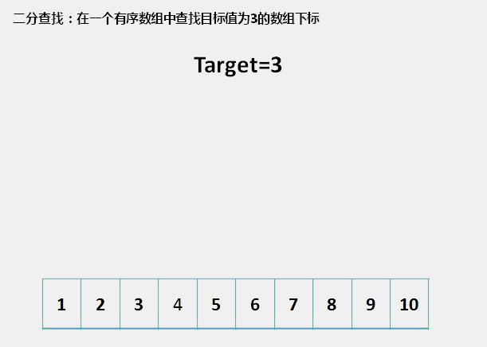
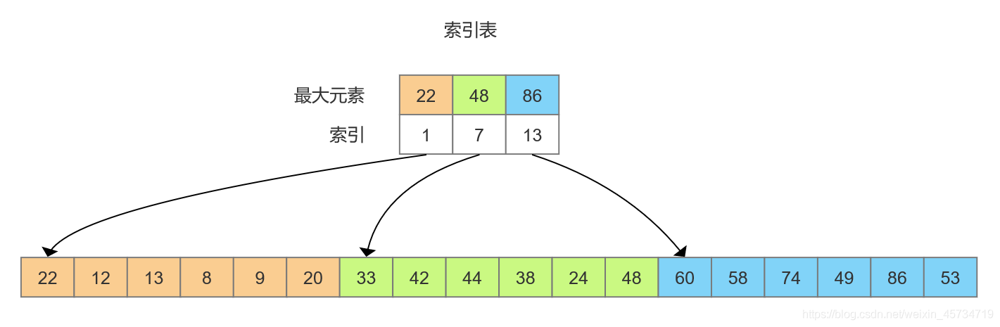
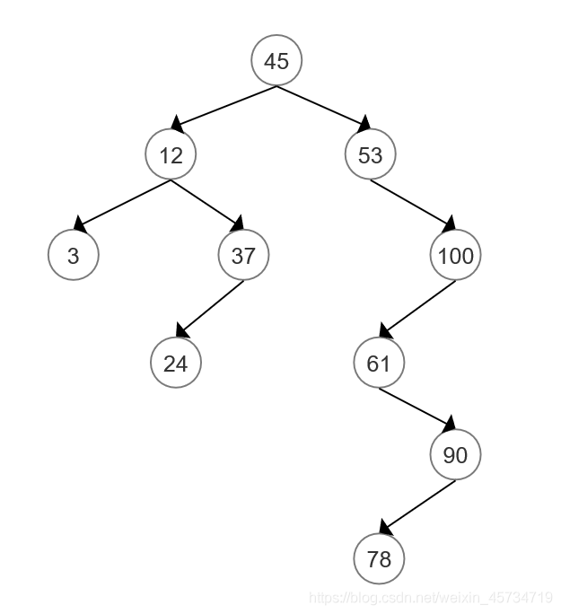
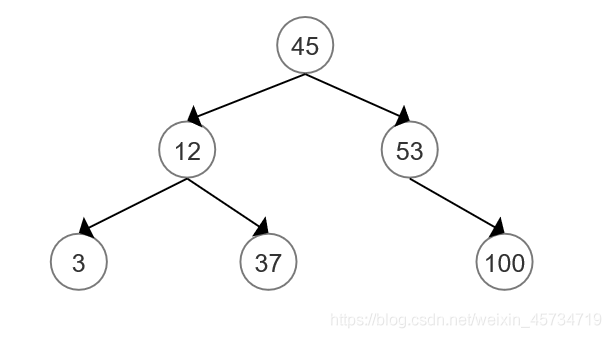

#### 1.快速查找算法（二分查找、折半查找）
　　查找过程：假设表中元素是按升序排列，将表中间位置记录的关键字与查找关键字比较，如果两者相等，则查找成功；否则利用中间位置记录将表分成前、后两个子表，如果中间位置记录的关键字大于查找关键字，则进一步查找前一子表，否则进一步查找后一子表。重复以上过程，直到找到满足条件的记录，使查找成功，或直到子表不存在为止，此时查找不成功。
  


```
//非递归
function search(int $key, array $array){
    $start = 0;
    $end = count($array) - 1;
    while ($start <= $end) {
        $mid = $start + ($end - $start) >> 1;//右移1位 跟除以2的效果一样，但效率更高
        if ($key < $array[$mid]) {
            $end = $mid - 1;
        } else if ($key > $array[$mid]) {
            $start = $mid + 1;
        } else {
            return $mid;
        }
    }
    return -1;
}

//递归二分查找算法
function search2(int $key, array $array, int $start, int $end){
    if ($start > $end) {
        return -1;
    }
    $mid = $start + (($end - $start) >> 2);
    if ($key < $array[$mid]) {
        return search2($key, $array, $start, $mid - 1);
    } else if ($key > $array[$mid]) {
        return search2($key, $array, $mid + 1, $end);
    } else {
        return $mid;
    }
}

$arr = [1,2,3,4,5,6,7,8,9,10,11,12,13,14,15,16,17,18,19];
$ret = search2(17, $arr, 0 , count($arr)-1);

var_dump($ret);
```

#### 2.插值查找
　　二分查找是比较固定的查找算法，不会根据数组自适应变化。而插值查找可以自适应，是二分查找的改进，适合分布比较均匀的有序数组。
二分查找的mid计算公式如下：(固定的值是1/2)

　　插值查找的mid计算公式，des是需要查找的数值：(自适应部分已标红)

```
//插值查找(前提是数组必须是有序数组) 事件复杂度　O(logn)
//但对于数组长度比较大，关键字分布又是比较均匀的来说，插值查找的效率比折半查找的效率高
//@param 待查找数组
//@param 待搜索的数字
function insertsearch($arr,$num){
$count = count($arr);
$lower = 0;
$high = $count - 1;
while($lower <= $high){
  if($arr[$lower] == $num || $arr[$high] == $num){
   return $lower;
  }
  // 折半查找 ： $middle = intval(($lower + $high) / 2);
  $middle = intval($lower + ($num - $arr[$lower]) / ($arr[$high] - $arr[$lower]) * ($high - $lower));
  if($num < $arr[$middle]){
   $high = $middle - 1;
  }else if($num > $arr[$middle]){
   $lower = $middle + 1;
  }else{
   return $middle;
  }
}
return -1;
}
$arr = array(0,1,16,24,35,47,59,62,73,88,99);
$pos = insertsearch($arr,62);
print($pos);
echo "
";
echo $i;
```

#### 3、斐波那契查找 
　　斐波那契查找就是在二分查找的基础上根据斐波那契数列进行分割的。在斐波那契数列找一个略等于大于查找表中元素个数的数F[k]。
斐波那契数列公式为：f(0) = 0；f(1) = 1； f(2) = 1；  f(n) = f(n-1) + f(n-2)
适用于以下场景：
* 数据分布比较均匀的有序数组或列表。斐波那契查找算法是一种插值查找算法，它根据查找值与有序数组或列表的分布关系，通过斐波那契数列中的元素计算得到中间位置，可以更快地找到查找值。
* 数据量较大的有序数组或列表。斐波那契查找算法与二分查找算法相比，其平均时间复杂度更低，尤其是在数据量比较大的情况下。
* 在查找连续性较强的数据时，斐波那契查找算法也能够发挥出很好的效果。

　　需要注意的是，斐波那契查找算法也存在一些限制和缺点，例如需要提前计算出斐波那契数列，这会增加计算和存储的开销；而且在数据分布不均匀或存在大量重复值时，其效率可能会受到影响。因此，需要根据实际情况来选择是否使用斐波那契查找算法。


```
/**
* 斐波那契查找算法
* @param array $arr   查找表
* @param $findValue "目标值"
* @return int  目标值在查找表中的索引
*/
function fibonacciSearch(array $arr, $findValue): int
{
   $i = 0;
   $left = 0;   // 区间左端
   $len = count($arr);
   $right = $len - 1;   // 区间右端
   // 1. 创建斐波那契数列
   $fibonacci = getFibonacci($len);

   // 2. 获取斐波那契数列中等于或者第一个大于数组长度的数值A
   while ($fibonacci[$i] < $right) {
      $i++;
   }
   $tempLen = $fibonacci[$i];

   // 3. 按照斐波那契数列中的元素长度拷贝一个查找表
   $temp = $arr;
   // 4. 以原查找表最后一个元素补齐临时查找表长度
   for ($j = $len; $j < $tempLen; $j++) {
      $temp[$j] = $arr[$len - 1];
   }

   // 5. 循环判断, 二分查找， 但mid的计算值不是中间点， 而是黄金分割点
   $time = 0;
   while ($left <= $right) {
      //计算查找点
      /**
       * 斐波那契数列
       * f(0) = 0
       * f(1) = 1
       * f(2) = 1
       * f(n) = f(n-1) + f(n-2)
       * 斐波那契数列构造公式两边减1：  [f(n) - 1]= [f(n-1) - 1] +[ f(n-2) - 1 ] + 1
       *
       * 斐波那契数列增加mid元素： f(n) + 1 =   |________f(n-1)__________|__mid__|____f(n-2)_____|
       * 由上式两边减2得：        f(n) - 1 =   (left)|______f(n-1) - 1________|__mid__|__f(n-2) - 1___|(right)
       * 那mid 索引值:  mid = left + f(n-1) - 1
       */
      $mid = $left + $fibonacci[$i - 1] - 1;
      $searchMid[$mid]= "$left + {$fibonacci[$i - 1]} - 1";
      $searchVal[]=$temp[$mid];
      if ($temp[$mid] < $findValue) {  // 如果查找点小于目标值，说明在右区间
         $left = $mid + 1; // 右区间起点
         $i -= 2; // 右区间长度是 f[i-2]，所以要把 i 换成 i-2
      } else if ($temp[$mid] > $findValue) {    // 如果查找点大于目标值，说明在左区间
         $right = $mid - 1; // 左区间终点
         $i -= 1; // 左区间长度是 f[i-1]，根据所以要把 i 换成 i-1
      } else {  // 如果相等，说明找到了
         /* 找到存在两种可能：一是找到的是原查找表中的元素，二是找到的是填充值。因此需要判别*/
         if ($mid <= $right) {  // 如果是原查找表中的元素，直接返回索引
            return $mid;
         } else {  // 如果找到的是填充值，则返回原查找表最后一个索引
            return $right;
         }
      }
      $time++;
   }
   return -1;
}
/**
* 创建斐波那契数列
* @param int $maxSize 斐波那契数列长度
* @return int[]    斐波那契数列
*/
function getFibonacci(int $maxSize)
{
   $fibonacci = [];
   $fibonacci[0] = 0;
   $fibonacci[1] = 1;
   for ($i = 2; $i < $maxSize; $i++) {
      $fibonacci[$i] = $fibonacci[$i - 1] + $fibonacci[$i - 2];
   }
   return $fibonacci;
}
```

###### 3.1、问题
在mysql的B+树索引中，查询到了叶子节点时，为什么使用二分查找算法，而不使用插值查找、或者斐波那契查找算法呢？

　　插值查找算法在处理数据分布较为均匀的情况下，可以比二分查找算法更快地定位到查找值，所以插值算法更优异。但是再B+树索引中，数据分布很复杂，可能存在大量重复值和数据分布不均匀的情况，这时使用插值查找算法可能会出现较大的误差，导致查找效率降低。相对于插值查找算法，二分查找算法具有更好的稳定性和可靠性，能够更好地处理不同情况下的数据分布，因此在B+树索引中更为常用。

###　4、分块查找（索引顺序查找）
　　分块查找又称索引顺序查找，是对顺序查找的一种改进方法。在此查找方法中，除了表本身外，还需要建立一个索引表。对表进行分块，分成几个子表，将子表中的索引保存至索引表，索引表按关键字有序，则分块有序，即前一个子表中所有元素均小于后一个子表中所有元素（大于同理）


分块查找过程：
* 通过二分查找或顺序查找确定待查找元素所在的块，
* 在块中进行顺序查找。
```
function blockSearch(array $array, array $indexTable, $des) {
    // 查找索引表，找到元素所在块，这里使用顺序查找
    $i = 0;
    $length = count($indexTable);
    for (; $i < $length; $i++) {
        if($des <= $indexTable[$i][0]) {
            break;
        }
    }
    if($i == $length) {
        return -1;  // 比最大元素还大
    }
    $start = $indexTable[$i][1];//起始索引
    $len = $indexTable[$i][2];//分块元素个数长度
    for ($j = $start; $j <= $start+$len; $j++) {
        if($des == $array[$j]) {
            return $j;
        }
    }
    return -1;
}
$arr = [1,2,3,4,5,6,7,8,9,10,11,12,13,14,15,16,17,18,19,20];
$indexTable = [
    //最大值，起始索引，长度
    [10, 0, 10],
    [20, 10, 10],
];
$ret = blockSearch($arr, $indexTable,12);
var_dump($ret);
```
### 5、树表查找
#### 5.1、二叉排序树（ 二叉查找树）
二叉排序树或是一棵空树，或是具有下列性质的二叉树：
* 若它的左子树不为空，则左子树上的所有结点的值均小于它的根结点的值；
* 若它的右子树不为空，则右子树上的所有结点的值均大于它的根结点的值；
* 它的左右子树也是二叉排序树。(二叉排序树极端情况下，退化成链表)


#### 5.2、平衡二叉排序树
　　平衡二叉树又称 AVL 树。它或是一棵空树，或是具有下列性质的二叉树：它的左右子树均是平衡二叉树，且左右子树的高度差的绝对值不超过1。
