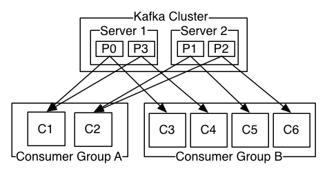
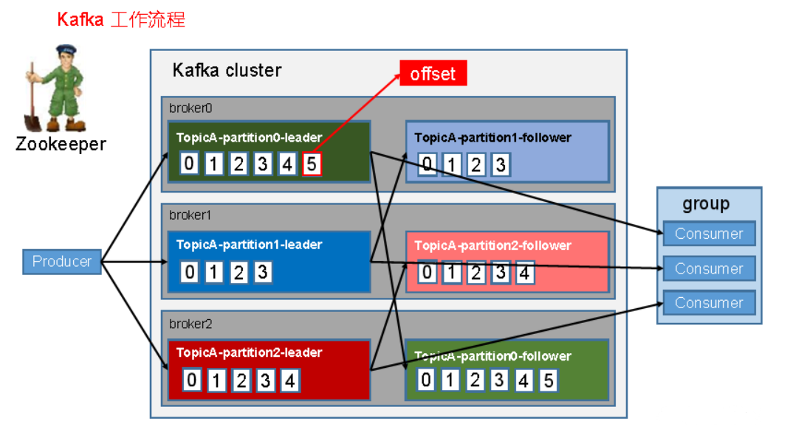
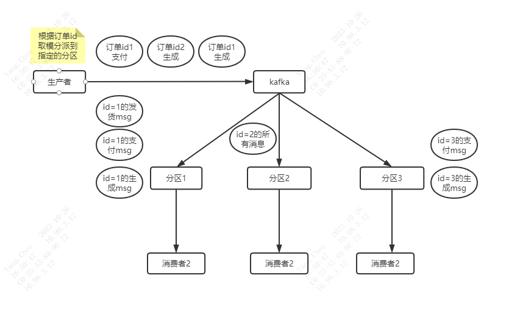
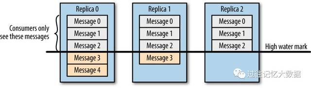

### **1、生产者(Producers)**
生产者往某个Topic上发布消息。生产者也负责选择发布到Topic上的哪一个分区。最简单的方式从分区列表中轮流选择。也可以根据某种算法依照权重选择分区。开发者负责如何选择分区的算法。
kafka中，以broker区分集群内服务器，同一个topic下，多个partition经hash到不同的broker。

<span style='color:red'>生产者发布消息的流程如下图：</span>



#### **Replicas副本是如何管理的？**
* AR:分区中的所有 Replica 统称为 AR（AR = ISR + OSR）
* ISR:所有与 Leader 副本保持一定程度同步的Replica(包括 Leader 副本在内)组成 ISR
* OSR:与 Leader 副本同步滞后过多的 Replica 组成了 OSR

Leader 负责维护和跟踪 ISR 集合中所有 Follower 副本的滞后状态，当 Follower 副本落后过多时，就会将其放入 OSR 集合，当 Follower 副本追上了 Leader 的进度时，就会将其放入 ISR 集合。
`默认情况下，只有 ISR 中的副本才有资格晋升为 Leader。`

#### **ISR策略（ISR同步副本集合）** <span style='color:red'>保证生产者发送到的消息不丢失</span>
就是与Leader保持数据同步的follower集合，它由**Leader动态维护**，如果follower超过一定的时间内未与Leader同步数据，此follower将会被踢出ISR中。Leader只需要等待ISR中所有副本都同步完成即可回复producer生产者 ack。

**生产者发布消息设置参数ack的三种机制**（生产者的acks参数与ISR同步副本机制密切相关）
1. <span style='color:red'>acks=0，producer不等待ack，也就是数据发给partition就算完了，当机器故障时，存在丢数据的情况，也就是；</span>
    (1)、数据发送给broker时，leader故障，由于不等待ack，没有重发机制，消息丢失。
    (2)、数据发送给broker时，leader接收到了数据，follower还没同步数据，leader故障，也会导致消息丢失
2. <span style='color:red'>acks=1，producer等待ack，只要Leader写完数据就返回ack，不关心follower是否完成同步，存在丢失数据情况；</span>
(1)、数据发送给broker时，leader写完了数据并返回ack，follower还没同步数据，leader故障，导致消息丢失
3. <span style='color:red'>acks=all，producer等待所有的ISR副本ack，ISR中所有的follower都同步完成数据才返回ack，不代表数据绝不会丢失；</span>**此状态下有极端情况**是:ISR中只剩一个Leader，此时acks=all退化到acks=1，将有可能丢失数据。
(1)、leader写完数据，ISR的follower也将数据同步完成时，leader故障，producer没收到ack，将数据重发，造成数据重复的情况。**

### **2、Kafka 文件存储机制**


工作流程如上图，概念如下：
* **Topic**：Kafka将消息分门别类，每一类的消息称之为一个主题（Topic）。
* **Producer**：发布消息的对象称之为主题生产者（Kafka topic producer）
* **Consumer**：订阅消息并处理发布的消息的对象称之为主题消费者（consumers）
* **Broker**：已发布的消息保存在一组服务器中，称之为Kafka集群。集群中的每一个服务器都是一个代理（Broker）。 消费者可以订阅一个或多个主题（topic），并从Broker拉数据，从而消费这些已发布的消息。
一个topic可以含有多个分区partition，一个分区可以分为多个段segment。`因为生产者生产的消息会不断追加到log文件末尾，为防止log文件过大导致数据定位效率低下，Kafka采取了分片和索引机制，将每个 partition 分为多个 segment 。每个 segment 对应两个文件 ——“.index”文件和“.log”文件（一个存储当前文件的索引范围，一个存储真正的数据，即.log文件）； `**<span style='color:red'>当一个段文件的大小达到预定义的阈值（通过配置 segment.bytes 设置），Kafka 会创建一个新的段文件。</span>**
#### **kafka过期消息删除过程**
kafka消息首先由用户设定一个或多个partition，每个partition中kafka会根据消息量来逐步建立多个segment存储消息，每个segment的大小由配置项进行设定，比如这里
```mysql
log.segment.bytes=1073741824 【1GB】
```
**kafka至少会保留1个工作segment保存消息。消息量超过单个文件存储大小就会新建segment，比如消息量为2.6GB, 就会建立3个segment。kafka会定时扫描非工作segment，将该文件时间和设置的topic过期时间进行对比，如果发现过期就会将该segment文件（具体包括一个log文件和两个index文件）打上.deleted 的标记，如下所示：**
```mysql
-rw-r--r-- 1 root root 1073740353 Nov 13 03:02 00108550131.log.deleted
-rw-r--r-- 1 root root 526304 Nov 13 03:02 00108550131.index.deleted
-rw-r--r-- 1 root root 697704 Nov 13 03:02 00108550131.timeindex.deleted
```
最后kafka中会有专门的删除日志定时任务过来扫描，发现.deleted文件就会将其从磁盘上删除，释放磁盘空间，至此kafka过期消息删除完成。
可以看出，kafka删除消息是以segment为维度的，而不是以具体的一条条消息为维度。一个segment包含了一段时期的全部消息并存储在一个文件中，比如上文提到的00108550131.log。删除时是一次性把这个过期的文件包含所有消息全部删除，效率非常高。可以设想如果是先判断一条条的消息时间是否过期再一条条的执行删除，将十分影响kafka的性能和效率，频繁擦除磁盘，对硬盘性能也有较大影响！
**所以如果消息量不多，没有超过一个segment的存储容量，由于kafka至少要保留一个segment用于存取消息，所以也不会去删除里面过期的消息。实际上，也存在着设置了消息7天过期，但是kafka里面仍存在着10天前的数据，这就是由kafka的删除特性决定的。**

### **3、消费者(Consumers)**

<span style='color:red'>消息模型可以分为两种， 队列和发布-订阅式</span>
* 队列的处理方式是 一组消费者从服务器读取消息，一条消息只有其中的一个消费者来处理。
* 在发布-订阅模型中，消息被广播给所有的消费者，接收到消息的消费者都可以处理此消息。

Kafka为这两种模型提供了单一的消费者抽象模型： 消费者组 （consumer group）。 一个发布在Topic上消息被分发给此消费者组中的一个消费者。
* 假如所有的**消费者都在一个组中，那么这就变成了queue模型。 【所有的消费者消费这个topic上的消息，且一条消息只会被一个消费者消费】**
* 假如所有的**消费者都在不同的组中，那么就完全变成了发布-订阅模型**。

* 正如下图所示：


2个kafka集群托管4个分区（P0-P3），2个消费者组，消费组A有2个消费者实例，消费组B有4个。

### **关于消息的顺序性**
* **<span style='color:red'>单个分区内的消息：消费是严格有序的</span>**；
* **<span style='color:red'>跨分区的消息：消费是无序的</span>**；
* 整体来看，无法保证整个 Topic 的消息消费顺序，仅能保证分区级别的顺序。

虽然Kafka保证消息的顺序不变，但是如果一个消费者组下有多个消费者，**<span style='color:red'>消息还是异步的发送给各个消费者，消费者收到消息的先后顺序不能保证了</span>**。这也意味着并行消费将不能保证消息的先后顺序。用过传统的消息系统的同学肯定清楚，消息的顺序处理很让人头痛。如果只让一个消费者处理消息，又违背了并行处理的初衷。 在这一点上Kafka做的更好，尽管并没有完全解决上述问题。

Kafka采用了一种分而治之的策略：**<span style='color:red'>分区</span>**。 因为Topic分区中消息只能由消费者组中的唯一一个消费者处理，所以消息肯定是按照先后顺序进行处理的。但是它也仅仅是保证Topic的一个分区顺序处理，不能保证跨分区的消息先后处理顺序。 所以，**<span style='color:red'>如果想要顺序消费Topic的消息，那就只提供一个分区，使用一个消费者</span>**。

kafka做的更好，通过并行topic的parition —— kafka提供了顺序保证和负载均衡。每个partition仅由同一个消费者组中的一个消费者消费到。并确保消费者是该partition的唯一消费者，并按顺序消费数据。每个topic有多个分区，则需要对多个消费者做负载均衡，但请注意，相同的消费者组中不能有比分区更多的消费者，否则多出的消费者一直处于空等待，不会收到消息（**<span style='color:red'>即某个topic有n个分区，那就应该有m个消费者一一对应 [m=n]。若消费者个数m>n, 那么多出来的就是空闲进程）</span>**

  
### **多消费者顺序消费**
**<span style='color:red'>例子</span>**： 双十一，大量的用户抢在0点下订单。为了用户的友好体验，我们把订单生成逻辑与支付逻辑包装成一个个的MQ消息发送到Kafka中，让kafka积压部分消息，防止瞬间的流量压垮服务。

问题来了：订单生成与支付都被包装成了消息。这两个消息是有严格的先后顺序的，订单生成逻辑肯定在支付之前。
因为Kafka的消息在分区内是严格有序的，那么可以把同一笔订单的所有消息，按照生成的顺序一个个发送到同一个topic的同一个分区。 那么consumer就能顺序的消费到同一笔订单的消息。
生产者在发送消息时，将消息对应的id进行取模处理，相同的id发送到相同的分区。消息在分区内有序，一个分区对应了一个消费者，保证了消息消费的顺序性。


#### **消息传递同步策略**
* Producer在发布消息到某个Partition时，先通过ZooKeeper找到该Partition的Leader，然后无论该Topic的Replication Factor为多少，Producer只将该消息发送到该Partition的Leader。
* Leader会将该消息写入其本地Log。每个Follower都从Leader pull数据。Follower在收到该消息并写入其Log后，向Leader发送ACK。一旦Leader收到了ISR中的所有Replica的ACK，该消息就被认为已经commit了，Leader将增加HW并且向Producer发送ACK。

为了提高性能，每个Follower在接收到数据后就立马向Leader发送ACK，而非等到数据写入Log中。因此，对于已经commit的消息，Kafka只能保证它被存于多个Replica的内存中，而不能保证它们被持久化到磁盘中，也就不能完全保证异常发生后该条消息一定能被Consumer消费。
Consumer读消息也是从Leader读取，只有被commit过的消息才会暴露给Consumer。

#### **消息一致性**

不管是新老分区副本Leader，消费者consumer都能读到一样的数据。假设分区的副本为3，其中副本0是Leader, 副本1，2是follower，并且在ISR （副本同步队列）列表里面。虽然副本0已经写入了message4，但是Consumer只能读取到Message2。因为所有的ISR都同步了message2（类似于木桶原理）