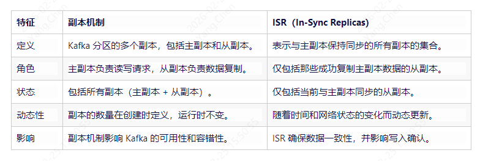

### **1、如何保证消息不重复消费？**

* **消息幂等性**：当启用kafka消息幂等性时，每条消息都会被赋予一个唯一的ID（Producer ID + Sequence Number），Kafka会使用这个ID来识别和过滤重复的消息。即使生产者发送了重复的消息，Kafka也会确保消费者不会消费到重复的数据。
* **消费者端去重**（业务逻辑幂等）：除了在生产者端保证消息的幂等性外，还可以在消费者端进行去重操作。消费者可以维护一个已处理消息的ID列表，每次消费消息时，都先检查该列表，以确保不会处理重复的消息。
* **Exactly-Once**(恰好一次)语义：可以确保生产者发送的消息不会被重复处理，并且消费者在处理消息时也不会丢失消息或产生重复数据。这是通过Kafka事务API来实现的，允许生产者在发送消息时进行事务性操作，以确保消息的完整性和一致性。

### **2、如何保证消息不丢失？**

#### 2.1、从生产者层面来保证消息不丢失
**2.1.1、acks参数设置（保证副本的数据一致性）**
* acks=0，producer不等待ack，也就是数据发给partition就算完了，当机器故障时，存在丢数据的情况；
* acks=1，producer等待ack，只要Leader写完数据就返回ack，不关心follower是否完成同步，存在丢失数据情况；
* acks=all，producer等待所有的ISR副本ack，ISR中所有的follower都同步完成数据才返回ack，

#### **2.1.2、生产者发送消息重试**
* 当消息发送失败时，生产者可以设置重试机制。

#### 2.2、从kafka集群层面来保证消息不丢失
**2.2.1、副本机制**
* 主副本负责处理读写请求，从副本则定期从主副本同步数据。当主副本不可用时，会从从副本中选举出新的主副本。

**2.2.2、ISR副本集合( ISR 是指与主副本保持同步的所有副本的集合)**

#### 2.3、从消费者层面保证消息不丢失
**2.3.1、消费者手动提交偏移量**
