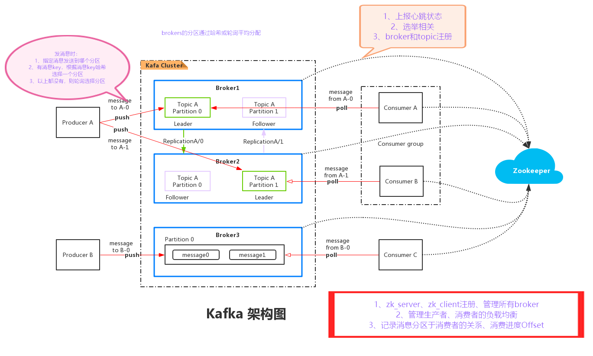
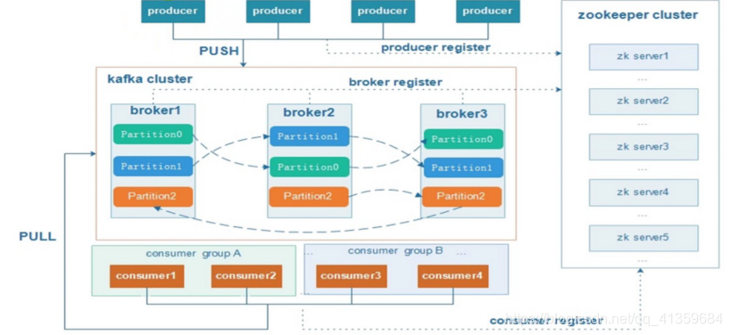
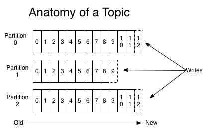
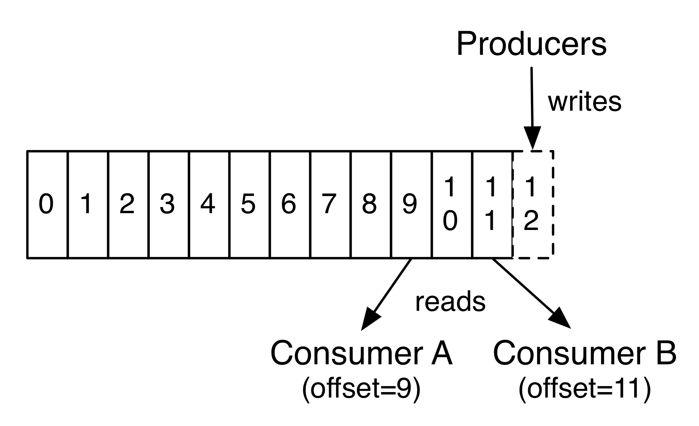
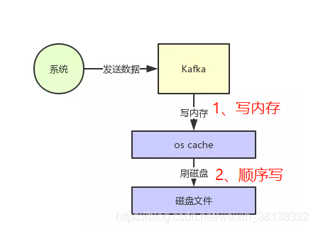
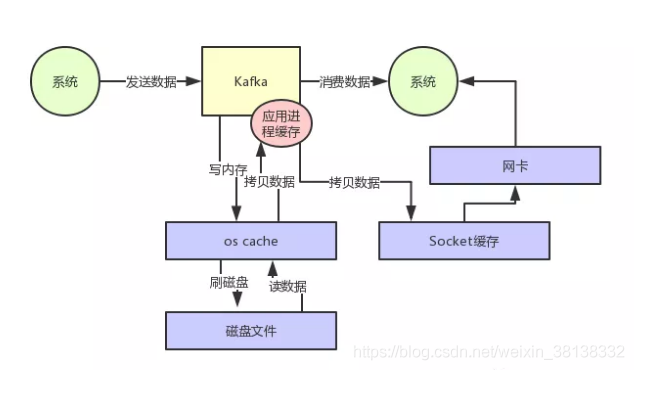
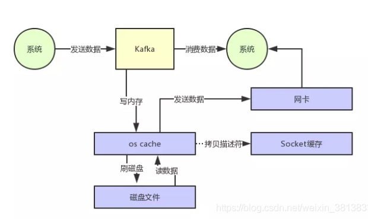

### **1、初识kafka**

kafka是一款分布式消息发布和订阅系统，它的特点是高性能、高吞吐量.

### **2、使用场景**

用于 web/nginx 日志、访问日志，消息服务等等。
* 行为跟踪
```mysql
kafka可以用于跟踪用户浏览页面、搜索及其他行为。通过发布-订阅模式实时记录到对应的Topic 中，通过后端大数据平台接入处理分析，并做更进一步的实时处理和监控
```
* 日志收集系统
```mysql
日志收集方面，有很多比较优秀的产品，比如 Apache Flume， 很多公司使用kafka 代理日志聚合。日志聚合表示从服务器上收集日志文件，然后放到一个集中的平台（文件服务器）进行处理。在实际应用开发中，我们应用程序的 log 都会输出到三、Kafka的架构理 log 日志用来快速定位到问题。所以很多公司的套路都是把应用日志集中到kafka上，然后分布导入到es 和 hdfs 上。用来做实时检索分析和离线统计数据备份等。而另一个方面，kafka 本身又提供了很好的api来集成日志并且做日志收集
推荐一个基于ElasticSearch+Logstash+Kibana搭建的日志管理中心：https://blog.csdn.net/qq_39938758/article/details/103974396
推荐一个ElasticSearch+Logstash+Filebeat+Kafka+Zookeeper+Kibana 的日志收集分析：https://blog.csdn.net/weixin_41047933/article/details/82699823
```
* 消息系统

### **3、Kafka的架构**




### **4、Kafka所使用的基本术语**

* <span style='color:red'>**Topic**</span>：Kafka将消息分门别类，每一类的消息称之为一个主题（Topic）。
* <span style='color:red'>**Producer**</span>：发布消息的对象称之为主题生产者（Kafka topic producer）
* <span style='color:red'>**Consumer**</span>：订阅消息并处理发布的消息的对象称之为主题消费者（consumers）
* <span style='color:red'>**Broker**</span>：已发布的消息保存在一组服务器中，称之为Kafka集群。集群中的每一个服务器都是一个代理（Broker）。 消费者可以订阅一个或多个主题（topic），并从Broker拉数据，从而消费这些已发布的消息。

#### **主题和日志 （Topic和Log）**
Topic是发布的消息的类别名，一个topic可以有零个，一个或多个消费者订阅该主题的消息。对于每个topic，Kafka集群都会维护一个分区log，就像下图中所示：

**<span style='color:red'>每一个分区都是一个顺序的、不可变的消息队列</span>**， 并且可以持续的添加。分区中的消息都被分了一个序列号，称之为偏移量(offset)，在每个分区中此偏移量都是唯一的。

Kafka集群保持所有的消息，直到它们过期（默认7天，无论消息是否被消费）。实际上消费者所持有的仅有的元数据就是这个offset（偏移量），也就是说<span style='color:red'>offset由消费者来控制：正常情况当消费者消费消息的时候，偏移量也线性的的增加</span>。但是实际偏移量由消费者控制，消费者可以将偏移量重置为更早的位置，重新读取消息。可以看到这种设计对消费者来说操作自如，一个消费者的操作不会影响其它消费者对此log的处理。


Kafka中采用分区的设计有几个目的：
* 可以处理更多的消息，不受单台服务器的限制。Topic拥有多个分区意味着它可以不受限的处理更多的数据。
* 可以作为并行处理的单元，稍后会谈到这一点。
### **高性能原理**

#### **1、页缓存技术 + 磁盘顺序写**

Kafka是基于操作系统的页缓存来实现文件写入的。操作系统本身有一层缓存，叫做page cache，是在内存里的缓存，也可以称为os cache，意思就是操作系统自己管理的缓存。在写入磁盘文件的时候，可以直接写入这个os cache里，也就是仅仅写入内存中，接下来由操作系统自己决定什么时候把os cache里的数据真的刷入磁盘文件中。


#### **2、零拷贝技术（用户消费消息时）**

不使用零拷贝技术（左图），使用零拷贝技术（右图）
* 传统数据复制，磁盘文件–>内核缓冲区–>用户缓冲区–>socket的发送缓冲区–>网卡接口–>消费者进程；
* **<span style='color:red'>零拷贝：磁盘文件–>内核缓冲区–>网卡接口–>消费者进程(数据直接从内存发送到网卡)</span>**



#### **kafka缺点：**
分区partition多于broker数量时，顺序io退化成随机io。