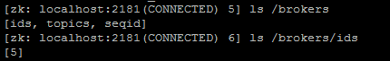

### **2、zookeeper和Kafka的关系**

#### **1.管理的所有Broker**
体现在zookeeper上会有一个专门用来进行Broker服务器列表记录的点，节点路径为/brokers/ids

每个Broker服务器在启动时，都会到Zookeeper上进行注册，即创建/brokers/ids/[0-N]的节点，然后写入IP，端口等信息，Broker创建的是临时节点，所有一旦Broker上线或者下线，对应Broker节点也就被删除了，因此我们可以通过zookeeper上Broker节点的变化来动态表征Broker服务器的可用性,Kafka的Topic也类似于这种方式。
#### **2.生产者负载均衡**
生产者需要将消息合理的发送到分布式Broker上，这就面临如何进行生产者负载均衡问题。
对于生产者的负载均衡，Kafka支持传统的4层负载均衡，zookeeper同时也支持zookeeper方式来实现负载均衡。
1. 传统的4层负载均衡
`根据生产者的IP地址和端口来为其定一个相关联的Broker,通常一个生产者只会对应单个Broker,只需要维护单个TCP链接。这样的方案有很多弊端，因为在系统实际运行过程中，每个生产者生成的消息量，以及每个Broker的消息存储量都不一样，那么会导致不同的Broker接收到的消息量非常不均匀，而且生产者也无法感知Broker的新增与删除。`
2. 使用zookeeper进行负载均衡
`很简单，生产者通过监听zookeeper上Broker节点感知Broker，Topic的状态，变更，来实现动态负载均衡机制，当然这个机制Kafka已经结合zookeeper实现了。`

3. 消费者的负载均衡和生产负载均衡类似
4. 记录消息分区于消费者的关系，都是通过创建修改zookeeper上相应的节点实现
5. 记录消息消费进度Offset记录，都是通过创建修改zookeeper上相应的节点实现