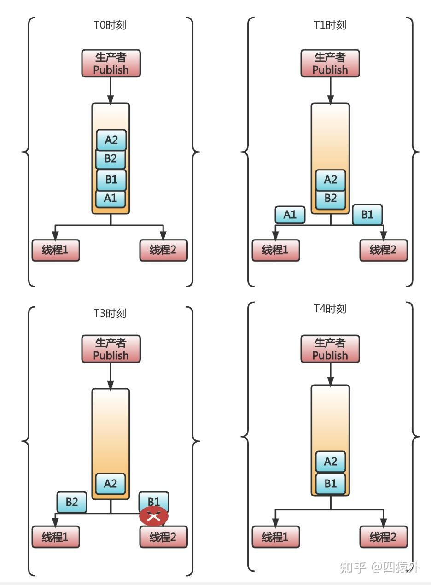
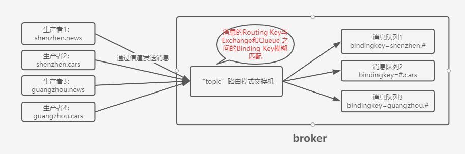

### **1、消息的顺序性对比**

```mysql
需求场景：当订单状态变化的时候，把订单状态变化的消息发送给所有关心订单变化的系统。订单会有创建成功、待付款、已支付、已发货的状态，状态之间是单向流动的
```
在这种业务下，最想要的是：
* 消息的顺序：对于同一笔订单来说，状态的变化都是有严格的先后顺序的。
* 吞吐量：像订单的业务，我们自然希望订单越多越好。订单越多，吞吐量就越大。
RabbitMQ不能保证多线程消费同一个队列的消息，一定保证顺序的。而不保证的原因，是因为多线程时，当一个线程消费消息报错的时候，RabbitMQ 会把消费失败的消息再入队，此时就可能出现乱序的情况。

这个场景用RabbitMQ，就会有三个问题：
* 为了实现发布订阅功能，从而使用的消息复制（多个消费者订阅时，exchange会复制消息到多个对应的队列），会降低性能并耗费更多资源
* 多个消费者无法严格保证消息顺序（单个消费者可以保证顺序）
* 大量的订单集中在一个队列，吞吐量受到了限制
这个场景消息的顺序性用kafka，更合适：
* Kafka 的发布订阅并不会复制消息，因为 Kafka 的发布订阅就是消费者直接去获取被 Kafka 保存在日志文件中的消息就好。无论是多少消费者，他们只需要主动去找到消息在文件中的位置即可。
* Kafka 不会出现消费者出错后，把消息重新入队的现象。（保证消息的顺序消费）
* Kafka 可以对订单进行分区，把不同订单分到多个分区中保存，吞吐量性能更好。

### **2、消息的匹配性**

```mysql
需求场景：要根据推广内容去匹配不同的方式做宣传。又比如，要根据不同的活动去匹配不同的渠道去做分发
```

**使用rabbitmq时，很合适。RabbitMQ是允许在消息中添加routing_key 或者自定义消息头，然后通过一些特殊的 Exchange，很简单的就实现了消息匹配分发。**
**使用kafka时，由于kafka不支持匹配。需要在消费者的业务逻辑里做过滤，如果不匹配就不处理等。**

### **3、消息的超时**

```mysql
需求场景：电商里面下单之后，如果用户在15分钟内未支付，则自动取消订单。
```
使用rabbitmq时（合适）：
* 使用死信队列，RabbitMQ最简单的实现方式就是设置 TTL，然后一个消费者去监听死信队列。当消息超时了，监听死信队列的消费者就收到消息了。但这样做有个大问题：假设，我们先往队列放入一条过期时间是 10 秒的 A 消息，再放入一条过期时间是 5 秒的 B 消息。 那么问题来了，B 消息会先于 A 消息进入死信队列吗？不是，B 消息会优先遵守队列的先进先出规则，在 A 消息过期后，和其一起进入死信队列被消费者消费。
* 官方延迟消息交换机插件，在发送消息的时候，把消息发往这个特殊的 Exchange。同时，在消息头里指定延迟的时间，收到消息的Exchange并不会立即把消息放到队列里，而是在消息延迟时间到达后，才会把消息放入。

使用kafka时（要自己实现逻辑很麻烦）：
* 需要把消息先放入一个临时的 topic。
* 然后得自己开发一个做中转的消费者。让这个中间的消费者先去把消息从这个临时的 topic 取出来。
* 取出来，这消息还不能马上处理啊，因为没到时间呢。也没法保存在自己的内存里，怕崩溃了，消息没了。所以，就得把没有到时间的消息存入到数据库里。
* 存入数据库中的消息需要在时间到了之后再放入到 Kafka 里，以便真正的消费者去执行真正的业务逻辑。

### **4、消息的保持**

```mysql
需求场景：在微服务里，事件溯源模式是经常用到的。如果想用消息队列实现，一般是把事件当成消息，依次发送到消息队列中。事件溯源有个最经典的场景，就是事件的重放。简单来讲就是把系统中某段时间发生的事件依次取出来再处理。而且，根据业务场景不同，这些事件重放很可能不是一次，更可能是重复N次。
```
使用rabbitmq时（不适合）。因为消息被取出来就被删除了，想再次被重复消费，就不可能了。

使用Kafka时，因为消息会被持久化一个专门的日志文件里，不会因为被消费了就被删除。所有可以通过kafka的消费者api重头到尾把消息拿出来。

### **5、消息的吞吐量**

Kafka 是每秒几十万条消息吞吐，而 RabbitMQ 的吞吐量是每秒几万条消息。其实，在一家公司内部，有必须用到 Kafka 那么大吞吐量的项目真的很少。大部分项目，像 RabbitMQ 那样每秒几万的消息吞吐，已经非常够了。