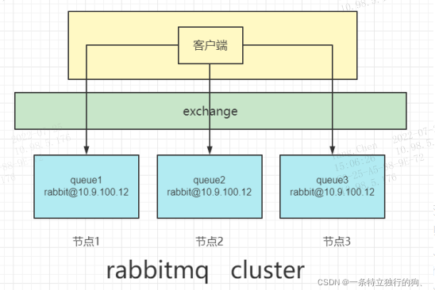
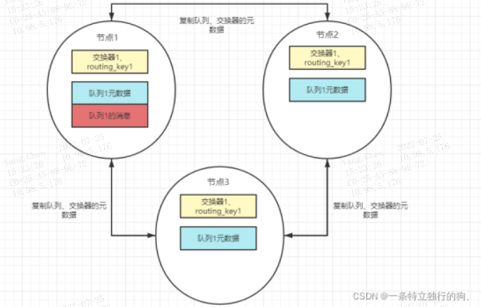
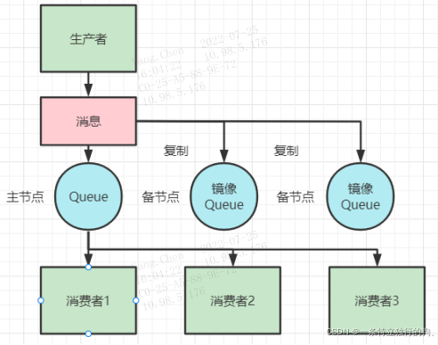
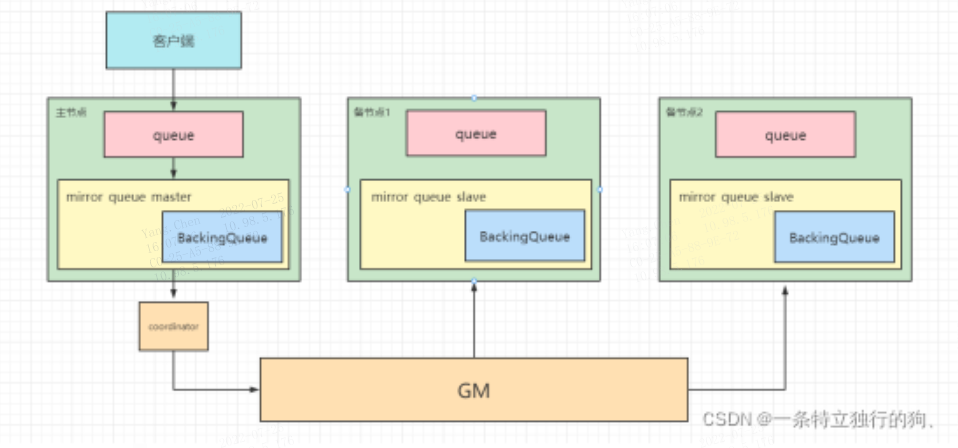
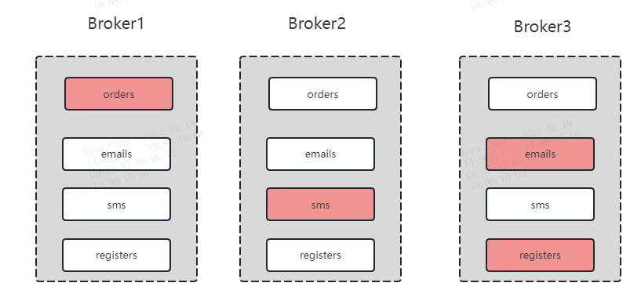

### **1、两种集群部署方式**

* 普通集群模式
* 镜像集群模式

### **2、普通集群**

下图三个节点组成了一个RabbitMQ的集群。其中exchange是交换器，它的元数据信息（交换器名称、交换器属性、绑定键等）在所有节点上都是一致的，而队列中的实际消息数据则只会存在于所创建的那个节点上，其它节点只知道这个队列的元数据信息和一个指向拥有这个消息的队列的节点指针。

RabbitMQ集群会同步四种类型的内部元数据：队列元数据（队列名和属性）、交换器元数据（交换器名和属性）、绑定键和虚拟机。在用户访问其中任何一个rabbitmq节点时查询到的queue、user、exchange和vhost等信息都是一致的。

那为什么普通集群只保持元数据同步，消息内容却没同步呢？这里涉及到存储空间和性能的问题，如果保持每个节点都有一份消息，那会导致每个节点的空间都非常大，消息的积压量会增加且无法通过扩容节点解决积压问题。另外如果要使每个节点存储一份消息，对于持久化的消息而言，内存和磁盘同步复制机制会导致性能受到很大影响。（此类型集群不支持高可用，该部署模式只解决了单节点的压力问题，但是当数据节点宕机之后便无法提供服务了）

上图中的三个节点，其中节点1是数据节点（即实际存储消息内容的节点），如果此时有客户端（生产者或消费者）与节点1建立了连接，那么关于消息的收发就只在节点1上进行（可以理解为简单的单机模式），而如果此时客户端是与节点2或者节点3建立的连接，此时由于数据在节点1上，那么节点2或节点3只会起到一个消息转发的作用，例如此客户端是消费者，那么消息将由节点2或节点3从节点1中拉取，再经自身节点路由给消费者端；如果此客户端是生产者，那么消息先发给节点2或3，再路由到节点1的队列中存储

一个节点可以是磁盘节点和内存节点，磁盘节点将元数据存储在磁盘，内存节点将元数据存储在内存，但对于队列和消息的持久化、非持久化而言，**磁盘节点和内存节点存储方式无区别：持久化存磁盘，非持久化存内存**。这里需要注意的是，内存节点只是将元数据（比如队列名和属性、交换器名和属性和虚拟机等）存储在内存，因此在对资源管理（创建和删除队列、交换器和虚拟机等）时的性能有所提升，但是对发布和订阅的消息速率并没有提升。

**RabbitMQ要求集群中至少有一个磁盘节点**，当节点加入和离开集群时，必须通知磁盘节点（如果集群中唯一的磁盘节点崩溃了，则不能进行创建队列、创建交换器、创建绑定、添加用户、更改权限、添加和删除集群节点）。如果唯一磁盘的磁盘节点崩溃，集群是可以保持运行的，但不能更改任何东西。因此建议在集群中设置两个磁盘节点，只要一个即可正常操作。总之在无法得知它们如何使用才能保证最佳时建议最好都用磁盘节点。

### **3、镜像集群模式**

镜像队列（Mirror Queue)：将队列复制到集群的其他Broker节点上，publish到镜像队列的所有消息也被publish到master和所有的slave。如果集群中的一个节点失效了，队列能自动地切换到镜像中的另一个节点上以保证服务的可用性。当消息设置了持久化时，每个节点都有属于自己的本地消息持久化存储机制。当消息入队和出队时，所有关于对主节点的操作都会同步给备用节点用来更新。此集群模式在主节点宕机之后备用节点所保留的消息与主节点完全一致，**即可实现高可用。**

#### 3.1、工作原理

镜像集群模式的实现流程，其中有三个节点（主节点、备节点1、备节点2）和三个镜像队列queue（其中备节点上的queue是由主节点镜像生成的）。要注意的是，这里的主节点和备节点是针对某个队列而言的，并不能认为一个节点作为了所有队列的主节点，因为在整个镜像集群模式下，会存在多个节点和多个队列，这时候任何一个节点都能作为某一个队列的镜像主节点，其它节点则成了镜像备节点（例如：有A、B、C三个节点和Q1、Q2、Q3三个队列，如果A作为Q1的镜像主节点，那么B和C就作为了Q1的镜像备节点，在此基础上，如果B作为了Q2的镜像主节点，那么A和C就是Q2的镜像备节点）
每一个队列都是由两部分组成的，一个是queue，用来接收消息和发布消息，另外还有一个BackingQueue（后备队列），它是用来做本地消息持久化处理。
镜像队列包含主队列和从队列，与这些队列同级还有一种后备队列。
#### 3.2、镜像队列的缺陷
镜像队列主要的问题是消息同步的性能。由于使用了一种低效的消息复制方法，镜像队列的性能会比较低下。
**镜像队列会有一个主队列和多个从队列，主队列会将自己接收的读、写请求同步给所有从队列。当所有的从队列保存消息之后，主队列才会向生产者发送确认。如果主队列挂掉，其中一个从队列会晋升成主队列，让整个镜像队列仍然保持可用，避免消息丢失。**
有多个镜像队列时，主队列（红色）和从队列会分布在集群的不同节点上，每个节点可以承载多个主队列和从队列。

**两个缺点：**
* 数据丢失：**当一个节点下线，然后恢复上线之后，它保存的所有从队列的镜像数据都会丢失**。从队列重新上线，但是它是空的，运维人员必须做出选择，是否要将数据同步到这个空队列。如果选择同步，那么就意味着要将当前所有的消息从主队列同步到从队列。
* 同步数据（同步阻塞）：如果队列的消息堆积量很大，同步的影响就会抱很大，可能要消耗几分钟、几小时或者更多时间去同步消息，不仅如此，同步还会消耗内存，导致内存相关的问题，甚至可能造成节点需要重启。

### **4、仲裁队列（3.8版本以后）**

**目的是解决镜像队列的性能和同步问题**：当节点重新上线时，不会丢数据，主副本会直接从从副本中断的地方开始复制消息。复制的过程是非阻塞的，所以整个队列不会因为新的副本加入而收到影响。唯一的影响是网络使用率。Raft 协议比镜像队列的算法更有效率，可以提供更好的消息吞吐量。
* 更高的可用性：仲裁队列支持过半数模式，只需要 n/2+1 个节点正常工作，队列就能够继续提供服务。而传统的镜像队列则需要所有镜像节点都正常工作才能提供服务。因此，使用仲裁队列可以更好地保障队列的可用性和容错性。
* 更好的性能：仲裁队列使用基于 Raft 协议的分布式一致性算法，能够更好地处理并发写入操作，从而提高队列的写入性能。而传统的镜像队列则在写入操作时需要等待所有镜像节点都写入成功后才返回响应，因此写入性能较低。
需要注意的是，使用仲裁队列也有一些缺点，比如需要更多的 CPU 和内存资源，因为仲裁队列需要运行 Raft 协议来实现过半数模式。
**缺点：**
* 消息存内存：堆积消息会增加内存的使用量，最终可能导致集群不可用。
* 失去多数节点时意味着队列不可用
* 延迟高：尽管仲裁队列的吞吐量更高，但是延迟也可能更高，这是由于使用了 Raft 协议。在仲裁队列中，所有消息都是持久化的，所有消息都会保存到每个副本的磁盘中。安全性是仲裁队列的主要目标
* 磁盘使用（写入放大）：fanout模式下，一条将要投递到多个队列的消息，它的存储大小不会随着投递到的队列变多而线性增长。而普通队列每个节点只会存储一次。