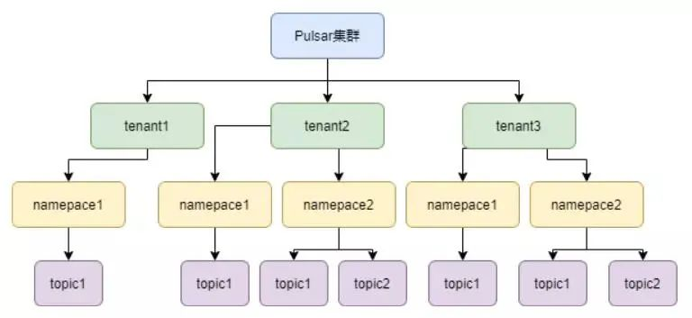
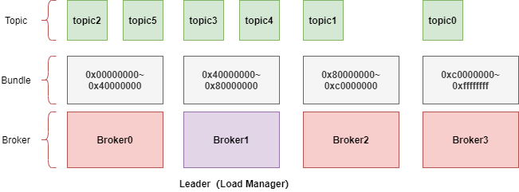
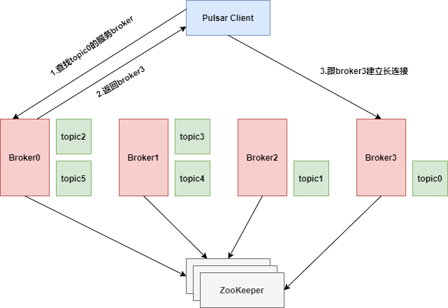

### **1、Broker 的定义**

<span style='color:red'>Broker是Pulsar 集群中的一个节点，主要负责处理与客户端的交互，包括生产者发送消息和消费者接收消息，但不直接存储消息。这部分存储的工作是由 Apache BookKeeper 来完成的。</span>

### **2、Broker服务**
#### 2.1、broker的作用
* 接收消息：Broker 接收来自生产者的消息请求，并负责将这些消息路由到适当的存储位置（即 BookKeeper 中的 Ledger）。
* 路由消息：Broker 负责将消息发送到相关的消费者。它根据订阅关系和负载均衡策略来决定将消息推送到哪个消费者。
* 提供 API：Broker 提供了一套 RESTful API 和客户端库，以便生产者和消费者进行消息的发送和接收。
* 管理主题Topic：当一个新的 Topic 被创建时，负责管理该 Topic 的注册和元数据。维护有关Topic的信息，包括分区、订阅者等。Topic的消息是存储在BookKeeper的Ledger中
* 负载均衡：Broker 负责在集群中进行负载均衡，确保请求在多个 Broker 之间合理分配。
* 监控与管理：Broker 提供监控和管理功能，以便系统管理员可以监控系统状态和性能。

#### 2.2、Broker组成部分
* Dispatcher：调度分发器，通过自定义的二进制协议，与生产者、消费者进行数据传输
* Load Balancer：用于做负载均衡，即分配合适的topic数量到自身
* Managed Ledger：Ledger是一个只追加的数据结构，其中存储着一条条消息。而Managed Ledger作为Ledger的上一层抽象，负责管理消息流，作为添加消息和消费消息的入口，有一个写入器进程添加消息，并且有多个cursor消费消息，每个cursor有自己的消费位置。
* BK Client：请求Bookie的客户端
* Cache：为了提升性能，broker会将消费者要消费的消息提前放到Cache中。如果积压的消息超过了缓存大小，Broker就直接从BooKeeper读取消息（存在的场景如消息未确认ack，但消费者继续请求数据，这时积压的消息就可能超过缓存大小）
* Global replicators：用于做Geo复制（实现跨区域或跨数据中心的消息复制，跨区域消息一致性，负载均衡，故障恢复）
<span style='color:red'>Broker可以管理一个或者多个Topic。Pulsar是一个多租户平台，多租户的特性体现在Topic是一个层级概念，Topic的URL如下图：</span>
一个Topic可以使用persistent属性指定是否持久化，而Topic的上层使用租户来进行权限隔离，使用Namespace来进行策略管理。
在一个公司内部的Pulsar集群中，可以根据业务部门建租户，根据业务部门内部的不同项目组来划分Namespace，根据每个项目组的不同业务单元来划分Topic。Topic的层级概念也可以用下图来表示：




### **3、Broker中的Bundle**

#### 3.1、定义
Bundle是一种逻辑分区的集合，它将一个或多个Topic 的分区组合在一起。每个Bundle 可以看作是一个可管理的单元，用于在Pulsar集群中处理消息。
#### 3.2. 主要功能
#### 3.2.1 负载均衡
* 分布式管理：将Topic的分区组织成Bundles，以便于在不同的 Broker 之间进行负载均衡。当一个 Broker 负载过高时，系统可以将某些 Bundles 迁移到其他 Broker，从而实现负载均衡。
* 动态分配：当新的Broker节点加入集群时，Pulsar 可以对Bundles 进行动态分配，以确保集群的负载均匀分布。
#### 3.2.2 扩展性
* 增加 Bundle：随着系统的扩展，Pulsar 可以增加新的 Bundles，以支持更多的 Topic 和分区。
* 分区管理：每个 Bundle 可以包含多个 Topic 的分区，这样能够有效管理大量的 Topic 和分区，提高系统的扩展性。
#### 3.3、Broker分配Bundle
Broker集群启动过程中会在Zookeeper竞争创建临时节点，创建成功的成为Leader节点，叫Load Manager，这个节点会定期搜集其他Broker的服务状态，比如CPU、内存、网卡带宽利用率，这些指标都是临时数据，所以Leader节点并不会保存太多数据。
Leader节点会根据搜集到的负载情况为其他Broker节点分配Bundle。如下图：
```mysql
下图中Broker1竞争成为Leader，它负责为其他几个Broker分配Bundle。初始化时，每个Broker都没有Boundle，Leader把topic0分配给了Broker3，这就代表topic0所在的Bundle分配给了Broker3，之后Hash值跟topic0相同的都会落到这个Bundle，其他同理。
```

#### 3.4、Bundle高可用
<span style='color:red'>如上图，如果Broker0宕机了，Load Manager和ZK都能检测到broker0宕机，这时Load Manager会重新把Bundle(0x00000000~0x400000000)分配给其他三个broker，会找一个负载最小的broker分配。如果Leader节点宕机了，那Broker0、Broker2和Broker3三个节点会去Zookeeper抢占注册临时节点，注册成功的成为新的Leader，新的Leader节点会把Broker1的Bundle分配给剩下的3个Broker。</span>
#### 3.5、使用Bundle后，客户端的连接流程
生产者和消费者连接Pulsar集群时的流程如下：


### **4、Broker扩展**

#### 4.1 动态扩展
* 增加Broker节点：在需要扩展时，可以动态增加新的 Broker 节点到 Pulsar 集群中。新加入的 Broker 会自动与现有 Broker 进行协作，参与消息的处理（配置新的broker参数，启动新broker后会向zk注册服务信息，zk更新集群状态，生产者，消费者，主题分区都会识别到新的broker）。
* 负载均衡：扩展后，Pulsar会自动进行负载均衡，将Topic的分区重新分配到新的Broker节点上，以实现更高的吞吐量和更好的资源利用率。
#### 4.2 Topic重新分配
* 分区管理：当一个Topic有多个分区时，Pulsar可以在扩展时将分区在新的Broker之间重新分配，以提高并行处理能力。
* 分区增加：在需要更高吞吐量的情况下，可以增加 Topic 的分区数量。扩展后的 Broker 可以接管新增加的分区，从而提高系统的整体性能。

### **5、Broker遇到故障时的处理机制**

#### 5.1、故障转移
* 高可用性：Pulsar集群通常会部署多个Broker，以实现高可用性。当某个Broker节点发生故障时，其他Broker可以接管该节点的工作，确保消息的持续处理。
* Leader 选举：在Pulsar中，每个Topic 的分区有一个Leader Broker，负责管理该分区的消息流。当 Leader Broker 故障时，系统会触发选举机制，选举新的 Leader Broker 来接管该分区的管理工作。
#### 5.2、数据恢复
* 消息持久化：由于消息是存储在Apache BookKeeper的 Ledger 中，Broker的故障不会导致消息丢失。即使某个Broker失效，其他Broker仍然可以从 BookKeeper中恢复消息。
* 快速恢复：Broker 在重启后会从 BookKeeper 中恢复其管理的 Topic 和分区的状态，从而快速恢复服务。
#### 5.3、监控与告警
* 健康检查：Pulsar 提供了监控和告警机制，可以实时监控Broker的健康状态。一旦检测到Broker 故障，系统管理员可以及时采取措施进行恢复。