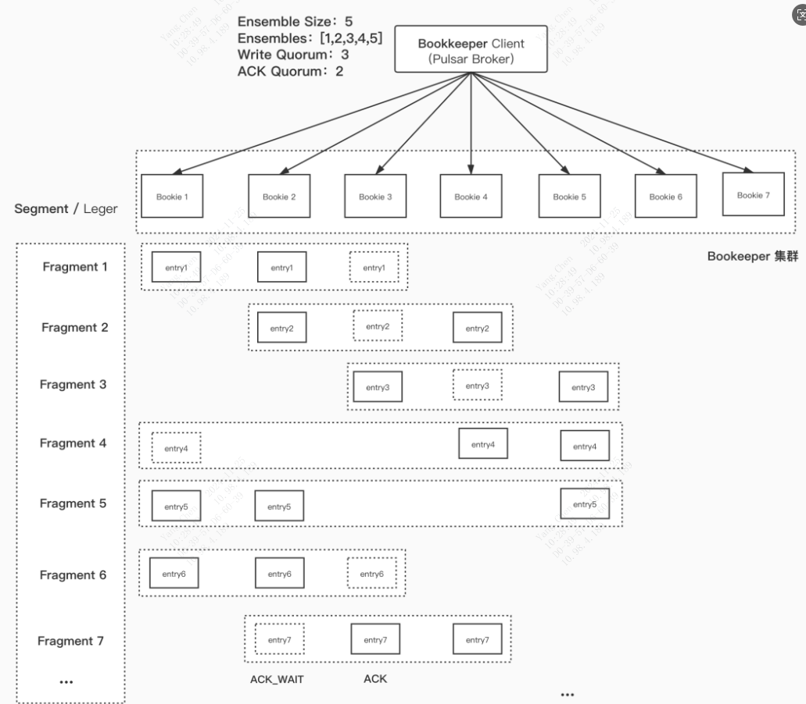
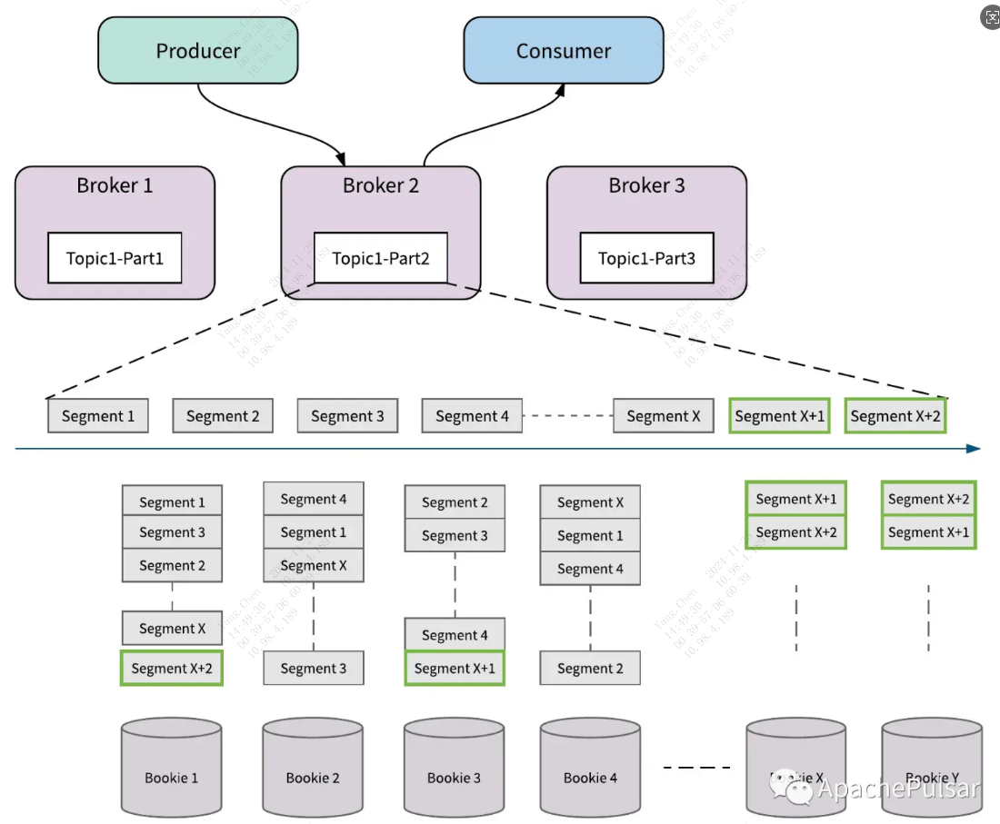
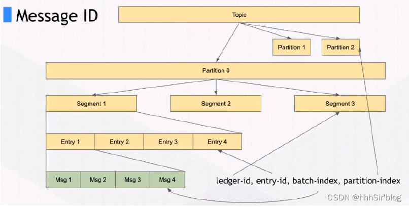
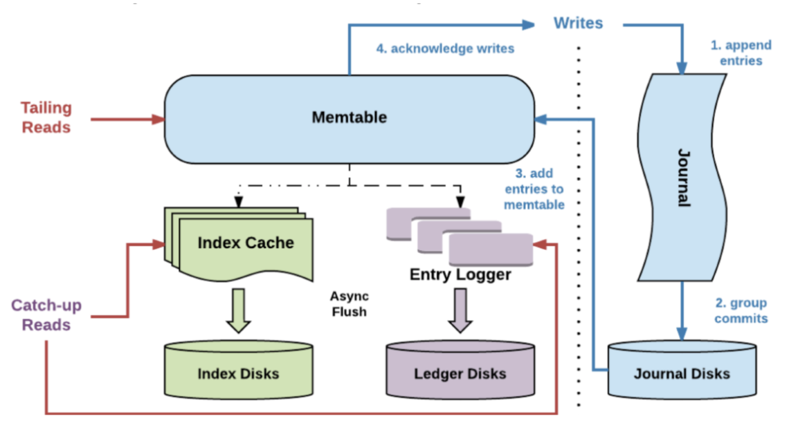

### **1、Bookkeeper架构**

append-only 的分布式 KV 日志系统，拥有以下特性：
* 高效写：append-only 磁盘顺序写。
* 高容错：通过 bookie ensemble 对日志进行冗余复制。
* 高吞吐：直接水平扩展 bookie 提高读写吞吐。

#### **1.1、名词解释**
* Ensemble Size：指定一段日志要写的 bookies 数量。
* Ensembles：指定写一段日志的目标 bookies 集合。
* Write Quorum（Qws）：写入操作至少要N个bookie数量成功才算写入成功。
* ACK Quorum(Qas)：客户端必须收到至少n个成功ack才认为写入操作成功。
* Segment / Ledger：要写入的一段日志，用于持久化存储消息的基本单位，每个 Ledger 都有一个唯一的 ID，Append-only 的，即消息只能以追加的方式写入，不能修改或删除。
* Fragment：写入的一条日志，每个 Fragment 可能包含多个消息（Entry），这些消息在逻辑上是相互关联的。
#### **1.2、Fragment，Segment ，Ledger之间的关系**

层级关系：
* Ledger是最底层的存储单位，负责持久化消息。
* Segment是Ledger的逻辑分区，用于管理和组织消息。一个 Ledger 可以包含多个 Segment。
* Fragment 是 Segment 内部的逻辑部分，用于细粒度地管理消息。

工作流程：
* 当消息被写入 Pulsar 时，它们首先被追加到 Ledger 中。
* Ledger 会被划分为多个 Segment，以便更高效地进行读写操作。
* 在 Segment 内部，消息会被组织成 Fragment，以支持高效的消息查询和过滤。

### **2、bookies的存储消息结构**

#### 2.1、bookkeeper的多副本策略
当数据被写入到 BookKeeper 时，系统会根据配置的副本数来管理数据的复制，具体是以下3个参数：
Ensemble Size：指定一段日志要写的 bookies 数量。
Write Quorum（Qws）：写入操作至少要N个bookie数量成功才算写入成功。
ACK Quorum(Qas)：客户端必须收到至少n个成功ack才认为写入操作成功。
如下图：若有5个bookie，设置了Ensemble Size为3，Qws=2, Qas=2。则表示数据会写入3个bookie，当写入2个bookie成功时，bookkeeper认为是写入成功，客户端收到至少2个ack确认时，客户端认为写入成功。

### **3、BookKeeper的读写分离**

读写分离保证了在有大量滞后消费（磁盘IO会增加）时，不会影响服务的正常运行，尤其是不会影响到数据的写入。涉及到的Bookie 存储的几个概念:
* Journals：Journal 文件包含了BookKeeper事务日志，在 Ledger 更新之前，Journal 保证描述更新的事务写入到 Non-volatile 的存储介质上
* Entry logs：Entry日志文件管理写入的 Entry，来自不同 ledger 的 entry 会被聚合然后顺序写入
* Index files：每个 Ledger都有一个对应的索引文件，记录数据在 Entry 日志文件中的 Offset 信息
#### 3.1、Bookie数据写入流程（如下图）
1. 客户端数据写入 Journal 内存。
2. 将Journal数据刷写到 Journal 磁盘（实时刷盘，Journal 数据相当于 WAL 日志，用于做故障恢复）。
3. 将Journal数据写入内存表Memtable。
4. 写入完成，响应请求。
5. Memtable 写满之后，会刷到 Entry Logger 和 Index cache，Entry Logger 中保存了数据，Index cache 保存了数据的索引信息，然后由后台线程将 Entry Logger 和 Index cache 数据落到磁盘。

#### 3.2、数据读取流程
* 如果是Tailing read（尾随读，实时读取）请求，直接从Memtable中读取Entry
* 如果是Catch-up read（滞后消费）请求，先读取 Index信息，然后索引从Entry Logger文件读取Entry