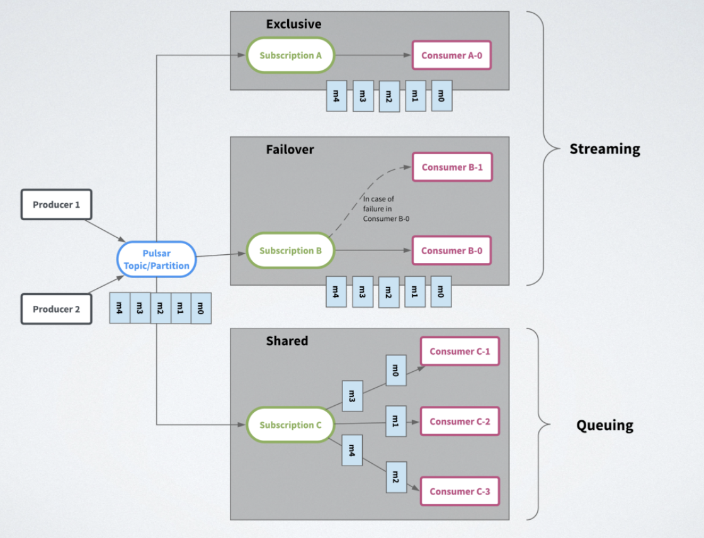
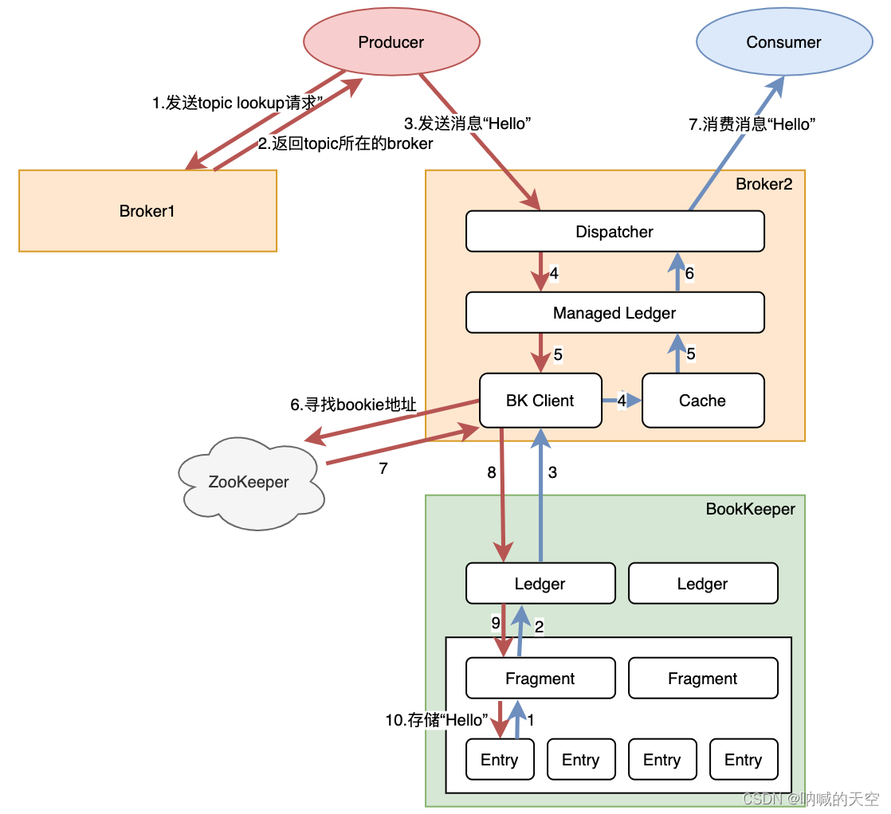

### **1、消费者订阅方式分为三种类型**

* **Exclusive独占订阅** ：在任何时间，一个消费者组（订阅）中有且只有一个消费者来消费 Topic 中的消息。
* **Failover故障切换** ：多个消费者（Consumer）可以附加到同一订阅。 但是，一个订阅中的所有消费者，只会有一个消费者被选为该订阅的主消费者。其他消费者将被指定为故障转移消费者。当主消费者断开连接时，分区将被重新分配给其中一个故障转移消费者，而新分配的消费者将成为新的主消费者。 发生这种情况时，所有未确认（ack）的消息都将传递给新的主消费者。
* **Share共享订阅**：订阅中的所有消息以循环分发形式发送给订阅背后的多个消费者，并且一个消息仅传递给一个消费者。当消费者断开连接时，所有传递给它但是未被确认（ack）的消息将被重新分配和组织，以便发送给该订阅上剩余的剩余消费者。可以根据键共享（key_shared），相同的key会分配到相同的消费者，可以实现key纬度的顺序消费，效率上比kafka的一个分区只分配一个消费者的顺序消费要高效

### **2、消息的生命周期**

#### 2.1、消息的产生与发送
消息的生产者（Producer）将消息发送到指定的主题（Topic）中。这个过程通常包括以下几个步骤：
* **消息发送**：生产者将消息发送到Pulsar的Broker上。Broker是Pulsar中的核心组件，负责消息的路由和分发。
* **本地队列缓存**：为了提高效率，消息在发送到Broker之前，通常会先被存储在本地的一个队列（Pending Queue）中。这个队列可以缓冲一定数量的消息，以减少网络传输的次数和延迟。
* **异步写入**：Pulsar采用异步写入的方式，生产者无需等待消息写入完成就可以继续发送下一条消息，这大大提高了生产者的吞吐量。
#### 2.2、消息的存储
消息发送到Broker后，Broker会负责将消息存储到BookKeeper中。BookKeeper是Pulsar的底层存储引擎，提供了高可用性和强一致性的保障。
* **写入Ledger**：Broker将消息封装成Entry，然后写入到BookKeeper中的Ledger中。Ledger是BookKeeper中存储数据的逻辑单元，类似于日志文件。
* **多副本机制**：为了提高数据的可靠性和容错性，BookKeeper采用多副本机制，将每个Ledger的数据复制到多个节点上。
* **存储优化**：Pulsar还采用了分段存储、持久化和缓存、压缩算法等优化策略，以提高存储效率和性能。
#### 2.3、消息的消费
消费者（Consumer）通过订阅主题来接收消息。Pulsar支持多种订阅模式，如独占订阅、共享订阅和故障订阅等。
* **接收消息**：消费者从Broker中拉取消息，这些消息存储在Receive Queue中，然后按照消费者的处理速度逐步消费。
* **应答机制**：消费者在成功处理消息后，会向Broker发送应答（Acknowledge），通知Broker该消息已被处理。这是Pulsar中删除消息的重要依据。
#### 2.4、消息的过期与删除
Pulsar通过TTL（Time-To-Live）和Retention策略来控制消息的过期和删除。
* TTL策略：TTL定义了消息在未被消费时的最大存活时间。如果消息在TTL时间内未被消费，Broker会主动将其视为已消费（Ack），但这并不涉及物理删除。
* Retention策略：Retention保留策略定义了消息在被消费后还需要在BookKeeper中保留的时间。只有当Retention时间到期，消息才可以被物理删除。
* **删除机制**：当Retention时间到期时，Broker会触发删除操作，调用BookKeeper的delete Entry接口来删除消息。但需要注意的是，删除操作是以Ledger为最小单元的，即整个Ledger中的数据都会被删除（前提是当前ledger已经被写满，且这个ledger下的所有消息都已经达到了Retention的阈值，并创建new ledger作为写入目标，才会删除ledger）。
* **消息清理和压缩**：对于过期的消息，Pulsar 会在后台进行清理或压缩操作。这个过程可能会涉及到将有效消息重新整理到新的 Ledger 中，并删除过期消息的标记。
#### 2.5、一条消息的历程
