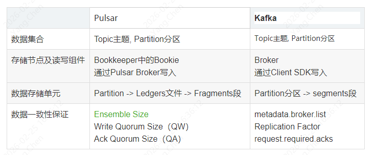
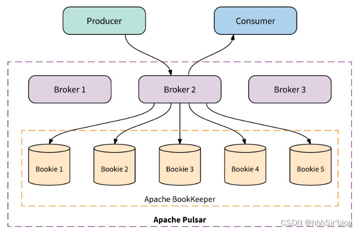
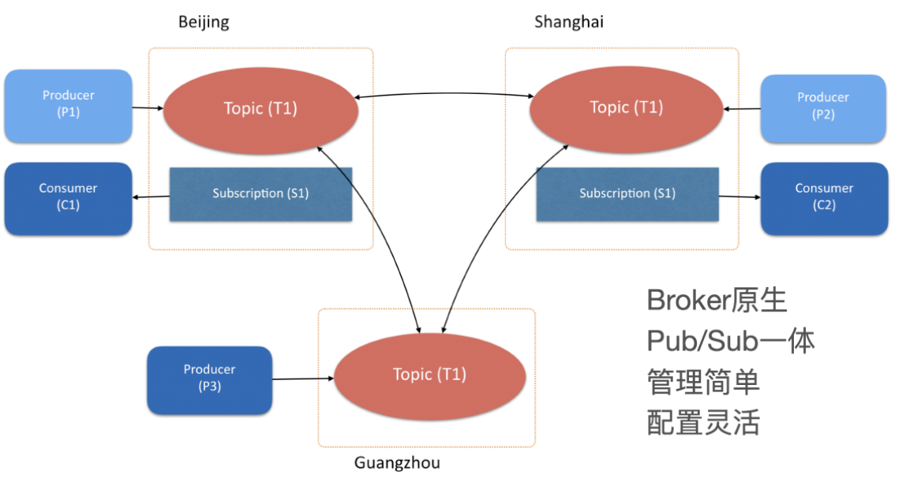

pulsar 是 Apache 的顶级项目， 定位为下一代云原生分布式消息流平台，集消息、存储、轻量化函数式计算为一体，采用计算与存储分离架构设计，支持多租户、持久化存储、多机房跨区域数据复制，具有强一致性、高吞吐、低延时及高可扩展性等流数据存储特性，被看作是云原生时代实时消息流传输、存储和计算最佳解决方案。Pulsar 是一个 pub-sub (发布-订阅)模型的消息队列系统。

**Ensemble Size：决定了每条消息在持久化存储中需要复制到多少个不同的节点上，以确保数据的可靠性和高可用性**

### **1、pulsar的组成**

* **Broker**：负责接收生产者的消息和路由消息给消费者，负责将消息路由到正确的topic，并将消息存储请求转发给后端存储系统（如 BookKeeper）。Broker 还提供负载均衡，确保消息的平滑传递和消费。
* **BookKeeper**：作为后端存储系统，负责持久化存储消息数据，将消息以日志的形式存储在多个书写器（Ledger）中，确保数据的持久性和高可用性。BookKeeper 提供副本机制，以提高数据的容错能力。
* **ZooKeeper**：分布式协调系统，用于集群的协调和管理，维护元数据和配置信息，确保各个组件之间的通信，负责 Broker 的注册和发现，管理主题、租户和命名空间的元数据，确保一致性和高可用性。
* **租户**（Tenants）：支持多租户架构，以便在同一集群中隔离不同用户的数据和资源，用于权限隔离。比如：一个公司下有几个项目（斗地主、麻将等游戏）
* **命名空间**（Namespaces）：用于组织主题，提供策略管理。
* **主题**（Topics）：消息的基本单位，用于组织和分类消息。
* **生产者**（Producers）：负责将消息发送到 Pulsar 主题的应用程序或服务。
* **消费者**（Consumers）：负责从 Pulsar 主题中读取和处理消息的应用程序或服务。

### **2、pulsar中一条消息从发布到消费的流程**
#### **2.1、消息发布**
* 创建生产者并连接：生产者（Producer）通过 Pulsar 客户端库与 Pulsar 集群中的 Broker 建立连接（获取zookeeper中可用的brokder列表）
* 指定要发送消息的Topic：向zookeeper检索查询主题、命名空间、租户的分区信息和配置信息
* 调用发送方法：生产者通过调用发送方法将消息发送到 Broker（生产者根据负载均衡策略选择一个可用的 Broker，将消息发送到该 Broker。）。
* Broker接收处理请求：Broker接收到来自生产者的消息发送请求，解析消息内容并确定其目标主题和分区。
#### **2.2、写入BookKeeper**
* 创建Ledger：如果主题是新的，Broker会在 BookKeeper 中创建一个新的 Ledger（书写器）来存储消息。
* 异步批量处理：Broker 可以将多个消息进行批量处理，会将消息异步写入到BookKeeper中，允许 Broker 在写入期间继续处理其他请求。
* 数据冗余：消息在 BookKeeper 中会被复制到多个节点，以确保高可用性和容错能力。
#### **2.3、消息确认与响应**
* 确认发送：一旦消息成功写入 BookKeeper，Broker 会向生产者返回确认响应，表明消息已持久化。
* 重试机制：如果写入失败，Broker 会进行重试，或者返回错误信息给生产者进行相应处理。
#### **2.4、消费者连接**
* 创建消费者建立连接：Consumer通过 Pulsar 客户端库与 Broker 建立连接（获取zookeeper中可用的brokder列表）。
* 订阅主题：消费者订阅特定的主题，Broker 会为该消费者创建相应的订阅信息。
#### **2.5、消息读取**
* 消息读取：在拉取模式下，消费者会发送请求到 Broker，Broker根据消费者的偏移量（Offset）从 BookKeeper 中读取相应的消息。
#### **2.4、消息处理**
* 解码与处理：Broker 将从BookKeeper 中读取到的原始消息进行解码，并将其发送到消费者。
#### **2.5、确认消费**
* 消费确认：消费者在成功处理消息后，会向Broker发送确认，Broker对这个偏移量进行维护和更新。
#### **2.6、错误处理与重试**
* 错误处理：如果消费者在处理消息时发生错误，可能会选择重试机制，根据业务逻辑决定是否重新消费该消息。
#### **2.7、关闭 Producer 和 Consumer**
* 释放资源：在完成消息的发布和消费后，生产者和消费者应当关闭连接，释放所有分配的资源。

### **3、pulsar的分层架构**

#### 3.1、分层架构图
<span style='color:red'>Pulsar采用“存储和服务分离”的两层架构（这是Pulsar区别于其他MQ系统最重要的一点，也是所谓的“下一代消息系统”的核心）。下图能够体现其存储和服务分离的特点。</span>

<span style='color:red'>3.2、分层架构的好处</span>
* 对于服务(计算)：也就是我们的broker,提供消息队列的读写,不存储任何数据，无状态对于我们扩展非常友好，只要机器足够，就能随便扩容。扩容Broker往往适用于增加Consumer的吞吐，当我们有一些大流量的业务或者活动，比如电商大促，可以提前进行broker的扩容。
* 对于存储：也就是我们的bookie,只提供消息队列的存储，如果对消息量有要求的，可以扩容bookie，并且我们不需要迁移数据，十分方便。

### **4、pulsar集群跨地区复制**

如图所示，有三个 Apache Pulsar 集群，分布于北京、上海和广州，用户创建的一个 Topic T1 设置了跨越三个数据中心做互备。在三个数据中心中，分别有三个生产者：P1、P2、P3，它们往主题 T1 中发布消息；有两个消费者：C1、C2，订阅了这个主题，接收主题中的消息。当消息由本数据中心的生产者发布成功后，会立即复制到其他两个数据中心。消息复制完成后，消费者不仅可以收到本数据中心产生的消息，也可以收到从其他数据中心复制过来。

问题：
```mysql
相比之下，Pulsar 的目标是简化运维和可扩展。根据 Pulsar 的性能，对以上问题，我们回复如下：
Q：要跟上业务增长的速度，扩展集群的操作是否迅速便捷？
A：Pulsar 有自动负载均衡的能力，集群中新增了计算和存储节点，可以自动、立即投入使用。这样 broker 之间可以迁移 topic 来平衡负载，新 bookie 节点可以立即接受新数据分片的写入流量，无需手动重新平衡或管理 broker。
Q：集群是否对多租户（对应于多团队、多用户）开箱可用？
A：Pulsar 采用分层架构，租户和命名空间能够与机构或团队形成良好的逻辑映射，Pulsar 通过这种相同的机构支持简易 ACL、配额、自主服务控制，同时也支持资源隔离，因此集群使用者可以轻松管理、共享集群。
Q：运维任务（如替换硬件）是否会影响业务的可用性与可靠性？
A：Pulsar 的 broker 是无状态的，替换操作简单，无需担心数据丢失。Bookie 节点会自动复制全部未复制的数据分片，而且用于解除和替换节点的工具为内置工具，很容易实现自动化。
Q：是否可以轻松复制数据以实现数据的地理冗余或不同的访问模式？
A：Pulsar 具有内置的复制功能，可用于无缝跨地域同步数据或复制数据到其他集群，以实现其他功能（如灾备、分析等）。
```