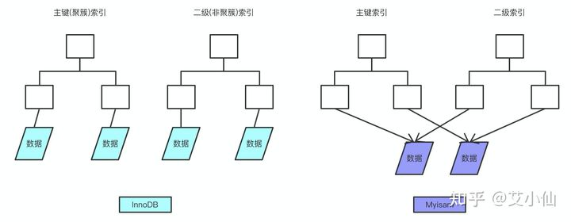
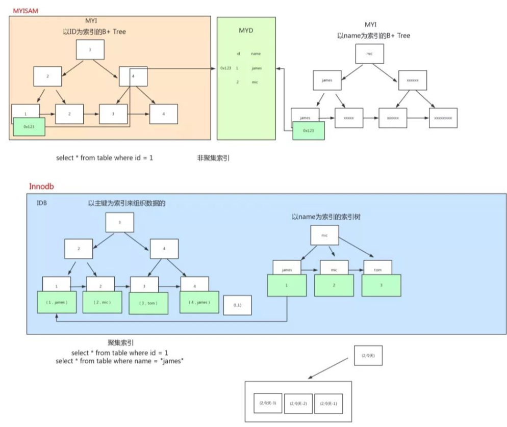

* **聚簇索引**：将数据存储与索引放到了一块，索引结构的叶子节点保存了行数据
* **非聚簇索引**：将数据与索引分开存储，索引结构的叶子节点指向了数据对应的位置

### **1、MyISAM的索引结构（非**聚簇索引）

myisam 存储会有两个文件，一个是索引文件，另外一个是数据文件，其中索引文件中的索引指向数据文件中的表数据

主键索引是不能有重复的, 索引下面的数据区保存的是innode(硬盘数据区的编号)。 找到索引对应的编号, 通过这个编号区数据区找到这个数据, 就把需要的数据返回给客户端。
普通索引的值是可以重复的, 其他和主键索引是一样的

### **2、InnoDB的索引结构**

主键索引是聚族索引，叶子节点包含也索引和数据

**非**聚簇索引(二级索引)叶子节点保存的是主键id值，这一点和myisam保存的是数据地址是不同的

### **3、为什么说MyISAM 查询快**

innodb在select时，维护的东西要比MyISAM引擎多很多：
* 数据块，innodb要缓存，MyISAM只缓存索引块，这中间还有换进换出的减少；
* innodb寻址要映射到块，再到行，MyISAM记录的直接是文件的OFFSET，定位比INNODB要快
* innodb还需要维护MVCC一致；虽然你的场景没有，但他还是需要去检查和维护MVCC多版本并发控制

