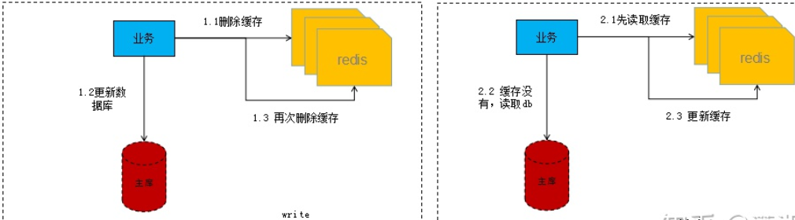
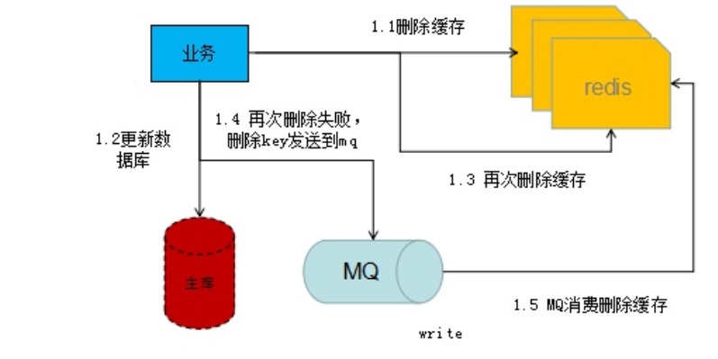
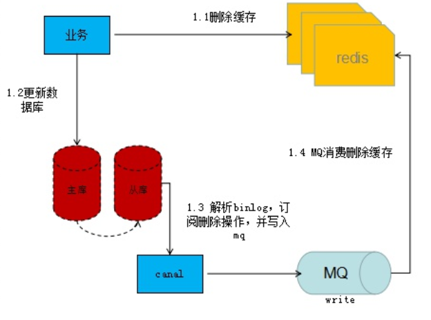
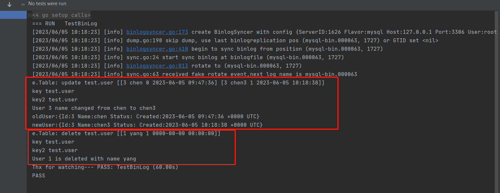
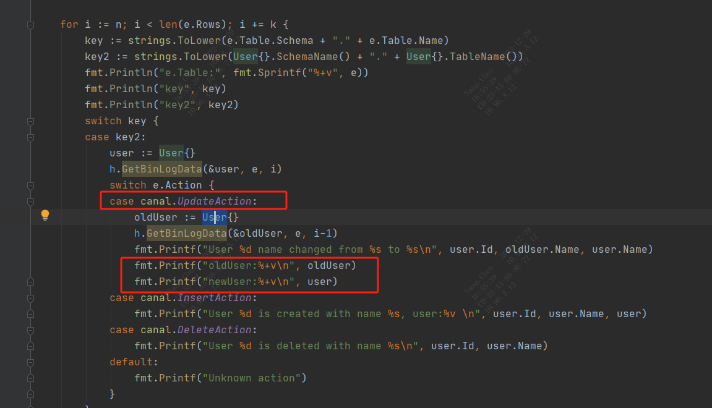

### **懒加载**

读取缓存步骤一般没有什么问题，但是一旦涉及到数据更新：数据库和缓存更新，就容易出现缓存和数据库间的数据一致性问题。不管是先写数据库，再删除缓存；还是先删除缓存，再写库，都有可能出现数据不一致的情况。举个例子：
1. 如果删除了缓存Redis，还没有来得及写库MySQL，另一个线程就来读取，发现缓存为空，则去数据库中读取数据写入缓存，此时缓存中为脏数据。
2. 如果先写了库，在删除缓存前，写库的线程宕机了，没有删除掉缓存，则也会出现数据不一致情况。
因为写和读是并发的，没法保证顺序,就会出现缓存和数据库的数据不一致的问题。如何解决？

综上，虑前后双删加**懒加载**模式。那么什么是**懒加载**？就是当业务读取数据的时候再从存储层加载的模式，而不是更新后主动刷新，它涉及的业务流程如下如所示：




### **延迟双删**

在写库前后都进行redis.del(key)操作，并且第二次删除通过延迟的方式进行。

<span style="color:red">方案①</span>（不严谨）具体步骤是：
1. 先删除缓存；
2. 再写数据库；
3. 休眠500毫秒（根据具体的业务时间来定）；
4. 再次删除缓存。

那么，这个500毫秒怎么确定的，具体该休眠多久呢？根据程序而定

<span style="color:red">方案②</span>，异步延迟删除：
1. 先删除缓存；
2. 再写数据库；
3. 触发异步写入串行化mq（也可以采取一种key+version的分布式锁）；
4. mq接受再次删除缓存。

异步删除对线上业务无影响，串行化处理保障并发情况下正确删除。

### **<span style="color:red">为什么要双删？</span>**

db更新分为两个阶段，更新前及更新后，更新前的删除很容易理解，在db更新的过程中由于读取的操作存在并发可能，会出现缓存重新写入数据，这时就需要更新后的删除。

### **双删失败如何处理？**
1. 设置缓存过期时间
2. 重试方案

重试方案有两种实现，一种在业务层做，另外一种实现中间件负责处理。

<span style="color:red">方案①</span>：业务层实现（<span style="color:red">缺点</span>：入侵业务代码）
1. 更新数据库数据；
2. 缓存因为种种问题删除失败；
3. 将需要删除的key发送至消息队列；
4. 自己消费消息，获得需要删除的key；
5. 继续重试删除操作，直到成功。



<span style="color:red">方案②</span>：**<span style="color:red">中间件监听binlog实现（推荐）</span>**

启动一个订阅程序去订阅数据库的binlog，获得mysql变更的行数据。写入变更行的mq数据，再启动mq消费者消费相应的数据，进行删除缓存操作。



流程说明：
1. 更新数据库数据（写入binlog日志）；
2. 订阅程序提取出所需要的数据以及key，尝试删除缓存操作，并将这些信息发送至消息队列MQ；
3. 读取MQ中的队列信息，重试操作。

基于go监听binlog例子

go语言基于canal监听mysql binlog实现mysql与redis数据一致性（**<span style="color:red">推荐上图<span style="color:red">方案②</span></span>**）

```
show variables like '%log_bin%';

Variable_name                    Value   
-------------------------------  --------
log_bin                          ON      
log_bin_trust_function_creators  OFF     
sql_log_bin                      ON      

[mysqld] 
# 启用二进制日志 
log-bin=mysql-bin 
# 主服务器唯一ID，可以使用主机IP地址的最后一个域值来作为MySQL集群中的serverid，5.7版本之后，在启用binlog的时候，这个参数也需要一并指定。否则启动MySQL服务失败。 
server-id=100 

# 设置binlog日志的格式 
binlog_format=row   #之前设置的是mixed监听不成功
binlog_row_image=minimal

修改完之后重启mysql
service mysql restart
======================================================================================================================

func TestBinLog(t *testing.T) {
   go binLogListener() //
   // placeholder for your handsome code
   // placeholder for your handsome code
   time.Sleep(1 * time.Minute) //只监听1分钟， 若长时间监听则binLogListener() 主进程处理
   fmt.Print("Thx for watching")
}
type User struct {
   Id      int       `gorm:"column:id"`
   Name    string    `gorm:"column:name"`
   Status  string    `gorm:"column:status"`
   Created time.Time `gorm:"column:created"`
}
// 表名，大小写不敏感
func (User) TableName() string {
   return "User"
}
// 数据库名称，大小写不敏感
func (User) SchemaName() string {
   return "Test"
}
func binLogListener() {
   c, err := getDefaultCanal()
   if err == nil {
      coords, err := c.GetMasterPos()
      if err == nil {
         c.SetEventHandler(&binlogHandler{})
         c.RunFrom(coords)
      }
   }
}
func getDefaultCanal() (*canal.Canal, error) {
   cfg := canal.NewDefaultConfig()
   cfg.Addr = fmt.Sprintf("%s:%d", "127.0.0.1", 3306)
   cfg.User = "root"
   cfg.Password = "123456"
   cfg.Flavor = "mysql"
   cfg.Dump.ExecutionPath = ""
   return canal.NewCanal(cfg)
}
type binlogHandler struct {
   canal.DummyEventHandler // Dummy handler from external lib
   BinlogParser // Our custom helper
}
func (h *binlogHandler) OnRow(e *canal.RowsEvent) error {
   defer func() {
      if r := recover(); r != nil {
         fmt.Print(r, " ", string(debug.Stack()))
      }
   }()

   // base value for canal.DeleteAction or canal.InsertAction
   var n = 0
   var k = 1

   if e.Action == canal.UpdateAction {
      n = 1
      k = 2
   }

   for i := n; i < len(e.Rows); i += k {
      key := strings.ToLower(e.Table.Schema + "." + e.Table.Name)
      key2 := strings.ToLower(User{}.SchemaName() + "." + User{}.TableName())
      fmt.Println("e.Table:", fmt.Sprintf("%+v", e))
      fmt.Println("key", key)
      fmt.Println("key2", key2)
      switch key {
      case key2:
         user := User{}
         h.GetBinLogData(&user, e, i)
         switch e.Action {
         case canal.UpdateAction:
            oldUser := User{}
            h.GetBinLogData(&oldUser, e, i-1)
            fmt.Printf("User %d name changed from %s to %s\n", user.Id, oldUser.Name, user.Name)
            fmt.Printf("oldUser:%+v\n", oldUser)
            fmt.Printf("newUser:%+v\n", user)
         case canal.InsertAction:
            fmt.Printf("User %d is created with name %s, user:%v \n", user.Id, user.Name, user)
         case canal.DeleteAction:
            fmt.Printf("User %d is deleted with name %s\n", user.Id, user.Name)
         default:
            fmt.Printf("Unknown action")
         }
      }
   }
   return nil
}

func (h *binlogHandler) String() string {
   return "binlogHandler"
}


type BinlogParser struct{}
func (m *BinlogParser) GetBinLogData(element interface{}, e *canal.RowsEvent, n int) error {
   var columnName string
   var ok bool
   v := reflect.ValueOf(element)
   s := reflect.Indirect(v)
   t := s.Type()
   num := t.NumField()
   for k := 0; k < num; k++ {
      parsedTag := parseTagSetting(t.Field(k).Tag)
      name := s.Field(k).Type().Name()

      if columnName, ok = parsedTag["COLUMN"]; !ok || columnName == "COLUMN" {
         continue
      }

      switch name {
      case "bool":
         s.Field(k).SetBool(m.boolHelper(e, n, columnName))
      case "int":
         s.Field(k).SetInt(m.intHelper(e, n, columnName))
      case "string":
         s.Field(k).SetString(m.stringHelper(e, n, columnName))
      case "Time":
         timeVal := m.dateTimeHelper(e, n, columnName)
         s.Field(k).Set(reflect.ValueOf(timeVal))
      case "float64":
         s.Field(k).SetFloat(m.floatHelper(e, n, columnName))
      default:
         if _, ok := parsedTag["FROMJSON"]; ok {
            newObject := reflect.New(s.Field(k).Type()).Interface()
            json := m.stringHelper(e, n, columnName)
            jsoniter.Unmarshal([]byte(json), &newObject)
            s.Field(k).Set(reflect.ValueOf(newObject).Elem().Convert(s.Field(k).Type()))
         }
      }
   }
   return nil
}
func (m *BinlogParser) dateTimeHelper(e *canal.RowsEvent, n int, columnName string) time.Time {
   columnId := m.getBinlogIdByName(e, columnName)
   if e.Table.Columns[columnId].Type != schema.TYPE_TIMESTAMP {
      panic("Not dateTime type")
   }
   t, _ := time.Parse("2006-01-02 15:04:05", e.Rows[n][columnId].(string))
   return t
}
func (m *BinlogParser) intHelper(e *canal.RowsEvent, n int, columnName string) int64 {
   columnId := m.getBinlogIdByName(e, columnName)
   if e.Table.Columns[columnId].Type != schema.TYPE_NUMBER {
      return 0
   }
   switch e.Rows[n][columnId].(type) {
   case int8:
      return int64(e.Rows[n][columnId].(int8))
   case int32:
      return int64(e.Rows[n][columnId].(int32))
   case int64:
      return e.Rows[n][columnId].(int64)
   case int:
      return int64(e.Rows[n][columnId].(int))
   case uint8:
      return int64(e.Rows[n][columnId].(uint8))
   case uint16:
      return int64(e.Rows[n][columnId].(uint16))
   case uint32:
      return int64(e.Rows[n][columnId].(uint32))
   case uint64:
      return int64(e.Rows[n][columnId].(uint64))
   case uint:
      return int64(e.Rows[n][columnId].(uint))
   }
   return 0
}

func (m *BinlogParser) floatHelper(e *canal.RowsEvent, n int, columnName string) float64 {
   columnId := m.getBinlogIdByName(e, columnName)
   if e.Table.Columns[columnId].Type != schema.TYPE_FLOAT {
      panic("Not float type")
   }
   switch e.Rows[n][columnId].(type) {
   case float32:
      return float64(e.Rows[n][columnId].(float32))
   case float64:
      return float64(e.Rows[n][columnId].(float64))
   }
   return float64(0)
}

func (m *BinlogParser) boolHelper(e *canal.RowsEvent, n int, columnName string) bool {
   val := m.intHelper(e, n, columnName)
   if val == 1 {
      return true
   }
   return false
}

func (m *BinlogParser) stringHelper(e *canal.RowsEvent, n int, columnName string) string {
   columnId := m.getBinlogIdByName(e, columnName)
   if e.Table.Columns[columnId].Type == schema.TYPE_ENUM {
      values := e.Table.Columns[columnId].EnumValues
      if len(values) == 0 {
         return ""
      }
      if e.Rows[n][columnId] == nil {
         //Если в енум лежит нуул ставим пустую строку
         return ""
      }


      return values[e.Rows[n][columnId].(int64)-1]
   }


   value := e.Rows[n][columnId]


   switch value := value.(type) {
   case []byte:
      return string(value)
   case string:
      return value
   }
   return ""
}


func (m *BinlogParser) getBinlogIdByName(e *canal.RowsEvent, name string) int {
   for id, value := range e.Table.Columns {
      if value.Name == name {
         return id
      }
   }
   panic(fmt.Sprintf("There is no column %s in table %s.%s", name, e.Table.Schema, e.Table.Name))
}
func parseTagSetting(tags reflect.StructTag) map[string]string {
   settings := map[string]string{}
   for _, str := range []string{tags.Get("sql"), tags.Get("gorm")} {
      tags := strings.Split(str, ";")
      for _, value := range tags {
         v := strings.Split(value, ":")
         k := strings.TrimSpace(strings.ToUpper(v[0]))
         if len(v) >= 2 {
            settings[k] = strings.Join(v[1:], ":")
         } else {
            settings[k] = k
         }
      }
   }
   return settings
}
```

下图是实行修改数据表的数据和删除一条数据后，监听binlog日志得到的响应：可以根据实际需求实现redis和mysql一致性





