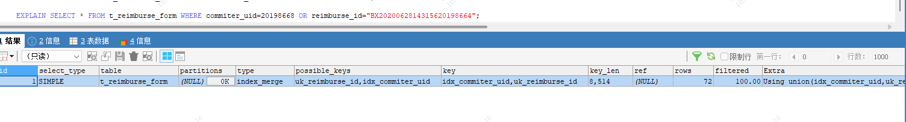
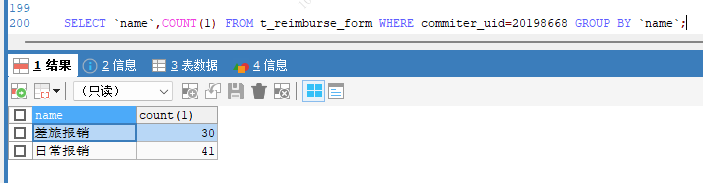
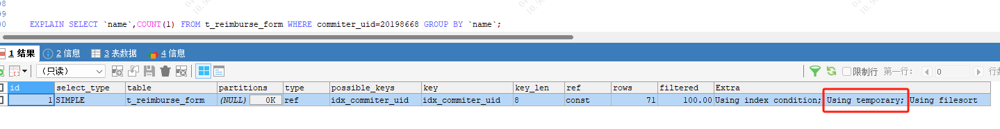

### **一、explain结果中的type字段代表什么意思？找到所需数据使用的扫描方式**

最为常见的扫描方式有：
* system：系统表，少量数据，往往不需要进行磁盘IO；
* const：常量连接；
* eq_ref：主键索引(primary key)或者非空唯一索引(unique not null)等值扫描；
* ref：非主键非唯一索引（即**普通索引**）等值扫描；
* range：范围扫描；
* index：索引树扫描；
* ALL：全表扫描(full table scan)；

**<span style='color:red'>各类扫描方式由快到慢： system > const > eq_ref > ref > range > index > ALL</span>**

#### **1、system扫描方式**

```mysql
explain select * from mysql.time_zone;
explain select * from (select * from user where id=1) tmp;
//内层嵌套(const)返回了一个临时表，外层嵌套从临时表查询，其扫描类型也是system，也不需要走磁盘IO，速度超快。
```

上例中，从系统库mysql的系统表time_zone里查询数据，扫码类型为system，这些数据已经加载到内存里，不需要进行磁盘IO。这类扫描是速度最快的。

#### **2、const**

扫描的条件为：
* 命中**主键**(primary key)或者**唯一**(unique)索引；
* 被连接的部分是一个常量(const)值；

```mysql
explain select * from user where id=1; //id是PK，连接部分是常量1。
```

#### **3、 eq_ref**

扫描的条件：对于前表的每一行(row)，后表只有一行被扫描。细化如下：
* join查询；
* 命中**主键**(primary key)或者非空唯一(unique not null)索引；
* 等值连接；

```mysql
explain select * from user,user_ex where user.id=user_ex.id;
explain select * from user where id=1;
//表user，与表user_ex的id都是主键
```

#### **4、ref**

扫描的条件：对于前表的每一行(row)，后表可能有多于一行的数据被扫描

```mysql
explain select * from user,user_ex where user.id=user_ex.id;
explain select * from user where id=1;
//表user，与表user_ex的id都是普通索引
//当id改为普通非唯一索引后，常量的连接查询，也由const降级为了ref，因为也可能有多于一行的数据被扫描。
```

#### **5、range**

扫描的条件：在索引中进行范围扫描

```mysql
explain select * from user where id between 1 and 4;
explain select * from user where id in(1,2,3);
explain select * from user where id > 3;
//上例中的between，in，>都是典型的范围(range)查询。
```

#### **6、index**

扫描条件：扫描索引上的全部数据

```mysql
explain count (*) from user;
//id是主键，该count查询需要通过扫描索引上的全部数据来计数。  它仅比全表扫描快一点
```

#### **7、ALL**

扫描条件：对于前表的每一行(row)，后表都要被全表扫描。

```mysql
explain select * from user,user_ex where user.id=user_ex.id;
//如果id上不建索引，对于前表的每一行(row)，后表都要被全表扫描。
```

### **二、不使用索引的情况**

#### **1、如果MySQL估计使用索引比全表扫描更慢，则不使用索引。**

<span style='color:red'>例如，如果列key均匀分布在1和100之间，下面的查询使用索引就不是很好：select * from table_name where key>1 and key<90;</span>

#### **2、OR 条件中的列只要有一列不是索引，就不会使用索引**

```mysql
EXPLAIN SELECT * FROM `t_reimburse_form` WHERE  pay_uid=111111 OR reimburse_id="BX202111190000031" ;
// pay_uid不是索引， reimburse_id是索引
```

#### **3、没有查询条件，或者查询条件没有建立索引在业务数据库中，特别是数据量比较大的表。**

* 建议换成有索引的列作为查询条件
* 建议或者将查询频繁的列建立索引

#### **4、查询结果集是原表中的大部分数据，应该是25％以上（查询的结果集，超过了总数行数25%，优化器觉得就没有必要走索引了）**

* 建议如果业务允许，可以使用limit控制。
* 建议结合业务判断，有没有更好的方式。如果没有更好的改写方案
* 建议尽量不要在mysql存放这个数据了。放到redis里面。

#### **5、索引本身失效，统计数据不真实（索引有自我维护的能力，对于表内容变化比较频繁的情况下，有可能会出现索引失效）**

* 建议备份表数据，删除重建相关表。

#### **6、查询条件使用函数在索引列上，或者对索引列进行运算，运算包括(+，-，*，/，! 等)**

* 建议减少在mysql中使用加减乘除等计算运算。

#### **7、隐式转换导致索引失效.这一点应当引起重视.也是开发中经常会犯的错误.**

```mysql
索引建立的字段为varchar();
select * from stu where name = '111'；走索引
select * from stu where name = 111；不走索引
索引建立的字段为int;
select * from stu where uid= '111'；走索引
select * from stu where uid= 111；走索引
```

* 建议与研发协商，语句查询符合规范。

#### **6、<> ，not in 不走索引（辅助索引）**

* 建议尽量不要用以上方式进行查询，或者选择有索引列为筛选条件。
* 建议单独的>,<,in 有可能走，也有可能不走，和结果集有关，尽量结合业务添加limit
* 建议or或in 尽量改成union

#### **7、like "%" 百分号在最前面不走**

```mysql
EXPLAIN SELECT * FROM teltab WHERE telnum LIKE '31%' 走索引
EXPLAIN SELECT * FROM teltab WHERE telnum LIKE '%110' 不走索引
```

* 建议%linux%类的搜索需求，可以使用elasticsearch+mongodb 专门做搜索服务的数据库产品

### **三、key_len字段**

定义：索引使用的字节数，反映索引列的利用率

计算规则：
* INT类型：4字节。
* bigint类型：8字节
* VARCHAR(100)（UTF8mb3）：3 * 100 + 2 = 302字节。
* **varchar**(128)[utf8mb4]: 128 * 4 + 2 = 514字节
* 允许NULL时额外加1字节。


### **四、rows & filtered**

含义：
* rows：预估扫描的行数。
* filtered：过滤后剩余行的百分比。

### **五、Extra字段**

#### **1、Using index**

* 含义：通过**覆盖索引**（Covering Index）直接获取数据，无需回表。
* 场景：查询字段全部包含在索引中。

```mysql
EXPLAIN SELECT user_id FROM orders WHERE order_id = 100;  -- 若 (user_id, order_id) 是联合索引
```

#### **2、Using index condition**

* 含义：启用**索引条件下推**（ICP），在索引扫描阶段过滤部分条件。
* 场景：查询条件仅部分匹配索引。

```mysql
1. 索引类型限制【主要是联合索引】
仅适用于二级索引：InnoDB 的聚簇索引（主键索引）不适用 ICP，因为聚簇索引的数据已加载到内存中，无需通过 ICP 减少 I/O
2. 查询条件限制
条件必须涉及索引字段：查询条件中的过滤字段需包含在索引中（无论是单列或联合索引）。
不支持复杂操作：子查询、存储过程、触发器等条件无法下推 。

CREATE TABLE products (
    id INT PRIMARY KEY,
    category VARCHAR(50),
    price DECIMAL(10,2),
    name VARCHAR(100),
    stock INT,
    INDEX idx_cat_price_name(category, price, name)
);
SELECT * FROM products WHERE category = 'electronics' AND price BETWEEN 1000 AND 5000 AND name LIKE '%phone%';
#在索引扫描阶段直接过滤 category + price + name，仅回表符合条件的记录，减少 I/O 压力
CREATE TABLE users (
    id INT PRIMARY KEY,
    name VARCHAR(50),
    age INT,
    is_active TINYINT(1),
    INDEX idx_name_age(name, age)
);
SELECT * FROM users WHERE name LIKE '王%'  AND age BETWEEN 25 AND 35  AND is_active = 1;
#在索引中直接过滤 name + age，减少回表次数，即使 is_active 需回表后处理，整体效率仍提升 30%+
```

#### **3、Using filesort**

含义：需外部文件排序，而非通过索引直接获取有序结果

```mysql
EXPLAIN SELECT * FROM users ORDER BY create_time;  -- create_time 无索引
```

#### **4、Using temporary**

<span style='color:red'>含义：需创建临时表存储中间结果，常见于复杂GROUP BY或ORDER BY。</span>


