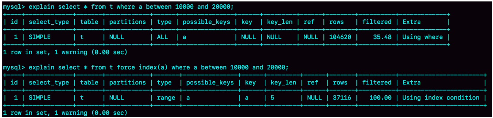
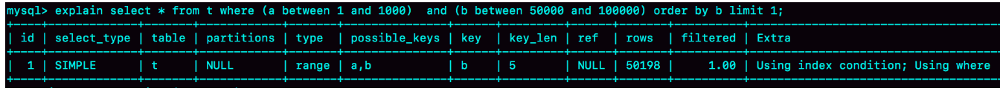
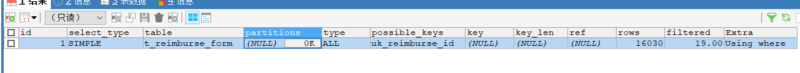
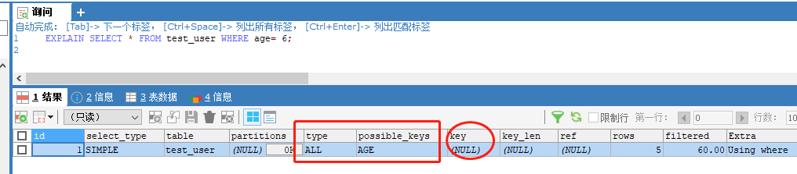
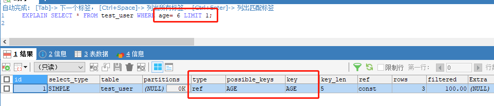
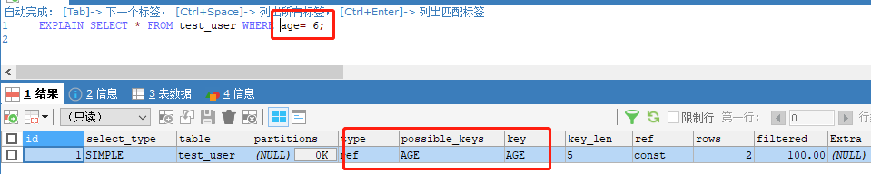

### **一、mysql选错索引**

#### **1、选择索引是优化器的工作**

优化器选择索引的目的，是找到一个最优的执行方案，并用最小的代价去执行语句。在数据库里面，扫描行数是影响执行代价的因素之一。扫描的行数越少，意味着访问磁盘数据的次数越少，消耗的CPU资源越少。

**<span style='color:red'>当然，扫描行数并不是唯一的判断标准，优化器还��结合是否使用临时表、是否排序、是否回表查询等因素进行综合判断</span>**

#### **2、扫描行数如何判断**

一个索引上不同的值越多，这个索引的区分度就越好。而一个索引上不同的值的个数，我们称之为"基数"（cardinality）。也就是说，这个基数越大，索引的区分度越好

**<span style='color:red'>MySQL是通过采样统计得到索引的基数的呢？InnoDB默认会选择N个数据页，统计这些页面上的不同值，得到一个平均值，然后乘以这个索引的页面数，就得到了这个索引的基数。而数据表是会持续更新的，索引统计信息也不会固定不变。所以，当变更的数据行数超过1/M的时候，会自动触发重新做一次索引统计。</span>**

```mysql
CREATE TABLE `t` (
`id` int(11) NOT NULL,
`a` int(11) DEFAULT NULL,
`b` int(11) DEFAULT NULL,
PRIMARY KEY (`id`),
KEY `a` (`a`),
KEY `b` (`b`)
) ENGINE=InnoDB；//建表并自增插入数据
```

图中a为普通索引（表中有10条数据1-100000）

Q1的结果还是符合预期的，rows的值是104620；但是Q2的rows值是37116，偏差就大了。而图1中我们用explain命令看到的rows是只有10001行，是这个偏差误导了优化器的判断。

* <span style='color:red'>扫描行数为什么会不准？</span>因为在RR级别（多版本并发控制mvcc），经过增删后，同一条数据可能会存在多个版本，这个也算在行数上
* <span style='color:red'>为什么mysq使用了全表扫描？</span>如果使用索引a，每次从索引a上拿到一个值，都要回到主键索引上查出整行数据，这个代价优化器也要算进去的。而如果选择扫描10万行，是直接在主键索引上扫描的，没有额外的代价。 优化器认为直接扫描主键索引更快

例子：

```mysql
mysql> explain select * from t where (a between 1 and 1000) and (b between 50000 and 100000) order by b limit 1;
#如果使用索引a进行查询，那么就是扫描索引a的前1000个值，然后取到对应的id，再到主键索引上去查出每一行，然后根据字段b来过滤。显然这样需要扫描1000行。
#如果使用索引b进行查询，那么就是扫描索引b的最后50001个值，与上面的执行过程相同，也是需要回到主键索引上取值再判断，所以需要扫描50001行。
#但是，结果如下：优化器选择使用索引b，是因为它认为使用索引b可以避免排序（b本身是索引，已经是有序的了，如果选择索引b的话，不需要再做排序，只需要遍历），所以即使扫描行数多，也判定为代价更小。
```


**解决方案：**

#### **1、强制使用索引force index(a)**

```mysql
explain select * from t force index(a) where (a between 1 and 1000) and (b between 50000 and 100000) order by b limit 1;
```

#### **2、考虑修改语句，引导MySQL使用我们期望的索引(使用b和a排序，2个都是索引，就使用扫描行数少的a)**

```mysql
explain select * from t where (a between 1 and 1000) and (b between 50000 and 100000) order by b,a limit 1;
```

### **二、不使用索引的情况**

#### **1、如果MySQL估计使用索引比全表扫描更慢，则不使用索引。**

<span style='color:red'>例如，如果列key均匀分布在1和100之间，下面的查询使用索引就不是很好：select * from table_name where key>1 and key<90;</span>

#### **2、OR 条件中的列只要有一列不是索引，就不会使用索引**

```mysql
EXPLAIN SELECT * FROM `t_reimburse_form` WHERE  pay_uid=111111 OR reimburse_id="BX202111190000031" ;
// pay_uid不是索引， reimburse_id是索引
```


#### **3、没有查询条件，或者查询条件没有建立索引在业务数据库中，特别是数据量比较大的表。**

* 建议换成有索引的列作为查询条件
* 建议或者将查询频繁的列建立索引

#### **4、查询结果集是原表中的大部分数据，应该是25％以上（查询的结果集，超过了总数行数25%，优化器觉得就没有必要走索引了）**

* 建议如果业务允许，可以使用limit控制。
* 建议结合业务判断，有没有更好的方式。如果没有更好的改写方案
* 建议尽量不要在mysql存放这个数据了。放到redis里面。

```mysql
CREATE TABLE `test_user` (
  `ID` int(11) NOT NULL AUTO_INCREMENT,
  `USER_ID` int(11) DEFAULT NULL COMMENT '用户账号',
  `USER_NAME` varchar(255) DEFAULT NULL COMMENT '用户名',
  `AGE` int(5) DEFAULT NULL COMMENT '年龄',
  `COMMENT` varchar(255) DEFAULT NULL COMMENT '简介',
  PRIMARY KEY (`ID`),
  UNIQUE KEY `UNIQUE_USER_ID` (`USER_ID`) USING BTREE,
  KEY `AGE` (`AGE`)
) ENGINE=InnoDB AUTO_INCREMENT=6 DEFAULT CHARSET=utf8;
//表中有一下数据
ID    USER_ID    USER_NAME    AGE    COMMENT
1        111       23         6        是大V
2        222       aefa       6        湖广会馆
3        33        犯桃花     6        一样
4        44        444        4        44
5        55        555        5        55
```




可见相同的数据增加了limit 1使得查询结果集没有超过25%，就使用了索引。

为了区分对比：

#### **1、 EXPLAIN SELECT * FROM test_user WHERE age= 6; //因为age=6的数据有3条，总行数是5条查询60%的结果集**

#### **2、现在把其中一个age的值改成其他值:**

```mysql
//表中有一下数据
ID    USER_ID    USER_NAME    AGE    COMMENT
1        111       23         6        是大V
2        222       aefa       6        湖广会馆
3        33        犯桃花      7        一样
4        44        444        4        44
5        55        555        5        55
继续执行查询sql：EXPLAIN SELECT * FROM test_user WHERE age= 6;
```

#### **5、索引本身失效，统计数据不真实（索引有自我维护的能力，对于表内容变化比较频繁的情况下，有可能会出现索引失效）**

* 建议备份表数据，删除重建相关表。

#### **6、查询条件使用函数在索引列上，或者对索引列进行运算，运算包括(+，-，*，/，! 等)**

* 建议减少在mysql中使用加减乘除等计算运算。

#### **7、隐式转换导致索引失效.这一点应当引起重视.也是开发中经常会犯的错误.**

```mysql
> select "10" > 9
```

以上的查询语句为1（即true），表示msyql在字符串和数字比较时，是把字符串转换成数字的

```mysql
select * from tracelog where traceid = 10039;//traceid 为varchar（32）类型，这个sql没有使用到索引，因为隐式转换
```

即：`select * from tracelog where CAST(traceid AS signed int) = 10039;`//即符合条件1，在字段上做函数操作

```mysql
索引建立的字段为varchar();
select * from stu where name = '111'；走索引
select * from stu where name = 111；不走索引
索引建立的字段为int;
select * from stu where uid= '111'；走索引
select * from stu where uid= 111；走索引
```

* 建议与研发协商，语句查询符合规范。

#### **6、<> ，not in 不走索引（辅助索引）**

* 建议尽量不要用以上方式进行查询，或者选择有索引列为筛选条件。
* 建议单独的>,<,in 有可能走，也有可能不走，和结果集有关，尽量结合业务添加limit
* 建议or或in 尽量改成union

#### **7、like "%" 百分号在最前面不走**

```mysql
EXPLAIN SELECT * FROM teltab WHERE telnum LIKE '31%' 走索引
EXPLAIN SELECT * FROM teltab WHERE telnum LIKE '%110' 不走索引
```

* 建议%linux%类的搜索需求，可以使用elasticsearch+mongodb 专门做搜索服务的数据库产品

#### **8、隐式字符编码转换**

```mysql
mysql> CREATE TABLE `tradelog` (
  `id` int(11) NOT NULL,
  `tradeid` varchar(32) DEFAULT NULL,
  `operator` int(11) DEFAULT NULL,
  `t_modified` datetime DEFAULT NULL,
  PRIMARY KEY (`id`),
  KEY `tradeid` (`tradeid`),
  KEY `t_modified` (`t_modified`)
) ENGINE=InnoDB DEFAULT CHARSET=utf8mb4;

mysql> CREATE TABLE `trade_detail` (
  `id` int(11) NOT NULL,
  `tradeid` varchar(32) DEFAULT NULL,
  `trade_step` int(11) DEFAULT NULL, /*操作步骤*/
  `step_info` varchar(32) DEFAULT NULL, /*步骤信息*/
  PRIMARY KEY (`id`),
  KEY `tradeid` (`tradeid`)
) ENGINE=InnoDB DEFAULT CHARSET=utf8;

insert into tradelog values(1, 'aaaaaaaa', 1000, now());
insert into tradelog values(2, 'aaaaaaab', 1000, now());
insert into tradelog values(3, 'aaaaaaac', 1000, now());
insert into trade_detail values(1, 'aaaaaaaa', 1, 'add');
insert into trade_detail values(2, 'aaaaaaaa', 2, 'update');
insert into trade_detail values(3, 'aaaaaaaa', 3, 'commit');
insert into trade_detail values(4, 'aaaaaaab', 1, 'add');
insert into trade_detail values(5, 'aaaaaaab', 2, 'update');
insert into trade_detail values(6, 'aaaaaaab', 3, 'update again');

mysql> select d.* from tradelog l, trade_detail d where d.tradeid=l.tradeid and l.id=2; /*语句Q1*/
//此语句会适用不了索引，原因是两个表的字符编码不一致
```
