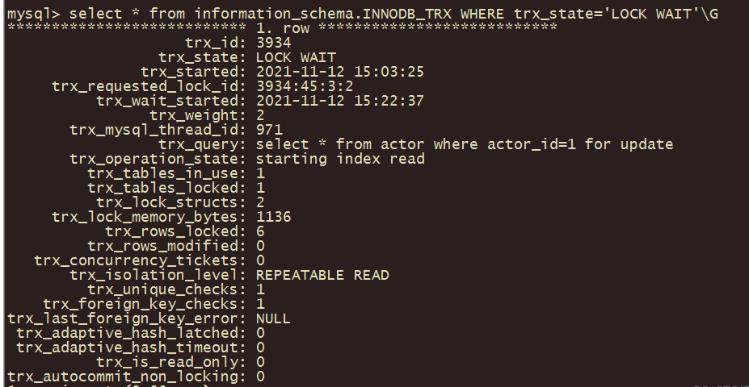
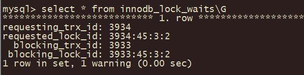
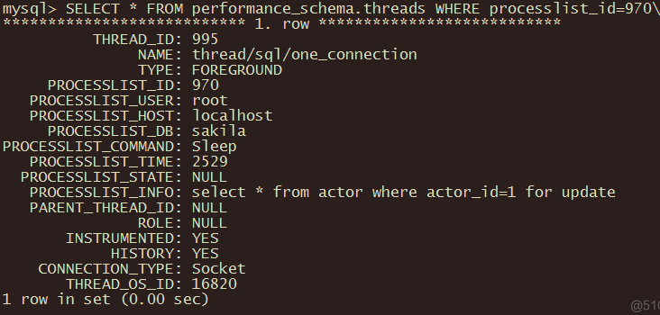

### **一、mysql排查锁问题**

#### **1、查看当前有无锁等待**

```mysql
SHOW STATUS LIKE 'innodb_row_lock%';#查看当前有无锁等待
```

#### **2、查看事务表（查看哪个事务在等待）**

```mysql
SELECT * FROM information_schema.INNODB_TRX where trx_state="LOCK WAIT";##查看当前运行中的事务（看看有没有所等待的，即：INNODB_TRX表的trx_state字段值为"LOCK WAIT"）及运行中的mysql进程id:trx_mysql_thread_id
SELECT * FROM information_schema.innodb_lock_waits;#查看锁等待的表，事务id：3934在等待事务id：3933
```





#### **3、根据trx_mysql_thread_id查到thread_id**

```mysql
分别查看事务id：3934和3933的trx_mysql_thread_id、thread_id
SELECT * FROM performance_schema.threads WHERE processlist_id=971;##查看进程processlist_id、线程thead_id
```

#### **4、根据thread_id，查询当前锁源的sql**

```mysql
SELECT * FROM performance_schema.events_statements_current WHERE processlist_id=970;##根据thread_id，查询当前锁源的sql
```


