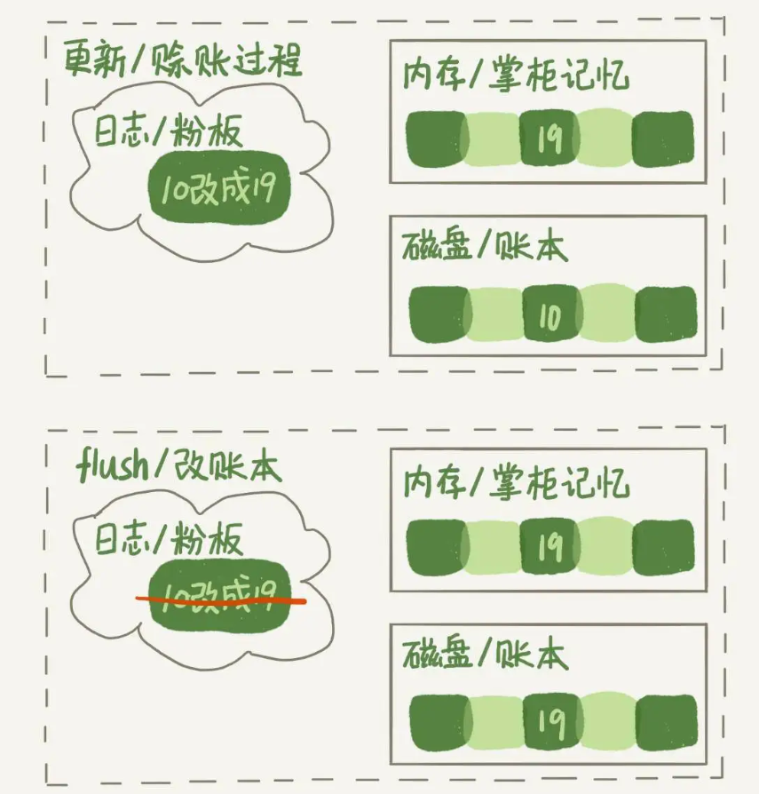
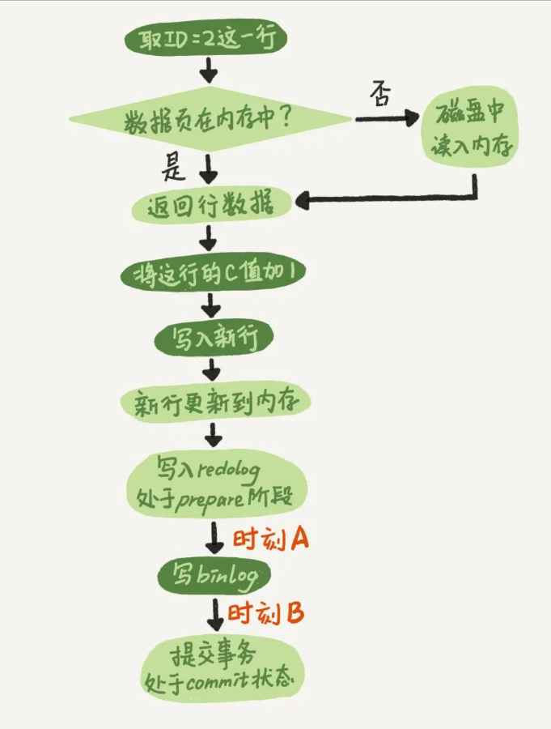

### **一、Mysql刷脏和数据恢复**

#### **1、脏页和干净页**

当内存中的数据页跟磁盘数据页内容不一致的时候，我们称这个内存页为"脏页"。内存数据写入到磁盘后，内存和磁盘上的数据页的内容就一致了，称为"干净页"。

InnoDB用缓冲池（buffer pool）管理内存，缓冲池中的内存页有三种状态：

* 第一种是，还没有使用的；
* 第二种是，使用了并且是干净页；
* 第三种是，使用了并且是脏页。

假设原来某人欠账10文，这次又要赊9文

#### **2、需要刷脏的场景**

* redo log写满了，要flush脏页。需要尽量避免的。因为出现这种情况的时候，整个系统就不能再接受更新了，所有的更新都必须堵住。如果从监控上看，这时候更新数会跌为0。
* 内存不够用了，要先将脏页写到磁盘，这种情况其实是常态。需要淘汰旧的数据页（干净页，若是脏页，则需要把该数据页的数据更新到磁盘）
* MySQL空闲时
* 数据库要关闭时，刷脏统一数据

InnoDB的策略是尽量使用内存，因此对于一个长时间运行的库来说，未被使用的页面很少。而当要读入的数据页没有在内存的时候，就必须到缓冲池中申请一个数据页。这时候只能把最久不使用的数据页从内存中淘汰掉：如果要淘汰的是一个干净页，就直接释放出来复用；但如果是脏页呢，就必须将脏页先刷到磁盘，变成干净页后才能复用。

所以，刷脏页虽然是常态，但是出现以下这两种情况，都是会明显影响性能的：

* 一个查询要淘汰的脏页个数太多，会导致查询的响应时间明显变长；
* 日志写满，更新全部堵住，写性能跌为0，这种情况对敏感业务来说，是不能接受的。

#### **3、 在两阶段提交的不同瞬间，MySQL如果发生异常重启，是怎么保证数据完整性的？**

如果在图中时刻A的地方，也就是写入redo log 处于prepare阶段之后、写binlog之前，发生了崩溃（crash），由于此时binlog还没写，redo log也还没提交，所以崩溃恢复的时候，这个事务会回滚。这时候，binlog还没写，所以也不会传到从库

大家出现问题的地方，主要集中在时刻B，也就是binlog写完，redo log还没commit前发生crash，那崩溃恢复的时候MySQL会怎么处理？

我们先来看一下崩溃恢复时的判断规则。

1. 如果redo log里面的事务是完整的，也就是已经有了commit标识，则直接提交；

2. 如果redo log里面的事务只有完整的prepare，则判断对应的事务binlog是否存在并完整：
a. 如果是，则提交事务.(时刻B)
b. 否则，回滚事务。（时刻A）

**两阶段提交原理描述:**
* 阶段1：InnoDB redo log 写盘，InnoDB 事务进入 prepare 状态
* 阶段2：如果前面prepare成功，binlog 写盘，那么再继续将事务日志持久化到binlog，如果持久化成功，那么InnoDB事务则进入commit 状态(实际是在redo log里面写上一个commit记录)
* 备注: 每个事务binlog的末尾，会记录一个 XID event，标志着事务是否提交成功，也就是说，recovery 过程中，binlog最后一个 XID event 之后的内容都应该被 purge

这个两阶段提交，其实是为了保证 redo log 和 binlog 的逻辑一致性，主从数据库一致性。
