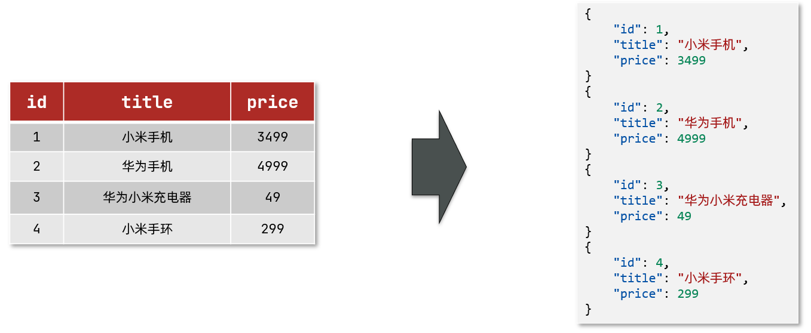
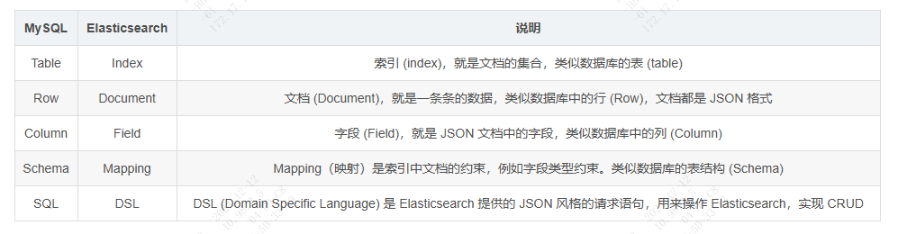
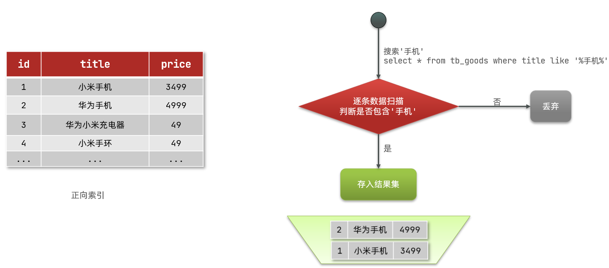

### **一、什么是 Elasticsearch？**

一个开源的分布式搜索引擎，可以用来实现搜索、日志统计、分析、系统监控等功能；

### **二、Elasticsearch的概念**

#### **2.1、文档和字段**

Elasticsearch 是面向**文档 (Document)**存储的，可以是数据库中的一条商品数据，一个订单信息。文档数据会被序列化为 JSON 格式后存储在 Elasticsearch 中

#### **2.2、索引和映射**

索引 (Index)，就是相同类型的文档的集合。例如：

* 所有用户文档，就可以组织在一起，称为用户的索引；
* 所有商品的文档，可以组织在一起，称为商品的索引；
* 所有订单的文档，可以组织在一起，称为订单的索引；

MySQL 与 Elasticsearch 的概念对比如下：

### **三、倒排索引与正向索引**

#### **3.1、正向索引**

什么是正向索引呢？例如下表 tb_goods 中的 id 创建索引：
如果是根据 id 查询，那么直接走索引，查询速度非常快。

但如果是基于 title 做模糊查询，只能是逐行扫描数据，流程如下：
1. 用户搜索数据，条件是title符合"%手机%"；
2. 逐行获取数据，比如id为1的数据；
3. 判断数据中的 title 是否符合用户搜索条件；
4. 如果符合则放入结果集，不符合则丢弃。回到步骤1；

逐行扫描，也就是全表扫描，随着数据量增加，其查询效率也会越来越低。当数据量达到数百万时，就是一场灾难。

#### **3.2、倒排索引**

（1）倒排索引中有两个非常重要的概念：
* 文档（Document）：用来搜索的数据，其中的每一条数据就是一个文档。例如一个网页、一个商品信息。
* 词条（Term）：对文档数据或用户搜索数据，利用某种算法分词，得到的具备含义的词语就是词条。例如：我是中国人，就可以分为：我、是、中国人、中国、国人这样的几个词条。

（2）创建倒排索引是对正向索引的一种特殊处理，流程如下：
1. 将每一个文档的数据利用算法分词，得到一个个词条；
2. 创建表，每行数据包括词条、词条所在文档 id、位置等信息；
3. 因为词条唯一性，可以给词条创建索引，例如 hash 表结构索引；

倒排索引的搜索流程如下（以搜索"华为手机"为例）：
1. 用户输入条件"华为手机"进行搜索。
2. 对用户输入内容分词，得到词条：华为、手机。
3. 拿着词条在倒排索引中查找，可以得到包含词条的文档 id：1、2、3。
4. 拿着文档 id 到正向索引中查找具体文档。

