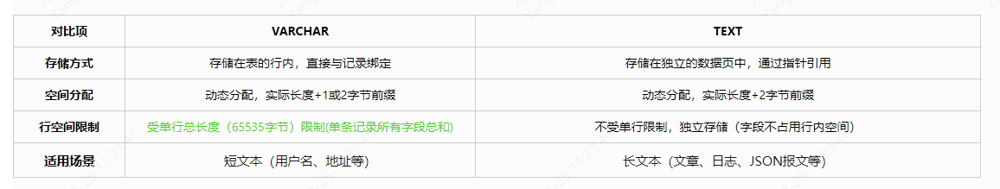

### 1、varchar (20)和varchar (200)有什么区别

**1.1、定义与存储机制**

**相同点**：两者均为可变长度字符串类型，实际存储空间 = 实际字符数 + 长度前缀（1或2字节）。例如，存储字符串"abc"时，无论是varchar(20)还是varchar(200)，均占用3个字符的字节数 + 1字节长度前缀（字符数 ≤255时）

**不同点**：最大允许字符数：varchar(20)最多存储20个字符，varchar(200)最多200个字符

**1.2、内存分配与性能影响**

**内存预分配**：MySQL在处理查询时（如排序、临时表操作），可能按定义长度分配内存，导致内存浪费。例如，varchar(200)会预分配200字符的内存空间，即使实际数据仅10字符，导致内存浪费；而varchar(20)仅预分配20字符。

**索引效率**：若字段被索引，varchar(200)的索引**键长度**可能更长，导致索引树层级增加，查询效率降低。【InnoDB 的索引基于B+树实现，每个节点（页）的默认大小为 16KB。每个节点中存储的索引键数量由**键长度**和**指针大小**决定。若索引**键长度**较长，单个节点(单页)能存储的键值对会减少，导致树的分支数（m 阶树的阶数）降低。与varchar（20）相同数量的索引下，B+树的索引高度更高，查询性能下降】

**碎片问题**：频繁更新varchar(200)字段时，若数据长度变化较大（如从10字符扩展到150字符），可能触发存储页分裂（InnoDB）或行碎片（MyISAM），影响性能；而varchar(20)因长度上限较小，碎片风险更低

### **2、varhcar和text有什么区别**

**2.1、存储机制与空间占用**

2.2、索引与查询性能

~~
