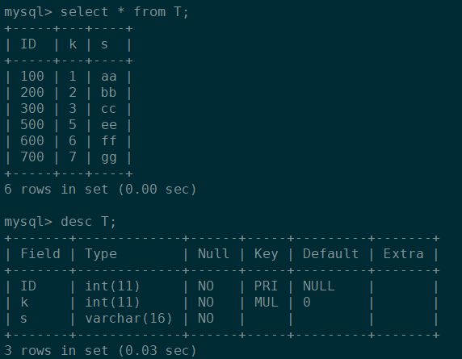
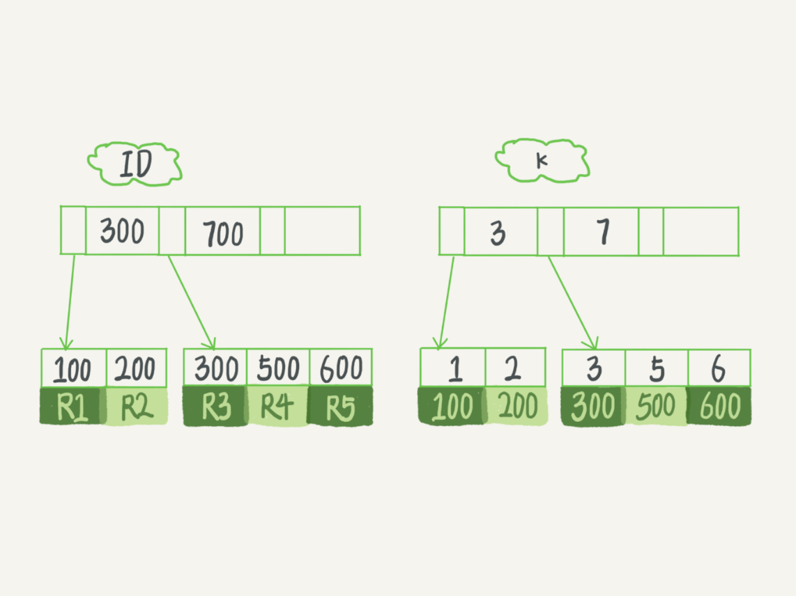

### 二、索引和锁

#### 1、索引

索引类型分为主键索引和非主键索引。主键索引的叶子节点存的是整行数据。在InnoDB里，主键索引也被称为聚簇索引。<span style="color:red">非主键索引的叶子节点内容是主键的值</span>，非主键索引也被称为二级索引。



**基于主键索引和普通索引的查询有什么区别？**
* ①、如果语句是select * from T where ID=500，即主键查询方式，则只需要搜索ID这棵B+树；
* ②、如果语句是select * from T where k=5，即<span style="color:red">普通索引</span>查询方式，则需要先搜索k索引树，得到ID的值为500，再到ID索引树搜索一次。这个过程称为回表。 也就是说，基于非主键索引的查询需要多扫描一棵索引树。因此，我们在应用中应该尽量使用主键查询(ID为<span style="color:red">主键</span>，k为<span style="color:red">普通索引</span>)

InnoDB 的索引模型：每一个索引在InnoDB里面对应一棵B+树（N叉树，N在InnoDB 中大概1200左右）

主键长度越小，<span style="color:red">普通索引</span>的叶子节点就越小，<span style="color:red">普通索引</span>占用的空间也就越小。

所以，从性能和存储空间方面考量，自增主键往往是更合理的选择


如：select * from T where k between 3 and 5;查询语句的执行流程：
1. 在k索引树上找到k=3的记录，取得 ID = 300；
2. 再到ID索引树查到ID=300对应的R3；
3. 在k索引树取下一个值k=5，取得ID=500；
4. 再回到ID索引树查到ID=500对应的R4；
5. 在k索引树取下一个值k=6，不满足条件，循环结束

#### 1.2、覆盖索引

如果执行的语句是select ID from T where k between 3 and 5，这时只需要查ID的值，而ID的值已经在k索引树上了，因此可以直接提供查询结果，不需要回表。也就是说，在这个查询里面，索引k已经“覆盖了”我们的查询需求，称为覆盖索引。<span style="color:red">由于覆盖索引可以减少树的搜索次数，显著提升查询性能，所以使用覆盖索引是一个常用的性能优化手段</span>。

**<span style="color:red">最左前缀原则</span>**：字段a,b,c 联合索引为:a_b_c,那么有a,a_b,a_b_c3个索引

如果通过调整顺序，可以少维护一个索引，那么这个顺序往往就是需要优先考虑采用的

**<span style="color:red">索引的选择</span>**： InnoDB的数据是按数据页为单位来读写的。也就是说，当需要读一条记录的时候，并不是将这个记录本身从磁盘读出来，而是<span style="color:red">以页为单位，将其整体读入内存</span>。在InnoDB中，每个数据页的大小默认是16KB。

上图数据中，如果要在这张表中插入一个新记录(4,400)的话，InnoDB的处理流程是怎样的。

① 对于<span style="color:red">唯一索引</span>来说，InnoDB的处理流程如下
* 要更新的目标页在内存中：找到3和5之间的位置，判断没有冲突，插入这个值，语句执行结束；
* 要更新的目标页不在内存中：需要将数据页读入内存，找到3和5之间的位置，判断到没有冲突，插入这个值，语句执行结束；

②对于<span style="color:red">普通索引</span>来说，InnoDB的处理流程如下
* 要更新的目标页在内存中：找到3和5之间的位置，插入这个值（修改内存，并写入redolog），语句执行结束
* 要更新的目标页不在内存中：将更新记录在change buffer，写入redolog（磁盘顺序写）语句执行就结束了

**将数据从磁盘读入内存涉及随机IO的访问，是数据库里面成本最高的操作之一。change buffer因为减少了随机磁盘访问，所以对更新性能的提升是会很明显的【<span style="color:red">只有<span style="color:red">普通索引</span>才有change buffer</span>】**

#### change buffer为什么针对非唯一<span style="color:red">普通索引</span>页

因为【<span style="color:red">唯一索引</span>】所有的更新操作都要先判断这个操作是否违反唯一性约束。而这必须要将数据页读入内存才能判断。如果都已经读入到内存了，那直接更新内存会更快，就没必要使用 change buffer 了。【<span style="color:red">普通索引</span>】不需要校验数据唯一性

顺序IO是指读取和写入操作基于逻辑块逐个连续访问来自相邻地址的数据。在顺序IO访问中，HDD所需的磁道搜索时间显着减少，因为读/写磁头可以以最小的移动访问下一个块。数据备份和日志记录等业务是顺序IO业务。随机IO是指读写操作时间连续，但访问地址不连续，随机分布在磁盘LUN的地址空间中。产生随机IO的业务有OLTP服务，SQL，即时消息服务等。（其实就是说在数据库查询时读取的不是连续区域，是要在整个磁盘上进行查找，多数时间可能耗费在了磁头寻道上）

* 对于写多读少的业务来说，页面在写完以后马上被访问到的概率比较小，使用<span style="color:red">普通索引</span>效果最好。这种业务模型常见的就是账单类、日志类的系统。
* 假设一个业务的更新模式是写入之后马上会做查询，那么即使满足了条件，将更新先记录在change buffer，但之后由于马上要访问这个数据页，会立即触发merge过程。这样随机访问IO的次数不会减少，反而增加了change buffer的维护代价

### 2、锁（全局锁、表级锁和行锁）

1. 全局锁就是对整个数据库实例加锁。
2. 表级别的锁有两种：一种是表锁，一种是元数据锁（MDL锁）。

* 表锁的语法是 lock tables … read/write，可以用unlock tables主动释放锁，也可以在客户端断开的时候自动释放【<span style="color:red">lock tables语法除了会限制别的线程的读写外，也限定了本线程接下来的操作对象</span>】
* 元数据锁：在访问一个表的时候会被自动加上，<span style="color:red">①当对一个表做增删改查操作的时候，<span style="color:red">加MDL</span></span>读<span style="color:red">锁，②对表做结构变更操作的时候</span><span style="color:red">加MDL</span>写<span style="color:red">锁 【</span>读锁之间不互斥，因此你可以有多个线程同时对一张表增删改查。读写锁之间、写锁之间是互斥的，用来保证变更表结构操作的安全性】

问题：<span style="color:red">给一个小表加个字段，导致整个库挂了</span>【给一个表加字段，或者修改字段，或者加索引，需要扫描全表的数据】

如何安全地给小表加字段？

①解决长事务，事务不提交，就会一直占着MDL锁(方法：先暂停DDL，或者kill掉这个长事务)

②表数据量不大，但是请求频繁，但必须加字段（1, ALTER TABLE tbl_name NOWAIT add column ; 2, ALTER TABLE tbl_name WAIT N add column）

在alter table语句里面设定等待时间，如果在这个指定的等待时间里面能够拿到MDL写锁最好，拿不到也不要阻塞后面的业务语句，先放弃。之后开发人员或者DBA再通过重试命令重复这个过程。

3. **行锁（共享锁【读锁】、排他锁【写锁】）**

在InnoDB事务中，行锁是在需要的时候才加上的，但并不是不需要了就立刻释放，而是要等到事务结束时才释放。这个就是两阶段锁协议。<span style="color:red">如果你的事务中需要锁多个行，要把最可能造成锁冲突、最可能影响并发度的锁尽量往后放</span>（减少了事务之间的锁等待，提升了并发度）

（1）共享锁：加锁方式：select...lock in share mode
1. 对于使用共享锁的事务，其他事务只能读，不可写
2. 如果执行了更新操作则会一直等待，直到当前事务commit或者rollback
3. 如果当前事务也执行了其他事务处于等待的那条sql语句，当前事务将会执行成功，而其他事务会报死锁
4. 并且允许其他事务加共享锁

（2）排它锁：加锁方式：select ... for update 【隔离级别为读提交】
1. 明确指定主键，并且有此记录，行级锁。例：select name,age from tb_user where id = '1' for update（id是主键）
2. 明确指定主键/索引，若查无记录，无锁。例：select name,age from tb_user where id = '1' for update（id是主键，但不存在id = 1的数据）
3. 无主键/索引，表级锁。例：select name,age from tb_user where age = 12 for update（age是普通字段）
4. 主键/索引不明确，表级锁。例：select name,age from tb_user where age = 12，id = '1' for update（id是主键，age不是，但数据库有此数据）

#### **问题：删除一个表里面的前10000行数据，有以下三种方法可以做到：**
* 第一种，直接执行delete from T limit 10000;(<span style="color:red">单个语句占用时间长，锁的时间也比较长；而且大事务还会导致主从延迟</span>)
* 第二种，在一个连接中循环执行20次 delete from T limit 500;
* 第三种，在20个连接中同时执行delete from T limit 500。(<span style="color:red">并发，</span><span style="color:red">会人为造成锁冲突</span>)

### 4、事务的四种隔离级别
**read uncommitted 读未提交[RU]**：一个事务读到另一个事务没有提交的数据
* 存在: 3个问题 (脏读、不可重复读、幻读)。

**read committed 读已提交[RC]**：一个事务读到另一个事务已经提交的数据
* 存在: 2个问题(不可重复读、幻读)。
* 解决: 1个问题 (脏读)

**repeatable read:可重复读[RR]**：在一个事务中读到的数据始终保持一致，无论另一个事务是否提交

<span style="color:red">解决: 3个问题 (脏读、不可重复读、</span><span style="color:red">部分场景的幻读-快照读select</span>)

存在：小部分幻读

-- 会话1
```sql
START TRANSACTION;
-- 第一次查询
SELECT COUNT(*) FROM users WHERE age > 35;  -- 假设返回1（age=40的用户）
-- 会话2插入新记录
INSERT INTO users (name, age) VALUES ('幻影用户', 45);
COMMIT;
```

-- 会话1执行更新操作
```sql
UPDATE users SET status = 1 WHERE age > 35;  -- 会更新2行！
SELECT COUNT(*) FROM users WHERE age > 35;  -- 返回2！幻读出现
COMMIT;
```


serializable 串行化：同时只能执行一个事务，相当于事务中的单线程<span style="color:red">完全解决幻读</span>

<span style="color:red">解决: 3个问题 (脏读、不可重复读、</span>幻读)

**安全和性能对比**
* 安全性: serializable > repeatable read > read committed > read uncommitted
* 性能:serializable < repeatable read < read committed < read uncommitted

**不可重复读和幻读**
* 不可重复读和幻读的区别不可重复读重点在于update和delete，而幻读的重点在于insert。
* 不可重复读，即：事务A开始期间查询同一个表数据2次，事务B开启后更新或删除表中的一些数据，此时事务A第二次查到的数据跟第一次的不一致
* 幻读，即：事务A开始期间查询同一个表数据2次，事务B开启后插入表中的一些数据，此时事务A第二次查到的数据跟第一次的不一致