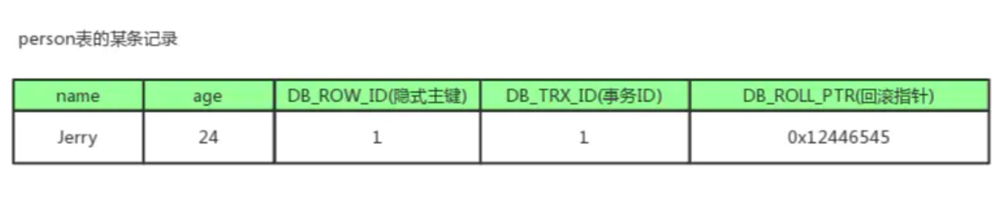
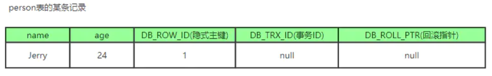
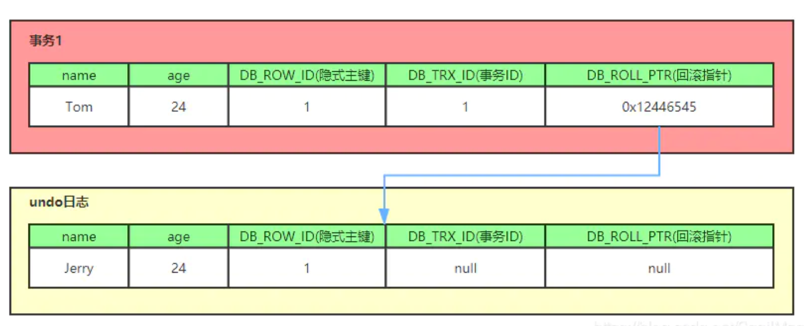
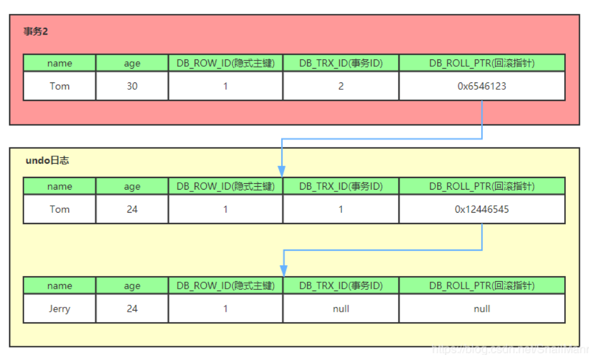
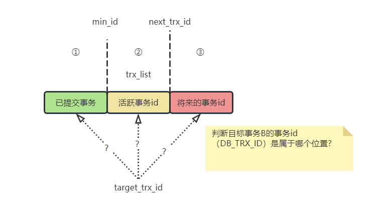
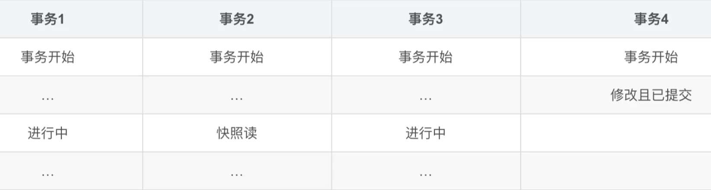
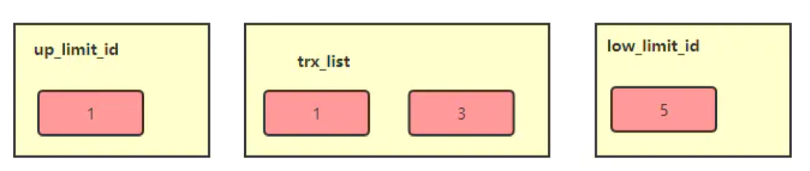
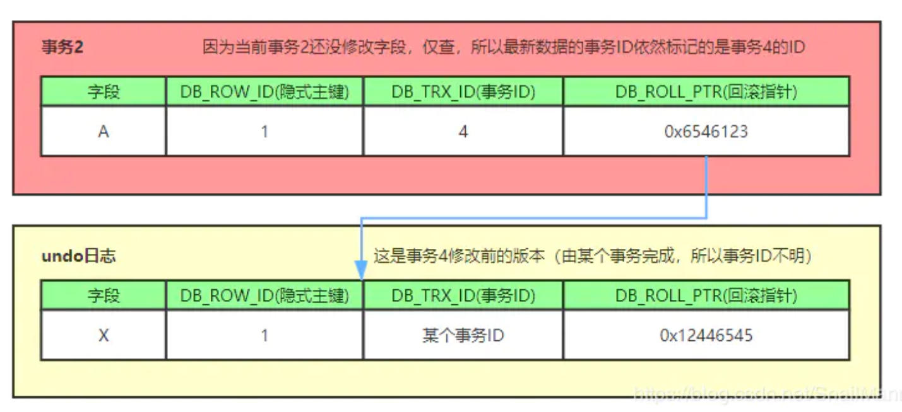

### **1、MVCC多版本并发控制**

MVCC在MySQL InnoDB中的实现主要是为了<span style="color:red">提高数据库并发性能，用更好的方式去处理读-写冲突，做到即使有读写冲突时，也能做到不加锁，非阻塞并发读</span>**


**默认RR（可重复读隔离级别）**

**前提概念：**

当前读。像select lock in share mode(共享锁), select for update ; update, insert ,delete(排他锁)这些操作都是一种当前读，为什么叫当前读？就是它读取的是记录的最新版本，读取时还要保证其他并发事务不能修改当前记录，会对读取的记录进行加锁。

快照读。像不加锁的select操作就是快照读，即不加锁的非阻塞读；快照读的前提是隔离级别不是串行级别，串行级别下的快照读会退化成当前读；之所以出现快照读的情况，是基于提高并发性能的考虑，快照读的实现是基于MVCC,可以认为MVCC是行锁的一个变种，但它在很多情况下，避免了加锁操作，降低了开销；既然是基于多版本，即快照读可能读到的并不一定是数据的最新版本，而有可能是之前的历史版本


当前读，快照读和MVCC的关系


准确的说，MVCC多版本并发控制指的是 “维持一个数据的多个版本，使得读写操作没有冲突”的概念。快照读就是MySQL为我们实现MVCC理想模型的其中一个具体非阻塞读功能。而当前读就是悲观锁的具体功能实现。


MVCC模型在MySQL中的具体实现则是由 3个**隐式字段**，undo日志 ，**<span style="color:red">Read View</span>** 等去完成的

MVCC能解决什么问题，好处是？

数据库并发场景有三种，分别为：

读-读：不存在任何问题，也不需要并发控制

读-写：有线程安全问题，可能会造成事务隔离性问题，可能遇到脏读，幻读，不可重复读

写-写：有线程安全问题，可能会存在更新丢失问题，比如第一类更新丢失，第二类更新丢失

MVCC带来的好处是？

多版本并发控制（MVCC）是一种用来解决读-写冲突的无锁并发控制，也就是为事务分配单向增长的时间戳，为每个修改保存一个版本，版本与事务时间戳关联，读操作只读该事务开始前的数据库的快照。 所以MVCC可以为数据库解决以下问题

在**<span style="color:red">并发读写</span>**数据库时，可以做到在读操作时不用阻塞写操作，写操作也不用阻塞读操作，提高了数据库**<span style="color:red">并发读写</span>**的性能

同时还可以解决脏读，幻读，不可重复读等事务隔离问题，但不能解决更新丢失问题

### **2、MVCC的实现原理**

MVCC就是为了**<span style="color:red">解决读写冲突</span>**，它的实现原理主要是依赖记录中的 3个**隐式字段**，undo日志 ，**<span style="color:red">Read View</span>** 来实现的


**隐式字段**

每行记录除了我们自定义的字段外，还有隐式定义的<span style="color:red">DB_TRX_ID</span>, <span style="color:red">DB_ROLL_PTR</span>, <span style="color:red">DB_ROW_ID</span>等字段

<span style="color:red">DB_TRX_ID</span>

6byte，最近修改(修改/插入)事务ID：记录创建这条记录/最后一次修改该记录的事务ID

<span style="color:red">DB_ROLL_PTR</span>

7byte，回滚指针，用于配合undo日志，指向上一个旧版本

<span style="color:red">DB_ROW_ID</span>

6byte，隐含的自增ID（隐藏主键），**如果数据表没有主键**，InnoDB会自动以<span style="color:red">DB_ROW_ID</span>产生一个聚簇索引

实际还有一个删除flag隐藏字段, 既记录被更新或删除并不代表真的删除，而是删除flag变了



### **undo日志（有两种）**

1、insert undo log，代表事务在insert新记录时产生的undo log, 只在事务回滚时需要，并且在事务提交后可以被立即丢弃(Insert 操作的记录只对事务本身可见，对于其它事务此记录是不可见的)

2、update undo log，事务在进行update或delete时产生的undo log; 不仅在事务回滚时需要，在快照读时也需要；所以不能随便删除，只有在快速读或事务回滚不涉及该日志时，对应的日志才会被purge线程统一清除

对MVCC有帮助的实质是update undo log ，undo log实际上就是存在rollback segment中旧记录链，它的执行流程如下：

①、 比如一个有个事务插入persion表插入了一条新记录，记录如下，name为Jerry, age为24岁，隐式主键是1，事务ID和回滚指针，我们假设为NULL



②、 现在来了一个事务1对该记录的name做出了修改，改为Tom

在事务1修改该行(记录)数据时，数据库会先对该行加排他锁

然后把该行数据拷贝到undo log中，作为旧记录，即在undo log中有当前行的拷贝副本

拷贝完毕后，修改该行name为Tom，并且修改隐藏字段的事务ID为当前事务1的ID, 我们默认从1开始，之后递增，回滚指针指向拷贝到undo log的副本记录（表示我的上一个版本就是它）

事务提交后，释放锁



③、 又来了个事务2修改person表的同一个记录，将age修改为30岁

在事务2修改该行数据时，数据库也先为该行加锁

然后把该行数据拷贝到undo log中，作为旧记录，发现该行记录已经有undo log了，那么最新的旧数据作为链表的表头，插在该行记录的undo log最前面

修改该行age为30岁，并且修改隐藏字段的事务ID为当前事务2的ID, 那就是2，回滚指针指向刚刚拷贝到undo log的副本记录

事务提交，释放锁




可以看出，<span style="color:red">不同事务或者相同事务的对同一记录的修改，会导致该记录的undo log成为一条记录版本线性表（链表）</span>，undo log的链首就是最新的旧记录，链尾就是最早的旧记录（当然就像之前说的该undo log的节点可能是会purge线程清除掉，像图中的第一条insert undo log，其实在事务提交之后可能就被删除丢失了，不过这里为了演示，所以还放在这里）

### <span style="color:red">Read View(读视图)</span>

**<span style="color:red">Read View</span>**就是事务进行**快照读操作**的时候生产的读视图(**<span style="color:red">Read View</span>**)，在该事务执行的快照读的那一刻，会生成数据库系统当前的一个快照，记录并维护系统当前活跃事务的ID(当每个事务开启时，都会被分配一个ID, 这个ID是递增的，所以最新的事务，ID值越大)

可以把**<span style="color:red">Read View</span>**简单的理解成有三个全局属性：

```sql
##名字随便取的
trx_list：一个数值列表，用来维护**<span style="color:red">Read View</span>**生成时刻mysql系统正活跃的事务ID
min_id： 记录trx_list列表中事务ID最小的ID
next_trx_id：ReadView生成时刻系统尚未分配的下一个事务ID，也就是目前已出现过的事务ID的最大值+1
target_trx_id:需要与之对比的事务id（目标事务B）
事务A查询: select * from table where id=1;
目标事务B: update table set name='yang' where id=1;
```





在①位置：则<span style="color:red">DB_TRX_ID</span> < target_trx_id，当前查询能查询到事务B的修改。

在②位置：如果<span style="color:red">DB_TRX_ID</span> 在活跃事务id列表里，表示事务B还没提交，所以当前查询不能查到事务B的修改。

如果不在活跃事务列表，则说明事务B在事务A的Read View生成之前就已经Commit了，当前事务是能看见的

在③位置：事务B修改的记录在事务A的Read View生成后才出现的，那对当前事务肯定不可见

##### <span style="color:red">RC,RR级别下的InnoDB快照读</span>有什么不同？

正是**<span style="color:red">Read View</span>**生成时机的不同，从而造成RC,RR级别下快照读的结果的不同

在RC隔离级别下，是每个快照读都会生成并获取最新的**<span style="color:red">Read View</span>**，获取最新的活跃事务id（如果同一个事务下多次查询，事务id不会新增）；

在RR隔离级别下，则是同一个事务中的第一个快照读才会创建**<span style="color:red">Read View</span>**, 之后的快照读获取的都是同一个**<span style="color:red">Read View</span>**

### MVCC整体的流程

当事务2对某行数据执行了快照读(生成一个读视图)，假设当前事务ID为2，此时还有事务1和事务3在活跃中，事务4在事务2快照读前一刻提交更新了，所以**<span style="color:red">Read View</span>**记录了系统当前活跃事务1，3的ID，维护在一个列表上，假设我们称为trx_list




<span style="color:red">Read View</span>不仅仅会通过一个列表trx_list来维护事务2执行快照读那刻系统正活跃的事务ID，还会有两个属性min_id（记录trx_list列表中事务ID最小的ID），next_trx_id(记录trx_list列表中事务ID最大的ID，也有人说快照读那刻系统尚未分配的下一个事务ID也就是目前已出现过的事务ID的最大值+1；所以在这里例子中min_id就是1，next_trx_id就是4 + 1 = 5，trx_list集合的值是1,3，**<span style="color:red">Read View</span>**如下图



例子中，只有事务4修改过该行记录，并在事务2执行快照读前，就提交了事务，所以该行当前数据的undo log如下图所示；事务2在快照读该行记录的时候，就会拿该行记录的<span style="color:red">DB_TRX_ID</span>去跟min_id,next_trx_id和活跃事务ID列表(trx_list)进行比较，判断当前事务2能看到该记录的版本是哪个。



1、事务ID 4是否小于min_id(1)，所以不符合条件

2、继续判断 4 是否大于等于next_trx_id(5)，也不符合条件

3、最后判断4是否处于trx_list中的活跃事务, 最后发现事务ID为4的事务不在当前活跃事务列表中, 符合可见性条件

即：事务4修改后提交的最新结果对事务2快照读时是可见的，事务2能读到的最新数据记录是事务4所提交的版本，而事务4提交的版本也是全局角度上最新的版本