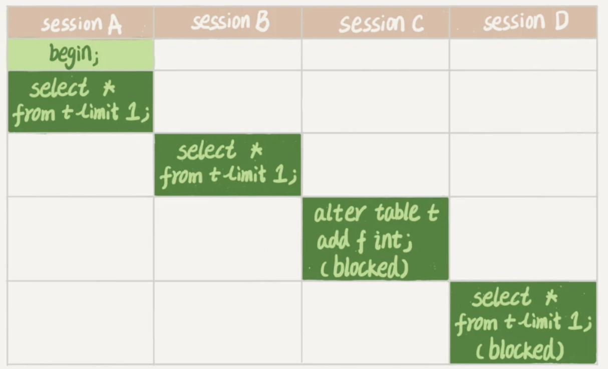
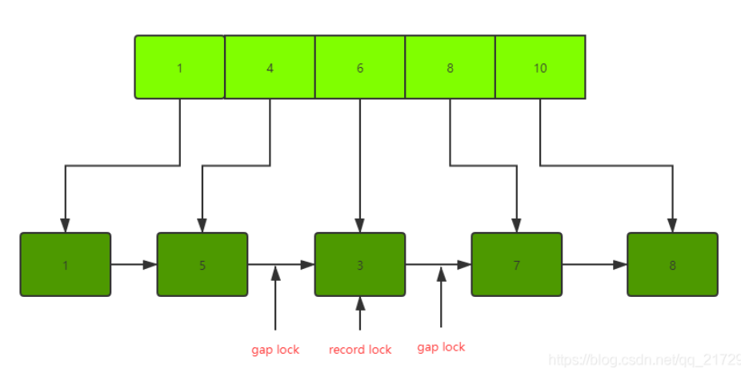

### **mysql全局锁**

全局锁就是对整个数据库实例加锁。MySQL提供了一个加全局读锁的方法，命令是 Flush tables with read lock (FTWRL)。当你需要让整个库处于只读状态的时候，可以使用这个命令，之后其他线程的以下语句会被阻塞：数据更新语句（数据的增删改）、数据定义语句（包括建表、修改表结构等）和更新类事务的提交语句。
* 1、全局锁的典型使用场景是，做全库逻辑备份**。如果没有全局锁，涉及多表的业务在运行的过程中，此时操作备份数据库，可能会导致数据前后不一致的情况！！！
* 2、官方自带的逻辑备份工具是mysqldump**。当mysqldump使用参数–single-transaction的时候，导数据之前就会启动一个事务，来确保拿到一致性视图。而由于MVCC的支持，这个过程中数据是可以正常更新的（<span style="color:red">只适用于所有的表使用事务引擎的库，如innodb</span>）

### **mysql表级锁**

MySQL里面表级别的锁有两种：一种是表锁，一种是元数据锁（meta data lock，**MDL**)。

**表锁的语法是 lock tables … read/write**。与FTWRL类似，可以用unlock tables主动释放锁，也可以在客户端断开的时候自动释放。需要注意，lock tables语法除了会限制别的线程的读写外，也限定了本线程接下来的操作对象。（举个例子, 如果在某个线程A中执行lock tables t1 read, t2 write; 这个语句，则其他线程写t1、读写t2的语句都会被阻塞。同时，线程A在执行unlock tables之前，也只能执行读t1、读写t2的操作。连写t1都不允许，自然也不能访问其他表）

**MDL表级锁（metadata lock)**是当对一个表做增删改查操作的时候，加**MDL**读锁；当要对表做结构变更操作的时候，加**MDL**写锁。
* 读锁之间不互斥，因此你可以有多个线程同时对一张表增删改查。
* 读写锁之间、写锁之间是互斥的，用来保证变更表结构操作的安全性。因此，如果有两个线程要同时给一个表加字段，其中一个要等另一个执行完才能开始执行。


**MDL**读写锁冲突的情况如下图：


#### <span style="color:red">如何安全地给小表加字段？</span>

在alter table语句里面设定等待时间，如果在这个指定的等待时间里面能够拿到**MDL**写锁最好，拿不到也不要阻塞后面的业务语句，先放弃。之后开发人员或者DBA再通过重试命令重复这个过程。
* ALTER TABLE tbl_name NOWAIT add column ...
* ALTER TABLE tbl_name WAIT N add column ...


### **InnoDB共有七种类型的锁**：
1. 自增锁(Auto-inc Locks)；
2. 共享/排它锁(Shared and Exclusive Locks)；
3. 意向锁(Intention Locks)；
4. 插入意向锁(Insert Intention Locks)；
5. 记录锁(Record Locks)；
6. 间隙锁(Gap Locks)；
7. 临键锁(Next-key Locks)；

#### **1、自增锁**

**自增锁**是一种特殊的<span style="color:red">表级别锁</span>（table-level lock），专门针对事务插入<span style="color:red">AUTO_INCREMENT</span>类型的列。

```
MySQL，InnoDB，默认的隔离级别(RR)，假设有数据表：
t(id <span style="color:red">AUTO_INCREMENT</span>, name);
数据表中有数据：
1, shenjian
2, zhangsan
3, lisi
事务A先执行，还未提交：
insert into t(name) values(xxx);
事务B后执行：
insert into t(name) values(ooo);
#由于**自增锁**，事务B会阻塞等待事务A执行完成
```

#### **2、共享/排它锁（读/写锁）**

《InnoDB并发如此高，原因竟然在这？》一文介绍了通用的共享/排它锁，在InnoDB里当然也实现了标准的行级锁(row-level locking)，共享/排它锁：
1. 事务拿到某一行记录的共享S锁（读），才可以读取这一行；
2. 事务拿到某一行记录的排它X锁（写），才可以修改或者删除这一行；

多个事务可以拿到一把S锁，读读可以并行；

而只有一个事务可以拿到X锁，写写/读写必须互斥；

共享/排它锁的潜在问题是，不能充分的并行，解决思路是MVCC

#### **3、意向锁**

未来的某个时刻，事务可能要加共享/排它锁了，先提前声明一个意向。（<span style="color:red">一种不与行级锁冲突的表级锁，为了提高效率</span>）

意向锁特点：
1. 是一个表级别的锁(table-level locking)；
2. 意向锁分为：
意向共享锁(intention shared lock, IS)，它预示着，事务有意向对表中的某些行加共享S锁
意向排它锁(intention exclusive lock, IX)，它预示着，事务有意向对表中的某些行加排它X锁

举个例子：
* select ... lock in share mode，要设置IS锁；
* select ... for update，要设置IX锁；
3. 意向锁协议(intention locking protocol)并不复杂：

事务要获得某些行的S锁，必须先获得表的IS锁

事务要获得某些行的X锁，必须先获得表的IX锁

意向锁之间的互斥性如下：


意向锁与读写锁的互斥性如下:


**<span style="color:red">这里的排他 / 共享锁指的都是表锁！！！意向锁不会与行级的共享 / 排他锁互斥！！！</span>**

```mysql
设想这样一张 users 表：
id    name
1    ROADHOG
2    Reinhardt
3    Tracer
4    Genji

事务 A 获取了某一行的排他锁，并未提交：
SELECT * FROM users WHERE id = 4 FOR UPDATE;
此时 users 表存在两把锁： users 表上的 意向排他锁 与 id 为 4 的数据行上的 排他锁 。

事务 B 想要获取 users 表的共享锁：
LOCK TABLES users READ;

共享锁与排他锁 互斥 ，所以事务 B 在视图对 users 表加共享锁的时候，必须保证：
* 当前没有其他事务持有 users 表的排他锁。
* 当前没有其他事务持有 users 表中任意一行的排他锁 。

此时
1、事务 B 检测事务 A 持有 users 表的 意向排他锁，就可以得知 事务 A 必然持有该表中某些数据行的 排他锁 ，
2、事务 B 对 users 表的加锁请求就会被排斥（阻塞，参考意向锁与读写锁）
3、无需去检测表中的每一行数据是否存在排他锁（若没有意向锁则需要执行这一步）。
```

#### **4、插入意向锁**

插入意向锁，是间隙锁(Gap Locks)的一种（也是实施在索引上的），它是专门针对insert操作的。**<span style="color:red">用于保护事务在插入数据时，对表或索引的结构进行修改。</span>**

它的玩法是：

多个事务，在同一个索引，同一个范围区间插入记录时，**<span style="color:red">如果插入的位置不冲突，不会阻塞彼此</span>**。

```azure
在MySQL，InnoDB，RR下：
t(id unique PK, name);
数据表中有数据：
10, shenjian
20, zhangsan
30, lisi
事务A先执行，在10与20两条记录中插入了一行，还未提交：
insert into t values(11, xxx);
事务B后执行，也在10与20两条记录中插入了一行：
insert into t values(12, ooo);
（1）会使用什么锁？
（2）事务B会不会被阻塞呢？
回答：虽然事务隔离级别是RR，虽然是同一个索引，虽然是同一个区间，但插入的记录并不冲突，故这里：
（1）使用的是插入意向锁；
（2）并不会阻塞事务B；
```

#### **5、记录锁(Record Locks)**

记录锁，它封锁索引记录，例如：

select * from t where id=1 for update;

它会在id=1的索引记录上加锁，以阻止其他事务插入，更新，删除id=1的这一行。

需要说明的是：

select * from t where id=1;  是快照读(SnapShot Read)，它并不加锁，具体在《 InnoDB并发如此高，原因竟然在这？》中做了详细阐述。

#### **6、间隙锁(Gap Locks)**

间隙锁，它**<span style="color:red">封锁索引记录中的间隔</span>**，或者第一条索引记录之前的范围，又或者最后一条索引记录之后的范围。

产生间隙锁的条件（RR事务隔离级别下）：

使用普通索引锁定；

使用多列唯一索引；

使用唯一索引锁定多行记录。

```azure
依然是上面的例子，InnoDB，RR：
mysql> select * from user;
+----+------+
| id | name |
+----+------+
|  1 | yang |
|  3 | test |
|  7 | heeh |
+----+------+
隐藏的间隙锁：
(-inf, 1) (1,3) (3,7), (7, +inf)
##数据表
CREATE TABLE `z` (
  `id` int(11) NOT NULL <span style="color:red">AUTO_INCREMENT</span>,
  `b` int(11) DEFAULT NULL,
  `c` int(255) NOT NULL DEFAULT '0',
  PRIMARY KEY (`id`),
  KEY `b` (`b`)
) ENGINE=InnoDB <span style="color:red">AUTO_INCREMENT</span>=19 DEFAULT CHARSET=utf8;
INSERT INTO `study`.`z` (`id`, `b`, `c`) VALUES ('1', '1', '0');
INSERT INTO `study`.`z` (`id`, `b`, `c`) VALUES ('3', '6', '1');
INSERT INTO `study`.`z` (`id`, `b`, `c`) VALUES ('5', '4', '2');
INSERT INTO `study`.`z` (`id`, `b`, `c`) VALUES ('7', '8', '3');
INSERT INTO `study`.`z` (`id`, `b`, `c`) VALUES ('8', '10', '4');
#此处的锁加在那里（b为二级非唯一索引）
begin; 
select * from z where b = 6 for update;
这条sql语句之后看看我们 需要做什么才能保证不发生幻读。
1不能插入、删除、修改b为6的数据
2不能把别的数据修改为b为6
```

两个next指针锁解决了插入b为6或者把别的数据修改为b为6，行锁解决了修改b为6的行。 副作用：

```
如： INSERT INTO `study`.`z` (`id`, `b`, `c`) VALUES ('6', '4', '0'); /**<span style="color:red">/也会阻塞</span>**因为4-6之间的间隙锁（5-3指针）

INSERT INTO `study`.`z` (`id`, `b`, `c`) VALUES ('4', '4', '0'); // **<span style="color:red">插入成功</span>**因为这条数据会插入在1的后面5的前面。（如果是插入“4，6，0”则不成功）

```


二级索引的B+树

#### **7、临键锁(Next-Key Locks)**

临键锁，是记录锁与间隙锁的组合，既包含索引记录，又包含索引区间。更具体的，<span style="color:red">临键锁会封锁索引记录本身，以及索引记录之前的区间</span>。

```azure
依然是上面的例子，InnoDB，RR：
mysql> select * from user;
+----+------+
| id | name |
+----+------+
|  1 | yang |
|  3 | test |
|  7 | heeh |
+----+------+
#开启事务
mysql> begin;
mysql> select * from user where id between 5 and 10  lock in share mode;
+----+------+
| id | name |
+----+------+
|  7 | heeh |
+----+------+
1 row in set (0.00 sec)
会封锁区间(3,7], (7, +inf) 以阻止其他事务在这个区间插入数据或者修改数据

```

在RR的隔离级别下，<span style="color:red">Innodb使用MVCC和next-key locks</span>**<span style="color:red">解决幻读</span>**，MVCC解决的是普通读（快照读）的幻读，next-key locks解决的是当前读情况下的幻读
