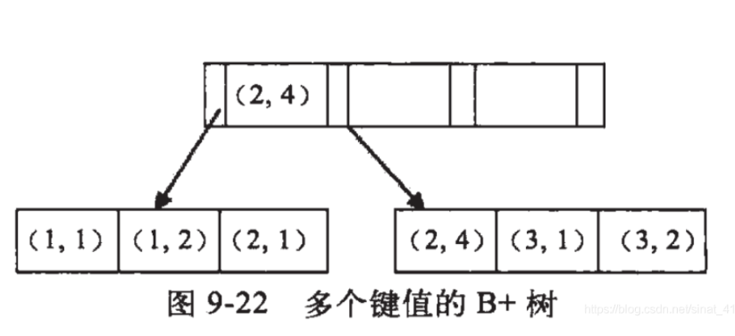

索引的底层是一颗B+树，那么联合索引当然还是一颗B+树，只不过联合索引的健值数量不是一个，而是多个。构建一颗B+树只能根据一个值来构建，因此数据库依据联合索引最左的字段来构建B+树。

例子：假如创建一个（a,b)的联合索引，那么它的索引树是这样的




可以看到a的值是有顺序的，1，1，2，2，3，3，而b的值是没有顺序的1，2，1，4，1，2。所以b = 2这种查询条件没有办法利用索引，因为联合索引首先是按a排序的，b是无序的。

同时我们还可以发现在<span style="color:red">a值相等的情况下，b值又是按顺序排列的，但是这种顺序是相对的</span>。所以**<span style="color:red">最左匹配原则遇上范围查询就会停止</span>**，剩下的字段都无法使用索引。例如a = 1 and b = 2 a,b字段都可以使用索引，因为在a值确定的情况下b是相对有序的，而a>1and b=2，a字段可以匹配上索引，但b值不可以，因为a的值是一个范围，在这个范围中b是无序的。


最左匹配原则：最左优先，以最左边的为起点任何连续的索引都能匹配上。同时遇到范围查询(>、<、between、like)就会停止匹配。

### **假如建立联合索引（a,b,c）**

**匹配范围值**：

```sql
select * from table_name where  a > 1 and a < 3;## 可以对最左边的列进行范围查询
select * from table_name where  a > 1 and a < 3 and b > 1;##多个列同时进行范围查找时，只有对索引最左边的那个列进行范围查找才用到B+树索引，也就是只有a用到索引，在1<a<3的范围内b是无序的，不能用索引，找到1<a<3的记录后，只能根据条件 b > 1继续逐条过滤
```

精确匹配某一列并范围匹配另外一列:

```sql
select * from table_name where  a = 1 and b > 3;
a=1的情况下b是有序的，进行范围查找走的是联合索引
```

**排序：**

一般情况下，我们只能把记录加载到内存中，再用一些排序算法，比如快速排序，归并排序等在内存中对这些记录进行排序，有时候查询的结果集太大不能在内存中进行排序的话，还可能暂时借助磁盘空间存放中间结果，排序操作完成后再把排好序的结果返回客户端。Mysql中把这种再内存中或磁盘上进行排序的方式统称为文件排序。文件排序非常慢，但如果order子句用到了索引列，就有可能省去文件排序的步骤

```sql
select * from table_name order by a,b,c limit 10;
因为b+树索引本身就是按照上述规则排序的，所以可以直接从索引中提取数据，然后进行回表操作取出该索引中不包含的列就好了
order by的子句后面的顺序也必须按照索引列的顺序给出，比如
select * from table_name order by b,c,a limit 10;
##这种颠倒顺序的没有用到索引
select * from table_name order by a limit 10;
select * from table_name order by a,b limit 10;
##这种用到部分索引
select * from table_name where a =1 order by b,c limit 10;
联合索引左边列为常量，后边的列排序可以用到索引
```