有2张表

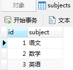 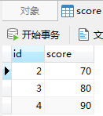

### **一、left join**

顾名思义，就是“左连接”，表1左连接表2，以左为主，表示以表1为主，关联上表2的数据，查出来的结果显示左边的所有数据，然后右边显示的是和左边有交集部分的数据。

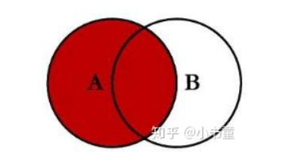 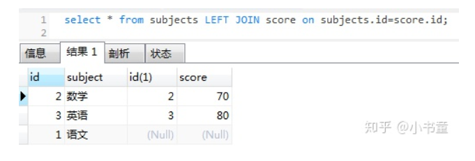

从subjects表中找出，没有在score表出现过的记录

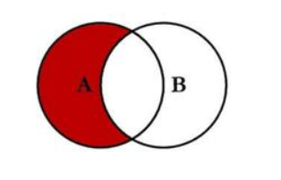 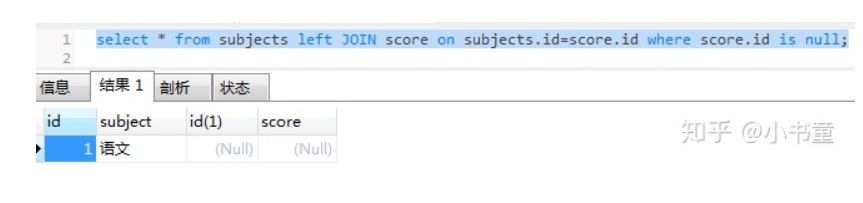

### **二、right join**

“右连接”，表1右连接表2，以右为主，表示以表2为主，关联查询表1的数据，查出表2所有数据以及表1和表2有交集的数据

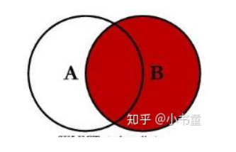 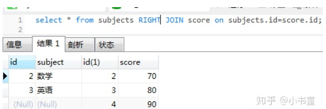

从score表中找出，没有在subjects表中出现过的记录

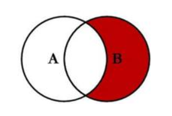 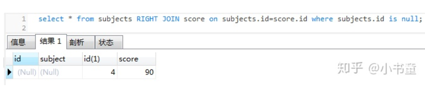

### **三、join**

“内连接”join，其实就是“inner join”，为了简写才写成join，两个是表示一个的，内连接，表示以两个表的交集为主，查出来是两个表有交集的部分，其余没有关联就不额外显示出来

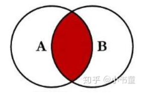 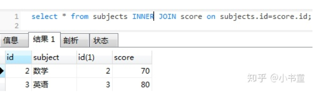

### 四、笛卡尔积

笛卡尔积是指在数学中，两个集合X和Y的笛卡尔积(Cartesian produc)，又称直积，表示为X*Y，第一个对象是X的成员而第二个对象是Y的所有可能有序对的其中一个成员。笛卡尔积又叫笛卡尔乘积， 简单的说就是两个集合相乘的结果。

假设集合A={a,b}，集合B={0,1,2}，则两个集合的笛卡尔积为{a,0),(a,1);(a,2),(b,0),(b,1),(b,2)}。

“笛卡尔积”就是什么都不写的直接连接在一起

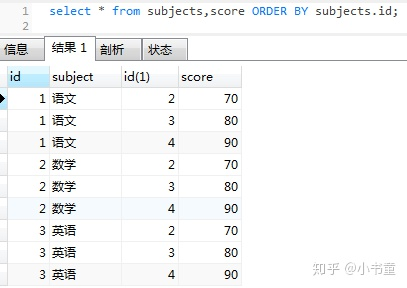

5、为什么 SQL 语句不要过多使用 JOIN？

**不要过多使用 JOIN 的本质原因是：数据库擅长存储和索引，但不擅长在运行时做复杂的连接计算。****核心建议**：

**少于4表的简单关联**：直接用 JOIN，保持代码清晰

**4-7表的中等复杂查询**：考虑分步查询，在应用层组合

**超过7表的复杂查询**：必须重构，考虑冗余、物化视图或ES等搜索引擎

**高频复杂查询**：预计算，空间换时间

**微服务架构**：禁止跨服务JOIN，通过API聚合数据