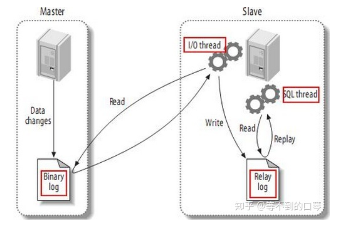
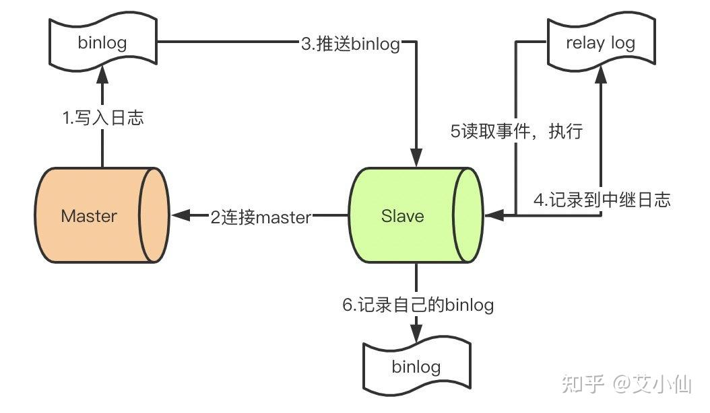
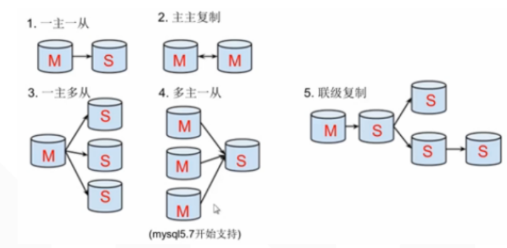

### **1、为什么需要主从复制？**

在业务复杂的系统中，有这么一个情景，有一句sql语句需要锁表，导致暂时不能使用读的服务，那么就很影响运行中的业务，使用主从复制，让主库负责写，从库负责读，这样，即使主库出现了锁表的情景，通过读从库也可以保证业务的正常运作。

做数据的热备

架构的扩展。业务量越来越大，I/O访问频率过高，单机无法满足，此时做多库的存储，降低磁盘I/O访问的频率，提高单个机器的I/O性能。

### **2、mysql复制原理**

（1）master服务器将数据的改变记录二进制binlog日志，当master上的数据发生改变时，则将其改变写入二进制日志中；

（2）slave服务器在一定时间间隔内对master二进制日志进行探测其是否发生改变，如果发生改变，则开始一个I/OThread请求master二进制事件

（3）同时主节点为每个I/O线程启动一个dump线程，用于向其发送二进制事件，并保存至从节点本地的中继日志中，从节点将启动SQL线程从中继日志中读取二进制日志，在本地重放，使得其数据和主节点的保持一致，最后I/OThread和SQLThread将进入睡眠状态，等待下一次被唤醒。

也就是说：

主库会生成一个log dump线程（一个从）,用来给从库I/O线程传binlog;

从库会生成两个线程,一个I/O线程,一个SQL线程;

I/O线程会去请求主库的binlog,并将得到的binlog写到本地的relay-log(中继日志)文件中;

SQL线程,会读取relay log文件中的日志,并解析成sql语句逐一执行;

### **3、mysql主从形式**

一主一从、主主复制（互为主从模式）、一主多从、多主一从、联级复制

### **4、主从同步延迟产生原因**

主从复制都是单线程的操作，主库对所有DDL和DML产生的日志写进binlog，由于binlog是顺序写，所以效率很高。

Slave的SQL Thread线程将主库的DDL和DML操作事件在slave中重放。DML和DDL是随机IO操作，成本高很多。另一方面，由于SQL Thread也是单线程的，当主库的并发较高时，产生的DML数量超过slave的SQL Thread所能处理的速度，或者当slave中有大型query语句产生了锁等待那么延时就产生了。

常见原因：Master负载过高、Slave负载过高、网络延迟、机器性能太低、MySQL配置不合理。

主从延迟解决方案：

优化网络、增加从机器、升级Slave硬件配置

中间加入redis等缓存缓解查询

Slave调整参数，关闭binlog，修改innodb_flush_log_at_trx_commit参数值

升级MySQL版本到5.7，使用并行复制

解决数据丢失的问题：（对数据安全性要求较高，如订单等）

#### 1. 半同步复制

主库在执行完事务后不立刻返回结果给客户端，需要等待至少一个从库接收到并写到relay log中才返回结果给客户端。相对于异步复制，半同步复制提高了数据的安全性，同时它也造成了一个TCP/IP往返耗时的延迟。

#### 2. 主库配置sync_binlog=1，innodb_flush_log_at_trx_commit=1

sync_binlog的默认值是0，MySQL不会将binlog同步到磁盘，其值表示每写n次binlog同步一次磁盘。

innodb_flush_log_at_trx_commit为1表示每一次事务提交或事务外的指令都需要把日志flush到磁盘。

注意:将以上两个值同时设置为1时，写入性能会受到一定限制，只有对数据安全性要求很高的场景才建议使用，比如涉及到钱的订单支付业务，而且系统I/O能力必须可以支撑！