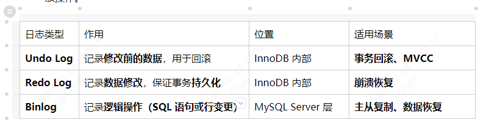
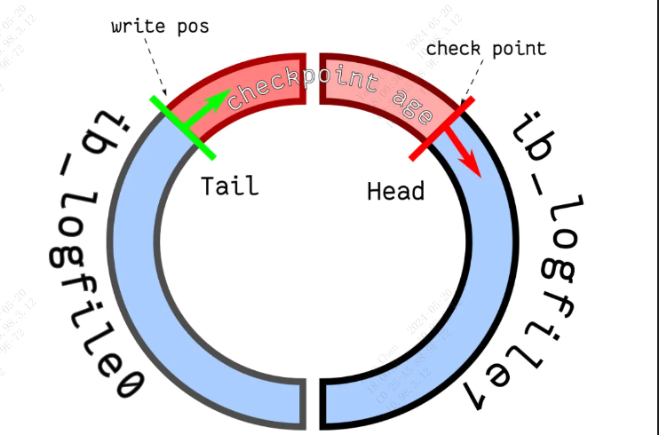

### **1、undolog**

作用：Undo Log 用于实现事务的回滚操作和 MVCC（多版本并发控制）。

原理：在事务执行过程中，Undo Log 记录了事务对数据所做的修改操作的逆操作，以便在事务回滚时能够撤销这些修改。同时，Undo Log 也用于提供数据库的 MVCC 功能，即在读取数据时能够看到之前版本的数据，从而实现事务的隔离性。

### **2、redolog（重做日志）**

作用：Redo Log 用于保证事务的持久性，即在数据库发生故障时能够恢复事务的提交状态。

原理在事务提交时，Redo Log 记录了事务对数据所做的修改操作，以便在数据库发生故障时能够重新执行这些修改操作，从而保证事务的持久性。

### **3、Binlog（二进制日志）**

作用：Binlog 用于记录数据库的变更操作，以便进行数据复制和恢复。

原理：Binlog 记录了数据库中的所有变更操作，包括对数据的增删改操作，以及对数据库结构的变更。Binlog 可以用于进行数据复制（replication）以及进行数据库的恢复和回放操作。

### **二、INSERT操作的日志写入顺序**

    执行流程：Undo Log → Redo Log (prepare) → Binlog → Redo Log (commit)

#### 1. 写入 Undo Log 【先写入原因：Undo Log 记录数据的旧值，在事务回滚或 MVCC 需要时使用；必须在事务开始前写入，以便回滚时能正确恢复数据】

记录修改前的数据（但 INSERT 操作不涉及回滚前的数据，因此 Undo Log 仅用于 MVCC）。

Undo Log 主要用于 事务回滚，以及支持 快照读（MVCC） 。

#### 2. 写入 Redo Log（Prepare 阶段）【原因：记录事务的物理变更，保证 MySQL 崩溃后数据可恢复。但事务尚未提交，避免未写入 Binlog 时崩溃导致数据不一致】

记录本次事务的变更（但未提交）。

Redo Log 采用 WAL（Write-Ahead Logging） 机制，先记录日志，再修改数据。

进入prepare状态，表示事务已经执行，但尚未提交。

#### 3. 写入 Binlog【先写Binlog原因：确保所有变更都可用于**主从复制**和**灾难恢复**。避免 Redo Log 提交后 MySQL 崩溃，导致主库和从库数据不一致】

记录 INSERT 语句或行数据到 Binlog（归档日志）。

Binlog 主要用于**主从复制**和数据恢复。

Binlog 以追加写（append-only） 方式记录，并最终刷盘。

#### 4. 提交 Redo Log（Commit 阶段）【**事务正式提交，确保数据最终一致**】

事务正式提交，Redo Log 进入 commit 状态，标志事务完成。

MySQL 崩溃时，如果 Redo Log 处于 commit 状态，则事务可恢复，否则回滚。

### **三、事务提交失败时的恢复**

#### 崩溃发生在prepare阶段：事务未提交，系统自动回滚。

#### 崩溃发生在Binlog写入后，但 Redo Log 未提交：事务未提交，回滚事务，确保数据一致【回滚到旧数据】。

#### 崩溃发生在Redo Log提交后：事务已提交，MySQL通过Redo Log恢复最新的数据，确保持久化。

### **undolog、redo log、binlog区别**

undolog、redo log是属于innoDB层面，binlog属于MySQL Server层面的，这样在数据库用别的存储引擎时可以达到一致性的要求。

redo log是循环写，日志空间大小固定；binlog是追加写，是指一份写到一定大小的时候会更换下一个文件，不会覆盖。

binlog可以作为（误删数据）恢复数据使用，**主从复制**搭建，redo log作为异常宕机或者介质故障后的数据恢复使用。

undolog保证原子性（MVCC并发控制也用到undolog）

* 比如，要修改A的值，那么在修改之前先读取A的原值，将A的原值写入undo log中，然后再修改A的值，再将undo log写入磁盘，然后将A的新值写入磁盘，事务提交；
* 如果在事务执行过程中意外宕机，那么就会读取undo log，将这个还没执行完的事务回滚；

undolog用于回滚，redolog用于前滚

* 前滚：事务提交之后，部分数据写入了磁盘，但是还有部分数据存在脏页上，并没有写入磁盘。此时设备宕机，没有写入磁盘的数据丢失。就要依赖redolog来恢复这部分数据。
* 回滚：事务还未提交，改动并没有完全生效，但是记录已经被修改。此时设备宕机，数据是有问题的，就要依赖undolog回滚改动。

### **redo log和change buffer**

对比两个机制在提升更新性能上的收益的话，**redo log 主要节省的是随机写磁盘的IO消耗（转成顺序写），而**change buffer**主要节省的则是随机读磁盘的IO消耗。**

### **redo log 什么时候写入磁盘**?
* 当innodb_flush_log_at_trx_commit和sync_binlog 都为 1 时是最安全的，在mysqld 服务崩溃或者服务器主机crash的情况下，binary log 只有可能丢失最多一个语句或者一个事务。但是鱼与熊掌不可兼得，双11 会导致频繁的io操作，因此该模式也是最慢的一种方式。
* 当innodb_flush_log_at_trx_commit设置为0，mysqld进程的崩溃会导致上一秒钟所有事务数据的丢失。
* 当innodb_flush_log_at_trx_commit设置为2，只有在操作系统崩溃或者系统掉电的情况下，上一秒钟所有事务数据才可能丢失。

#### redolog刷日志到磁盘有以下几种规则:
* 发出commit动作时。已经说明过，commit发出后是否刷日志由变量innodb flush log at trx commit 控制；
* 每秒刷一次。这个刷日志的频率由变量innodb fush log at timeout 值决定，默认是1秒。要注意，这个刷日志频率和commit动作无关；
* 当log buffer中已经使用的内存超过一半时；
* 当有checkpoint时，checkpoint在一定程度上代表了刷到磁盘时日志所处的LSN位置。

### **redo log 文件写满了怎么办？**

默认情况下， InnoDB 存储引擎有 1 个重做日志文件组( redo log Group），「重做日志文件组」由有 2 个 redo log 文件组成，这两个 redo 日志的文件名叫 ：ib_logfile0 和 ib_logfile1 。

redo log 是循环写的方式，相当于一个环形，InnoDB 用 write pos 表示 redo log 当前记录写到的位置，用 checkpoint 表示当前要擦除的位置，如下图：

图中的：
* write pos 和 checkpoint 的移动都是顺时针方向；
* write pos ～ checkpoint 之间的部分（图中的红色部分），用来记录新的更新操作；
* check point ～ write pos 之间的部分（图中蓝色部分）：待落盘的脏数据页记录；

如果 write pos 追上了 checkpoint，就意味着 redo log 文件满了，这时 MySQL 不能再执行新的更新操作，也就是说 MySQL 会被阻塞（因此所以针对并发量大的系统，适当设置 redo log 的文件大小非常重要），此时会停下来将 Buffer Pool 中的脏页刷新到磁盘中，然后标记 redo log 哪些记录可以被擦除，接着对旧的 redo log 记录进行擦除，等擦除完旧记录腾出了空间，checkpoint 就会往后移动（图中顺时针），然后 MySQL 恢复正常运行，继续执行新的更新操作。

所以，**一次 checkpoint 的过程就是脏页刷新到磁盘中变成干净页，然后标记 redo log 哪些记录可以被覆盖的过程.**