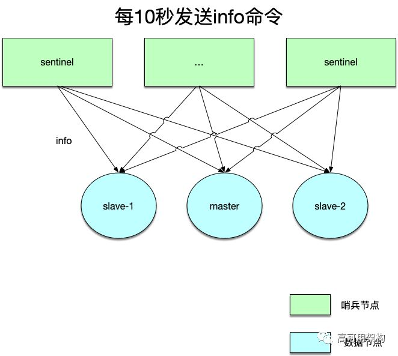
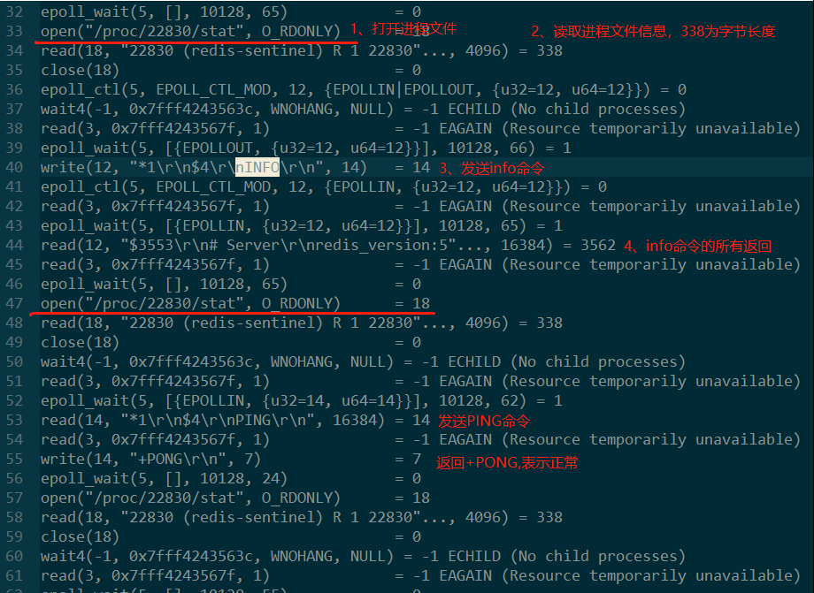
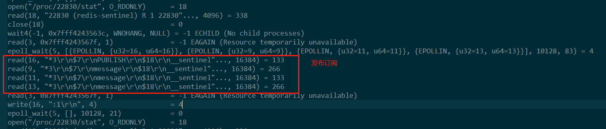
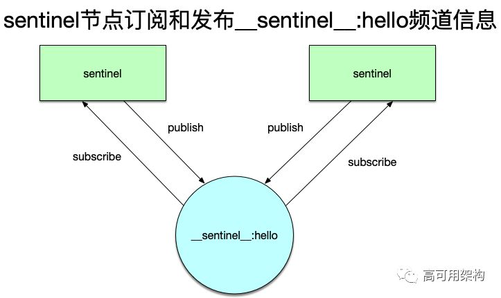
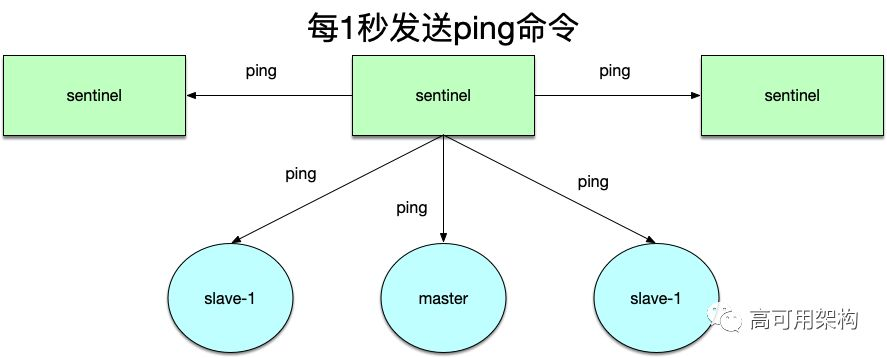
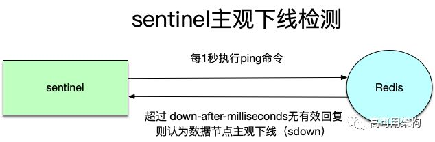
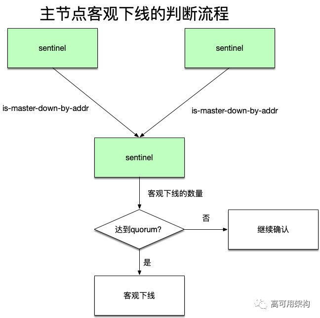
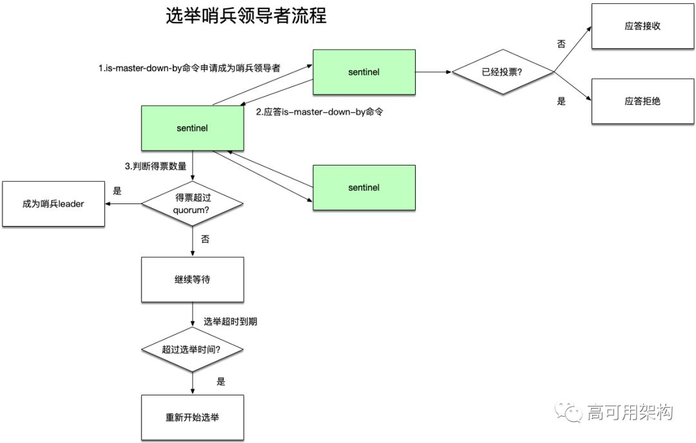
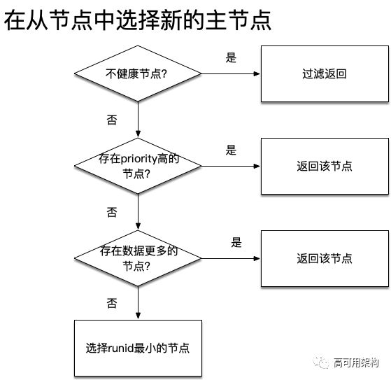
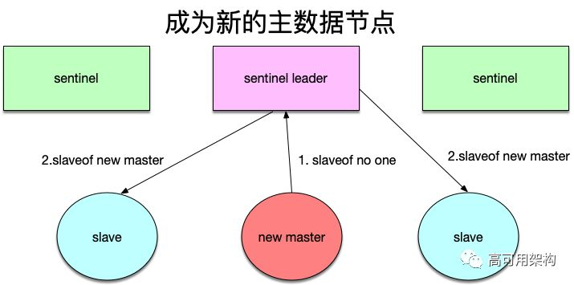

### **2、Redis查看哨兵进程的是如何工作的**

#### **1、哨兵机制概述**

Redis使用哨兵机制来实现高可用(HA)，其大概工作原理是：
* Redis使用一组哨兵（sentinel）节点来监控主从redis服务的可用性。
* 一旦发现Redis主节点失效，将选举出一个哨兵节点作为领导者（leader）。
* 哨兵领导者再从剩余的从Redis节点中选出一个Redis节点作为新的主Redis节点对外服务。
**1.1、Redis节点分为两类：**
* 哨兵节点（sentinel）：负责监控节点的运行情况。
* 数据节点：即正常服务客户端请求的Redis节点，有主从之分。
以上是大体的流程，这个流程需要解决以下几个问题：
* 如何对Redis数据节点进行监控？
* 如何确定一个Redis数据节点失效？
* 如何选择出一个哨兵领导者节点？
* 哨兵节点选择新的主Redis节点的依据是什么？
以下来逐个回答这些问题。

#### **2、Redis有三个监控任务**

哨兵节点通过三个定时监控任务监控Redis数据节点的服务可用性。
**2.1、info命令**
**每隔10秒，每个哨兵节点都会向主、从Redis数据节点发送info命令【就是redis客户端的info命令的所有返回】，获取新的拓扑结构信息。**
Redis拓扑结构信息包括了：
* 本节点角色：主或从。
* 主从节点的地址、端口、内存，cpu等等信息。
这样，哨兵节点就能从info命令中自动获取到从节点信息，因此那些后续才加入的从节点信息不需要显式配置就能自动感知。

**2.2、哨兵集群的自动发现机制（告诉其他哨兵节点，自己的端口信息等。达到所有哨兵节点数据互通）**
哨兵互相之间的发现，是通过redis的pub/sub系统实现的，每个哨兵都会往__sentinel__:hello这个channel里发送一个消息，这时候所有其他哨兵都可以消费到这个消息，并感知到其他的哨兵的存在。
具体就是，每隔2s，每个哨兵都会往自己监控的某个master+slaves对应的__sentinel__:hello channel里发送一个消息，内容是自己的host、ip和runid还有对这个master的监控配置。然后每个哨兵也会去监听自己监控的每个master+slaves对应的__sentinel__:hello channel，然后去感知到同样在监听这个master+slaves的其他哨兵的存在。

**每个哨兵还会跟其他哨兵交换对master的监控配置，互相进行监控配置的同步。**

**2.3、向数据节点做心跳探测**
每隔1秒，每个哨兵节点向主、从数据节点以及其他sentinel节点发送ping命令做心跳探测，这个心跳探测是后续主观判断数据节点下线的依据。

### **主观下线和客观下线**
#### **主观下线**
上面三个监控任务中的第三个探测心跳任务，如果在配置的down-after-milliseconds之后没有收到有效回复，那么就认为该数据节点“主观下线（sdown）”。

为什么称为“主观下线”？因为在一个分布式系统中，有多个机器在一起联动工作，网络可能出现各种状况，仅凭一个节点的判断还不足以认为一个数据节点下线了，这就需要后面的“客观下线”。

#### **客观下线**
当一个哨兵节点认为主节点主观下线时，该哨兵节点需要通过”sentinel is-master-down-by addr”命令向其他哨兵节点咨询该主节点是否下线了，如果有超过半数的哨兵节点都回答了下线，此时认为主节点“客观下线”。

#### **选举哨兵领导者**
当主节点客观下线时，需要选举出一个哨兵节点做为哨兵领导者，以完成后续选出新的主节点的工作。
这个选举的大体思路是：
* 每个哨兵节点通过向其他哨兵节点发送”sentinel is-master-down-by addr”命令来申请成为哨兵领导者。
* 而每个哨兵节点在收到一个”sentinel is-master-down-by addr”命令时，只允许给第一个节点投票，其他节点的该命令都会被拒绝。
* 如果一个哨兵节点收到了半数以上的同意票，则成为哨兵领导者。
* 如果前面三步在一定时间内都没有选出一个哨兵领导者，将重新开始下一次选举。
可以看到，这个选举领导者的流程很像raft中选举leader的流程。

#### **选出新的主节点**
在剩下的Redis从节点中，按照以下顺序来选择新的主节点：
* 过滤掉“不健康”的数据节点：比如主观下线、断线的从节点、五秒内没有回复过哨兵节点ping命令的节点、与主节点失联的从节点。
* 选择slave-priority（从节点优先级）最高的从节点，如果存在则返回不存在则继续后面的流程。
* 选择复制偏移量最大的从节点，这意味着这个从节点上面的数据最完整，如果存在则返回不存在则继续后面的流程。
* 到了这里，所有剩余从节点的状态都是一样的，选择runid最小的从节点。

**提升新的主节点**
选择了新的主节点之后，还需要最后的流程让该节点成为新的主节点：
* 哨兵领导者向上一步选出的从节点发出“slaveof no one”命令，让该节点成为主节点。
* 哨兵领导者向剩余的从节点发送命令，让它们成为新主节点的从节点。
* 哨兵节点集合会将原来的主节点更新为从节点，当其恢复之后命令它去复制新的主节点的数据。
