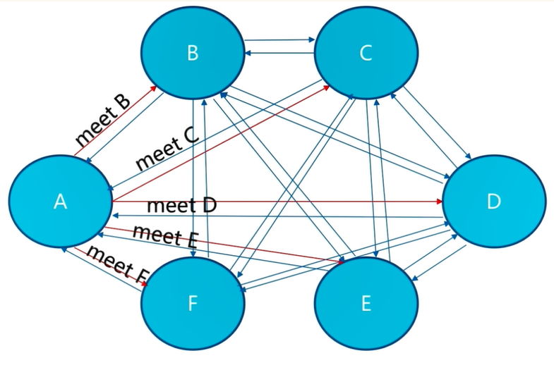
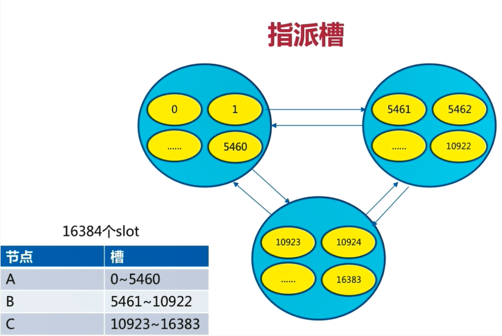
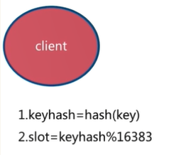
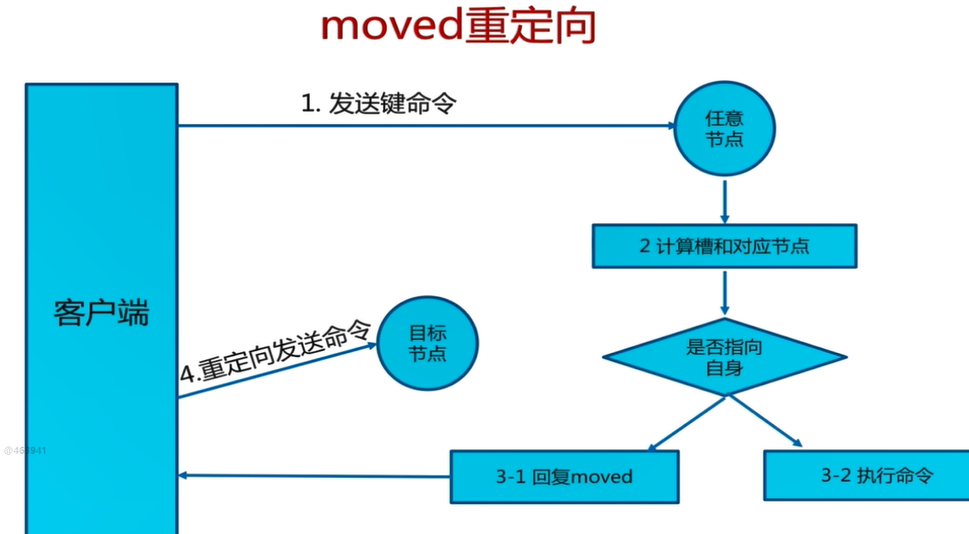
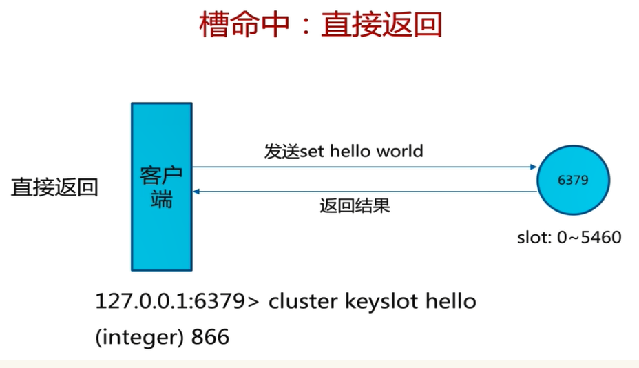
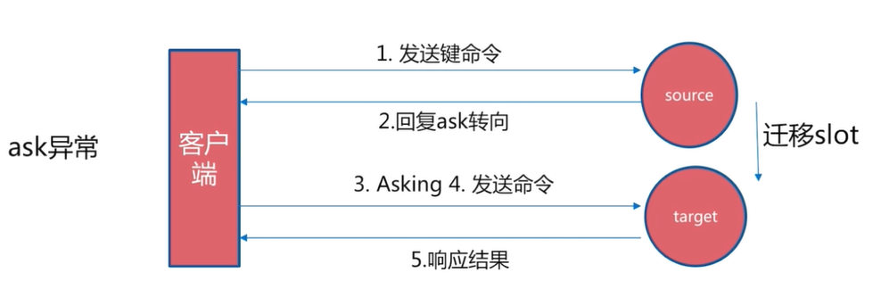
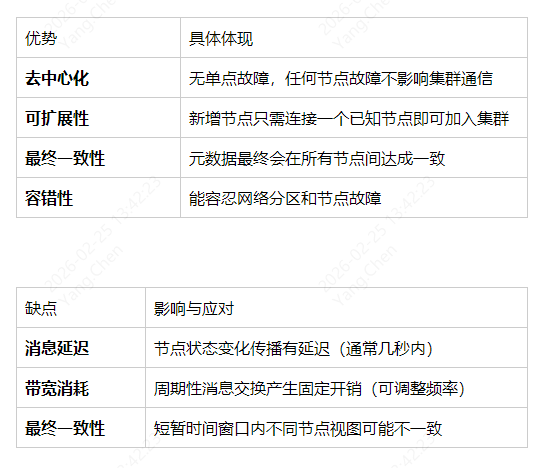

#### **1、下载安装redis cluster集群**

```mysql
wget https://download.redis.io/releases/redis-5.0.10.tar.gz
tar zxvf redis-5.0.10.tar.gz
mv redis-5.0.10/ /usr/local/redis        #移动
cd /usr/local/redis/src
make MALLOC=libc
make install
cd /usr/local/redis/
mkdir -p data/7001
mkdir -p data/7002
mkdir -p data/7003
mkdir -p data/7004
mkdir -p data/7005
mkdir -p data/7006
vim redis_cluster_7001.conf
port 7001
daemonize yes
bind 0.0.0.0
cluster-enabled yes
#这个文件夹要改成自己的目录
dir "/usr/local/redis/data/7001"
logfile "/usr/local/redis/data/7001/node.log"
masterauth "abcd1234"
requirepass "abcd1234"
# Generated by CONFIG REWRITE
protected-mode no
#创建同样的文件6个redis_cluster_700x.conf   端口注意修改
root@garden-micro:/usr/local/redis# ll redis_cluster_*
-rw-r--r-- 1 root root 270 Apr 28 11:51 redis_cluster_7001.conf
-rw-r--r-- 1 root root 218 Apr 28 10:58 redis_cluster_7002.conf
-rw-r--r-- 1 root root 218 Apr 28 10:58 redis_cluster_7003.conf
-rw-r--r-- 1 root root 218 Apr 28 10:58 redis_cluster_7004.conf
-rw-r--r-- 1 root root 218 Apr 28 10:58 redis_cluster_7005.conf
-rw-r--r-- 1 root root 218 Apr 28 10:58 redis_cluster_7006.conf
#启动脚本
vim start_cluster.sh
#########################################################################################
#!/bin/sh
/usr/local/redis/src/redis-server /usr/local/redis/redis_cluster_7001.conf
/usr/local/redis/src/redis-server /usr/local/redis/redis_cluster_7002.conf
/usr/local/redis/src/redis-server /usr/local/redis/redis_cluster_7003.conf
/usr/local/redis/src/redis-server /usr/local/redis/redis_cluster_7004.conf
/usr/local/redis/src/redis-server /usr/local/redis/redis_cluster_7005.conf
/usr/local/redis/src/redis-server /usr/local/redis/redis_cluster_7006.conf
#以上6个命令只是启动单个的redis服务
#停止脚本 
#ps -ef |grep cluster | grep -v grep | awk '{print $2}' | xargs kill -9
#########################################################################################
#创建集群模式命令
/usr/local/redis/src/redis-cli --cluster create 10.100.0.166:7001 10.100.0.166:7002 10.100.0.166:7003 10.100.0.166:7004 10.100.0.166:7005 10.100.0.166:7006 --cluster-replicas 1 -a abcd1234
Warning: Using a password with '-a' or '-u' option on the command line interface may not be safe.
>>> Performing hash slots allocation on 6 nodes...
Master[0] -> Slots 0 - 5460
Master[1] -> Slots 5461 - 10922
Master[2] -> Slots 10923 - 16383
Adding replica 10.100.0.166:7005 to 10.100.0.166:7001
Adding replica 10.100.0.166:7006 to 10.100.0.166:7002
Adding replica 10.100.0.166:7004 to 10.100.0.166:7003
>>> Trying to optimize slaves allocation for anti-affinity
[WARNING] Some slaves are in the same host as their master
M: 73d1bfe716860128dc31b54d456bc1c0365663c2 10.100.0.166:7001
   slots:[0-5460] (5461 slots) master
M: 909623e6396c36d88615cf16b664256d0cc14784 10.100.0.166:7002
   slots:[5461-10922] (5462 slots) master
M: 3c35131b3550efda0ff94c44ca84112269c137b9 10.100.0.166:7003
   slots:[10923-16383] (5461 slots) master
S: fe77c0ac1a8774db2f8ab2ac92cc743aa4839338 10.100.0.166:7004
   replicates 909623e6396c36d88615cf16b664256d0cc14784
S: 9fcc34ff2bfd116cd3d2fd2e49a9bd091107d56a 10.100.0.166:7005
   replicates 3c35131b3550efda0ff94c44ca84112269c137b9
S: c3a2d352faadfdf3ad03489826f587d17a880855 10.100.0.166:7006
   replicates 73d1bfe716860128dc31b54d456bc1c0365663c2
Can I set the above configuration? (type 'yes' to accept): yes
>>> Nodes configuration updated
>>> Assign a different config epoch to each node
>>> Sending CLUSTER MEET messages to join the cluster
Waiting for the cluster to join
>>> Performing Cluster Check (using node 10.100.0.166:7001)
M: 73d1bfe716860128dc31b54d456bc1c0365663c2 10.100.0.166:7001
   slots:[0-5460] (5461 slots) master
   1 additional replica(s)
S: 9fcc34ff2bfd116cd3d2fd2e49a9bd091107d56a 10.100.0.166:7005
   slots: (0 slots) slave
   replicates 3c35131b3550efda0ff94c44ca84112269c137b9
M: 909623e6396c36d88615cf16b664256d0cc14784 10.100.0.166:7002
   slots:[5461-10922] (5462 slots) master
   1 additional replica(s)
M: 3c35131b3550efda0ff94c44ca84112269c137b9 10.100.0.166:7003
   slots:[10923-16383] (5461 slots) master
   1 additional replica(s)
S: fe77c0ac1a8774db2f8ab2ac92cc743aa4839338 10.100.0.166:7004
   slots: (0 slots) slave
   replicates 909623e6396c36d88615cf16b664256d0cc14784
S: c3a2d352faadfdf3ad03489826f587d17a880855 10.100.0.166:7006
   slots: (0 slots) slave
   replicates 73d1bfe716860128dc31b54d456bc1c0365663c2
[OK] All nodes agree about slots configuration.
>>> Check for open slots...
>>> Check slots coverage...
[OK] All 16384 slots covered.表示创建成功
root@garden-micro:/usr/local/redis# redis-cli -c -p 7001        #-c集群模式连接
NOAUTH Authentication required.
127.0.0.1:7001> auth abcd1234
OK
127.0.0.1:7001> cluster nodes
9fcc34ff2bfd116cd3d2fd2e49a9bd091107d56a 10.100.0.166:7005@17005 slave 3c35131b3550efda0ff94c44ca84112269c137b9 0 1619588909000 5 connected
909623e6396c36d88615cf16b664256d0cc14784 10.100.0.166:7002@17002 master - 0 1619588909934 2 connected 5461-10922
73d1bfe716860128dc31b54d456bc1c0365663c2 10.100.0.166:7001@17001 myself,master - 0 1619588910000 1 connected 0-5460
3c35131b3550efda0ff94c44ca84112269c137b9 10.100.0.166:7003@17003 master - 0 1619588907000 3 connected 10923-16383
fe77c0ac1a8774db2f8ab2ac92cc743aa4839338 10.100.0.166:7004@17004 slave 909623e6396c36d88615cf16b664256d0cc14784 0 1619588910934 4 connected
c3a2d352faadfdf3ad03489826f587d17a880855 10.100.0.166:7006@17006 slave 73d1bfe716860128dc31b54d456bc1c0365663c2 0 1619588907929 6 connected
127.0.0.1:7001> set yang 111
-> Redirected to slot [10557] located at 10.100.0.166:7002
(error) NOAUTH Authentication required.
10.100.0.166:7002> auth abcd1234
OK
10.100.0.166:7002> set yang 111
OK
10.100.0.166:7002>
```

#### **2、Redis Cluster基本架构**

#### **2.1、节点**
Redis Cluster是分布式架构：即Redis Cluster中有多个节点，每个节点都负责进行数据读写操作。

#### **3.2 meet操作**
节点之间会相互通信，meet操作是节点之间完成相互通信的基础，meet操作有一定的频率和规则

#### **3.3 分配槽**
把16384个槽平均分配给节点进行管理，每个节点只能对自己负责的槽进行读写操作。由于每个节点之间都彼此通信，每个节点都知道另外节点负责管理的槽范围，客户端访问任意节点时，**<span style='color:red'>对数据key按照CRC16规则进行hash运算</span>**，然后对运算结果对16383进行取余，如果余数在当前访问的节点管理的槽范围内，则直接返回对应的数据
如果不在当前节点负责管理的槽范围内，则会告诉客户端去哪个节点获取数据，由客户端去正确的节点获取数据。



#### **3.4 复制**
保证高可用，每个主节点都有一个从节点，当主节点故障，Cluster会按照规则实现主备的高可用性。对于节点来说，有一个配置项：cluster-enabled，即是否以集群模式启动
#### **3.5 客户端路由**
**3.5.1 moved重定向**
* 每个节点通过通信都会共享Redis Cluster中槽和集群中对应节点的关系
* 客户端向Redis Cluster的任意节点发送命令，接收命令的节点会根据CRC16规则进行hash运算与16383取余，计算自己的槽和对应节点
* 如果保存数据的槽被分配给当前节点，则去槽中执行命令，并把命令执行结果返回给客户端
* 如果保存数据的槽不在当前节点的管理范围内，则向客户端返回moved重定向异常
* 客户端接收到节点返回的结果，如果是moved异常，则从moved异常中获取目标节点的信息
* 客户端向目标节点发送命令，获取命令执行结果


```mysql
[root@mysql ~]# redis-cli -c -p 9002
127.0.0.1:9002> cluster keyslot hello
(integer) 866
127.0.0.1:9002> set hello world
-> Redirected to slot [866] located at 192.168.81.100:9003
OK
192.168.81.100:9003> cluster keyslot python
(integer) 7252
192.168.81.100:9003> set python best
-> Redirected to slot [7252] located at 192.168.81.101:9002
OK
192.168.81.101:9002> get python
"best"
192.168.81.101:9002> get hello
-> Redirected to slot [866] located at 192.168.81.100:9003
"world"
192.168.81.100:9003> exit
[root@mysql ~]# redis-cli -p 9002
127.0.0.1:9002> cluster keyslot python
(integer) 7252
127.0.0.1:9002> set python best
OK
127.0.0.1:9002> set hello world
(error) MOVED 866 192.168.81.100:9003
127.0.0.1:9002> exit
[root@mysql ~]#
```
**3.5.2 ask重定向**
**在对集群进行扩容和缩容时，需要对槽及槽中数据进行迁移。当客户端向某个节点发送命令，节点向客户端返回moved异常，告诉客户端数据对应的槽的节点信息。如果此时正在进行集群扩展或者缩容操作，当客户端向正确的节点发送命令时，槽及槽中数据已经被迁移到别的节点了，就会返回ask，这就是ask重定向机制**


```mysql
步骤：
1.客户端向目标节点发送命令，目标节点中的槽已经迁移支别的节点上了，此时目标节点会返回ask转向给客户端
2.客户端向新的节点发送Asking命令给新的节点，然后再次向新节点发送命令
3.新节点执行命令，把命令执行结果返回给客户端
```
**moved异常与ask异常的相同点和不同点**
```mysql
两者都是客户端重定向
moved异常：槽已经确定迁移（迁移完成），即槽已经不在当前节点
ask异常：槽还在迁移中
```
**3.5.3 smart智能客户端**
使用智能客户端的首要目标：追求性能
从集群中选一个可运行节点，使用Cluster slots初始化槽和节点映射
将Cluster slots的结果映射在本地，为每个节点创建JedisPool，相当于为每个redis节点都设置一个JedisPool，然后就可以进行数据读写操作
```mysql
读写数据时的注意事项：
每个JedisPool中缓存了slot和节点node的关系
key和slot的关系：对key进行CRC16规则进行hash后与16383取余得到的结果就是槽
JedisCluster启动时，已经知道key,slot和node之间的关系，可以找到目标节点
JedisCluster对目标节点发送命令，目标节点直接响应给JedisCluster
如果JedisCluster与目标节点连接出错，则JedisCluster会知道连接的节点是一个错误的节点
此时JedisCluster会随机节点发送命令，随机节点返回moved异常给JedisCluster
JedisCluster会重新初始化slot与node节点的缓存关系，然后向新的目标节点发送命令，目标命令执行命令并向JedisCluster响应
如果命令发送次数超过5次，则抛出异常"Too many cluster redirection!"
```
**3.6 故障发现**
Redis Cluster通过ping/pong消息实现故障发现：不需要sentinel；ping/pong不仅能传递节点与槽的对应消息，也能传递其他状态，比如：节点主从状态，节点故障等

**主观下线：（某个节点认为另一个节点不可用）**
* 节点1定期发送ping消息给节点2
* 如果发送成功，代表节点2正常运行，节点2会响应PONG消息给节点1，节点1更新与节点2的最后通信时间
* 如果发送失败，则节点1与节点2之间的通信异常判断连接，在下一个定时任务周期时，仍然会与节点2发送ping消息
* 如果节点1发现与节点2最后通信时间超过node-timeout，则把节点2标识为pfail状态

**客观下线：（当半数以上持有槽的主节点都标记某节点主观下线）**
集群模式下，只有主节点(master)才有读写权限和集群槽的维护权限，从节点(slave)只有复制的权限

客观下线流程：
* 某个节点接收到其他节点发送的ping消息，如果接收到的ping消息中包含了其他pfail节点，这个节点会将主观下线的消息内容添加到自身的故障列表中，故障列表中包含了当前节点接收到的每一个节点对其他节点的状态信息
* 当前节点把主观下线的消息内容添加到自身的故障列表之后，会尝试对故障节点进行客观下线操作

#### **4、Gossip协议**

**Gossip协议是Redis Cluster实现去中心化集群通信，Gossip协议在Redis Cluster中的具体应用如下：**

**4.1、集群节点发现与元数据传播（这是Gossip最基本也是最核心的应用）**
Gossip协议是Redis Cluster的"神经系统"，负责：
* 节点发现 - 新节点自动加入集群
* 故障检测 - 分布式判定节点下线
* 元数据同步 - 槽位映射、配置纪元等信息传播
* 最终一致性 - 保证集群视图最终一致
* 
**4.2、为什么Redis Cluster选择Gossip？**


