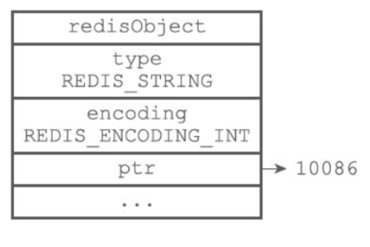
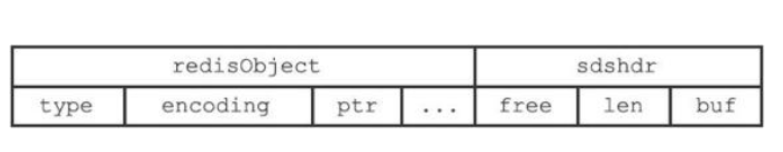
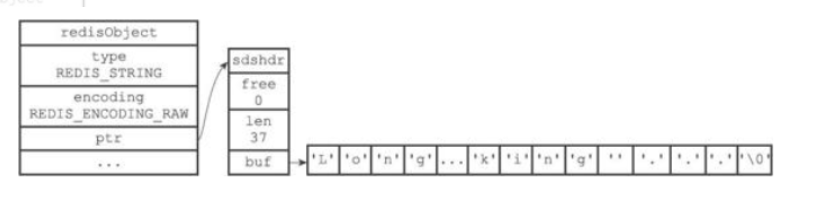

### **一、redis的5大数据对象**

字符串对象（string）、列表对象（list）、哈希对象（hash）、集合（set）对象和有序集合对象（zset）
redisObject结构
```mysql
typedef struct redisObject {
    unsigned type:4;// 类型
    unsigned encoding:4;  // 编码
    unsigned lru:LRU_BITS; // 记录访问时间
    int refcount; //引用计数
    void *ptr; // 指向底层实现数据结构的指针
    // ...
} robj;
```
redis是以键值对存储数据的，存储一个key-value键值对会创建两个对象，**<span style='color:red'>键对象和值对象</span>**。键对象总是一个字符串对象，而值对象可以是五大对象中的任意一种。

看看redis命令行的展示:
```mysql
查看redisObject
1. type key查看值的类型 (string、hash、list、set、zset)
2. object encoding key 查看编码类型
3. object refcount key 查看引用次数
4. object idletime key 查看空闲时间
127.0.0.1:6379> set chenNum "111"
OK
127.0.0.1:6379> OBJECT encoding chenNum
"int"
127.0.0.1:6379> set chenNum "100000.12"
OK
127.0.0.1:6379> OBJECT encoding chenNum
"embstr"
127.0.0.1:6379> set chenString "aaa"
OK
127.0.0.1:6379> OBJECT encoding chenString
"embstr"
127.0.0.1:6379> set chenString "aaaaaaaaaaaaaaaaaaaaaaaaaaaaaaaaaaaaaaaaaaaaaaaaaaaaaa"
OK
127.0.0.1:6379> OBJECT encoding chenString
"raw"
127.0.0.1:6379> OBJECT refcount chenString
(integer) 1
127.0.0.1:6379> OBJECT refcount chenNum  ##设置数字值小于10000的引用计数都为INT_MAX, 其他为1
(integer) 2147483647
127.0.0.1:6379> OBJECT idletime chenNum  ##显示该key闲置时间（单位是秒）；访问之后设置为0
(integer) 192534
##hash
127.0.0.1:6379> hset test chen 123
(integer) 1
127.0.0.1:6379> OBJECT encoding test
"ziplist"
127.0.0.1:6379> lpush testlist 1
(integer) 1
127.0.0.1:6379> OBJECT encoding testlist
"quicklist"
##set集合
127.0.0.1:6379> sadd testset 111 222 333
(integer) 3
127.0.0.1:6379> SMEMBERS testset
1) "111"
2) "222"
3) "333"
127.0.0.1:6379> OBJECT encoding testset
"intset" //纯数字的集合，且个数小于512个
127.0.0.1:6379> sadd testset 111 222 333 aaa vvv
(integer) 2
127.0.0.1:6379> OBJECT encoding testset
"hashtable"
```

#### **1、字符串对象(string)**

字符串对象底层数据结构实现为<span style='color:red'>简单动态字符串（SDS）</span>和直接存储，但其编码方式可以是int、raw或者embstr，区别在于内存结构的不同。
```mysql
SDS与c语言字符串对比
Redis使用SDS作为存储字符串的类型肯定是有自己的优势，SDS与c语言的字符串相比，SDS对c语言的字符串做了自己的设计和优化，具体优势有以下几点：
（1）c语言中的字符串并不会记录自己的长度，因此「每次获取字符串的长度都会遍历得到，时间的复杂度是O(n)」，而Redis中获取字符串只要读取len的值就可，时间复杂度变为O(1)。
（2）「c语言」中两个字符串拼接，若是没有分配足够长度的内存空间就「会出现缓冲区溢出的情况」；而「SDS」会先根据len属性判断空间是否满足要求，若是空间不够，就会进行相应的空间扩展，所以「不会出现缓冲区溢出的情况」。
（3）SDS还提供「空间预分配」和「惰性空间释放」两种策略。在为字符串分配空间时，分配的空间比实际要多，这样就能「减少连续的执行字符串增长带来内存重新分配的次数」。
当字符串被缩短的时候，SDS也不会立即回收不适用的空间，而是通过free属性将不使用的空间记录下来，等后面使用的时候再释放。
具体的空间预分配原则是：「当修改字符串后的长度len小于1MB，就会预分配和len一样长度的空间，即len=free；若是len大于1MB，free分配的空间大小就为1MB」。
（4）SDS是二进制安全的，除了可以储存字符串以外还可以储存二进制文件（如图片、音频，视频等文件的二进制数据）；而c语言中的字符串是以空字符串作为结束符，一些图片中含有结束符，因此不是二进制安全的。
```
#### （1）int编码
字符串保存的是整数值，并且这个整数可以用long类型来表示，那么其就会直接保存在redisObject的ptr属性里，并将编码设置为int，如图：


#### （2）embstr编码
字符串保存的小于等于32字节(**<span style='color:red'>6.2.6版本是46字节</span>**)的字符串值，使用的也是简单的动态字符串（SDS结构），但是内存结构做了优化，用于保存顿消的字符串；内存分配也<span style='color:red'>只需要一次</span>就可完成，分配一块连续的空间即可，如图：


#### （3）raw编码
**<span style='color:red'>字符串保存的大于32字节的字符串值(根据redis版本不同而不同，6.2.6版本是46字节)</span>**，则使用简单动态字符串（SDS）结构，并将编码设置为raw，此时内存结构与SDS结构一致，内存分配<span style='color:red'>次数为两次</span>，创建redisObject对象和sdshdr结构，如图：


字符串对象总结：
* 在Redis中，存储long、double类型的浮点数是先转换为字符串再进行存储的。
* raw与embstr编码效果是相同的，不同在于内存分配与释放，raw两次，embstr一次。
* embstr内存块连续，能更好的利用缓存带来的优势
* int编码和embstr编码如果做追加字符串等操作，满足条件下会被转换为raw编码；embstr编码的对象是只读的，一旦修改会先转码到raw。