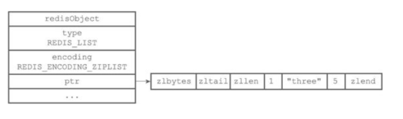
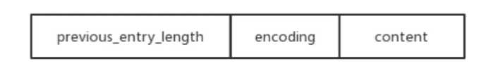
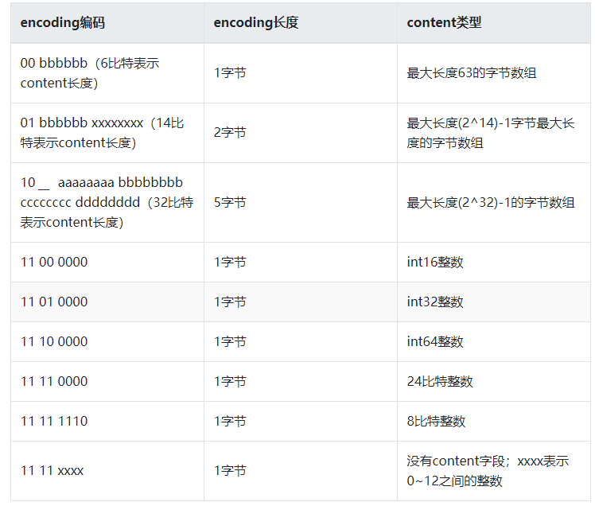
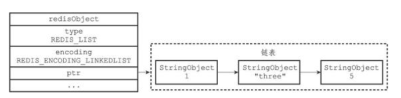
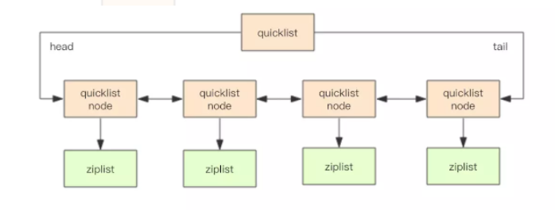
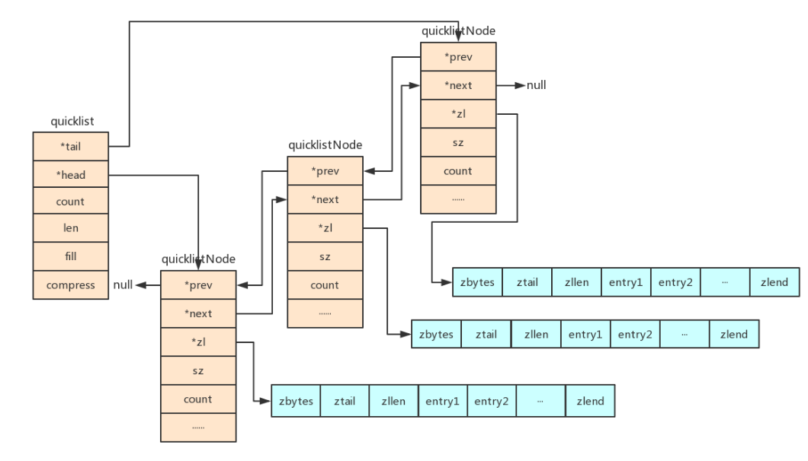
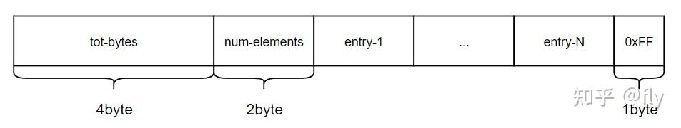
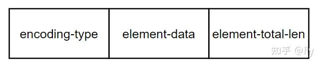
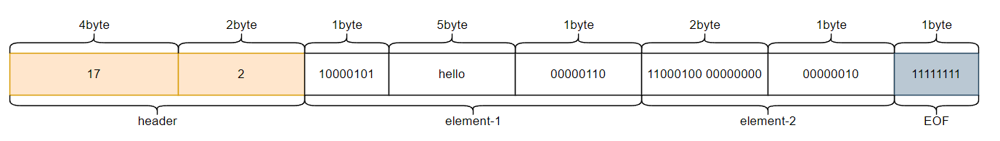

#### **2、列表对象(list)**

3.2版本之前：列表对象的编码可以是ziplist和linkedlist之一。
#### （1） ziplist编码
ziplist是如何节省内存的、压缩列表牺牲速度来节省内存
ziplist编码的哈希随想底层实现是压缩列表（为 Redis 节约内存而开发的），每个压缩里列表节点保存了一个列表元素。




一个entry的组成



* previous_entry_length字段表示前一个元素的字节长度，占1个或者5个字节；当前一个元素的长度小于254字节时，previous_entry_length字段用一个字节表示；当前一个元素的长度大于等于254字节时，previous_entry_length字段用5个字节来表示；而这时候previous_entry_length的第一个字节是固定的标志0xFE，后面4个字节才真正表示前一个元素的长度；假设已知当前元素的首地址为p，那么（p-previous_entry_length）就是前一个元素的首地址，从而实现压缩列表从尾到头的遍历；
* encoding字段表示当前元素的编码，即content字段存储的数据类型（整数或者字节数组），数据内容存储在content字段；为了节约内存，encoding字段同样是可变长度

```mysql
如：
1 previous_entry_length | 0000 1100 | "Hello Golden"
2 previous_entry_length | 1100 0000 | 10086
1、编码的最高两位00表示节点保存的是一个字节数组，编码的后六位001100记录了字节数组的长度12，content属性保存着节点的值"hello Golden"
2、编码1100 0000表示节点保存的是一个int16_t类型的整数值，content属性保存着节点的值10086
```

#### （2）linkedlist编码


linkedlist编码底层采用<span style='color:red'>**双端链表**</span>实现，每个双端链表节点都保存了一个字符串对象，在每个字符串对象内保存了一个列表元素。

列表对象编码转换：
* 列表对象使用ziplist编码需要满足两个条件：一是所有字符串长度都小于64字节，二是元素数量小于512，不满足任意一个都会使用linkedlist编码。
* 两个条件的数字可以在Redis的配置文件中修改，list-max-ziplist-value选项和list-max-ziplist-entries选项。
* 图中StringObject就是上一节讲到的字符串对象（SDS结构），字符串对象是唯一个在五大对象中作为嵌套对象使用的。

<span style='color:red'>3.2版本之后：列表对象的编码quicklist。</span>

quicklist编码
quickList 是 zipList 和 linkedList 的混合体，它将 linkedList 按段切分，每一段使用 zipList 来紧凑存储，多个 zipList 之间使用双向指针串接起来。

* linkedlist是标准的双向链表，Node节点包含prev和next指针，可以进行双向遍历；
* 还保存了 head 和 tail 两个指针，因此，对链表的表头和表尾进行插入的复杂度都为 (1) —— 这是高效实现 LPUSH 、 RPOP、 RPOPLPUSH 等命令的关键。



Redis 还会对 ziplist 进行压缩存储，使用 LZF 算法压缩，可以选择压缩深度。

ziplist长度：
* quicklist 内部默认单个 ziplist 长度为 8k 字节，超出了这个字节数，就会新起一个 ziplist。
* ziplist 的长度由配置参数 list-max-ziplist-size 决定。

<span style='color:red'>quicklist插入操作：</span>

#### **1、quicklist可以选择在头部或者尾部进行插入(quicklistPushHead和quicklistPushTail)，而不管是在头部还是尾部插入数据，都包含两种情况：**

* 如果头节点（或尾节点）上ziplist大小没有超过限制（即_quicklistNodeAllowInsert返回1），那么新数据被直接插入到 ziplist中（调用ziplistPush）。
* 如果头节点（或尾节点）上ziplist太大了，那么新创建一个quicklistNode节点（对应地也会新创建一个ziplist），然后把这个新创建的节点插入到quicklist双向链表中。

#### **2、从任意指定的位置插入。quicklistInsertAfter和quicklistInsertBefore就是分别在指定位置后面和前面插入数据项。**

* 当插入位置所在的ziplist大小没有超过限制时，直接插入到ziplist中就好了；
* 当插入位置所在的ziplist大小超过了限制，但插入的位置位于ziplist两端，并且相邻的quicklist链表节点的ziplist大小没有超过限制，那么就转而插入到相邻的那个quicklist链表节点的ziplist中；
* 当插入位置所在的ziplist大小超过了限制，但插入的位置位于ziplist两端，并且相邻的quicklist链表节点的ziplist大小也超过限制，这时需要新创建一个quicklist链表节点插入。
* 对于插入位置所在的ziplist大小超过了限制的其它情况（主要对应于在ziplist中间插入数据的情况），则需要把当前ziplist分裂为两个节点，然后再其中一个节点上插入数据。

<span style='color:red'>quicklist查找操作：</span>

list的查找操作主要是对index的，quicklist的节点是由一个一个的ziplist构成的每个ziplist都有大小。所以我们就只需要先根据我们每个node的个数，从而找到对应的ziplist，调用ziplist的index就能成功找到。
#### **listpack（ziplist的升级版）**

#### **1、listpack数据结构**


```mysql
字段解释：
tot-bytes：整个结构的字节数量，包括头部以及尾部，占4个字节。
num-elements：元素的数量，占2个字节，最大表示65535个，超过则需要遍历获取长度。
entry-N：具体的每个元素。
0xFF：结尾标志，占1个字节，全是1。
```

#### **2、entry元素结构**


```mysql
字段解释：
encoding-type表示编码类型，有下面几种：
a. 单字节编码
0|xxxxxxx：1个字节，表示7位无符号整型，后7位为数据。
10|xxxxxx：1个字节，表示短字符串，后6位表示长度，最大可以表示63字节的字符串。
b. 多字节编码
110|xxxxx yyyyyyyy：2个字节，表示13位有符号整数。
1110|xxxx yyyyyyyy：2个字节，后12位表示字符串长度，最大可以表示4095字节的字符串。
11110000|<4byte>：5个字节，后4个字节表示字符串长度，用来表示长字符串。
11110001|<2byte>：3个字节，后2个字节用来表示有符号整数。
11110010|<3byte>：4个字节，后3个字节用来表示有符号整数。
11110011|<4byte>：5个字节，后4个字节用来表示有符号整数。
11110100|<8byte>: 9个字节，后8个字节用来表示有符号整数。
11110101-11111110：未使用。
11111111：用来表示listpack结尾。
element-total-len表示前两部分占用的字节数，1-5字节不等。每个字节第一位用0或1来表示当前字节是否为最后一字节，0表示是，1表示否，剩余字节逻辑上拼接在一起来存放无符号整数表示字节数，采用的是大端模式，即高字节保存在低地址，低字节保存在高地址，这部分主要是为了是反向遍历而设计的。
```
假设要用listpack结构存放字符串"hello"以及整数1024，表示如下图: （请看多字节编码）
```mysql
当存储的为字符串，那么lsentry的sval不为空，slen记录大小。
当存储的为整形，那么lval记录整型，sval字段为空
```
