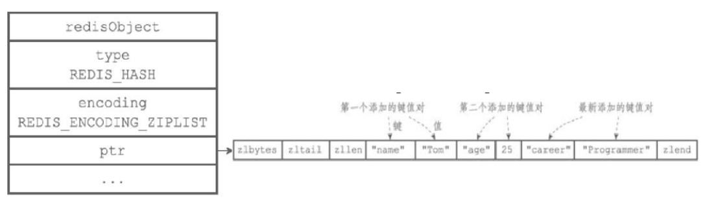
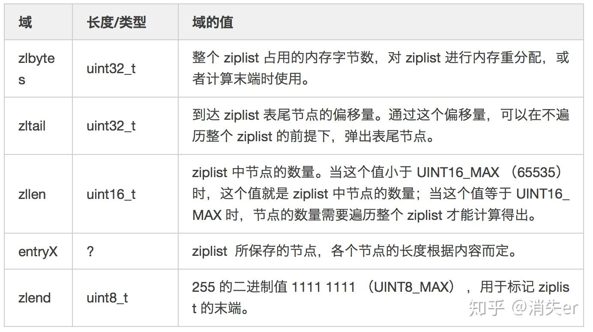
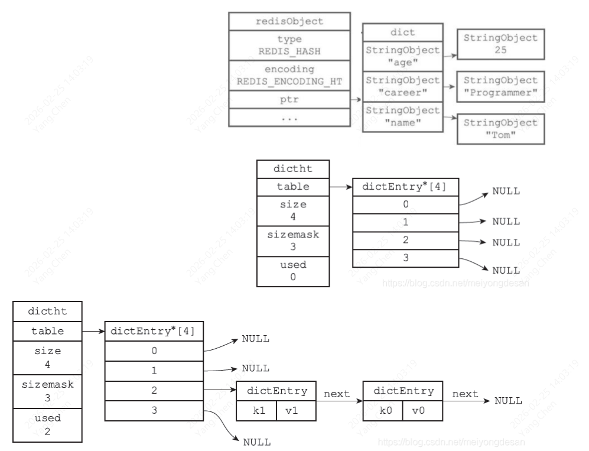

#### **3、哈希对象(hash)**

哈希对象的编码可以是**ziplist**和**hashtable**之一
#### （1）ziplist编码
ziplist编码的哈希对象底层实现是压缩列表，在ziplist编码的哈希对象中，key-value键值对是以紧密相连的方式放入压缩链表的，先把key放入表尾，再放入value；键值对总是向表尾添加。
使用ziplist编码方式的哈希对象不能实现O(1)复杂度的基本操作，而是<span style='color:red'>通过遍历来查找元素。</span>




* <span style="color:red">**为什么不直接用hastable，而要使用ziplist呢？**</span>
相比hashtable，ziplist结构少了指针，大大的减少了内存的使用。而数据量少的情况下，ziplist的效率和hashtable对比相差不多，影响不是很大
* <span style="color:red">**为什么不用 linklist，而要使用ziplist呢？**</span>
ziplist存储时内存分配是连续的，查询速度相比于双链表更快

#### （2）hashtable（哈希表）
hashtable编码的哈希对象底层实现是字典，哈希对象中的每个key-value对都使用一个字典键值对来保存。
字典键值对即是，字典的键和值都是字符串对象，字典的键保存key-value的key，字典的值保存key-value的value。
hashtable是如何扩容的

```mysql
//dictht 结构体定义
typedef struct dictht {//字典类型
    dictEntry **table; // 哈希表数组 dictEntry
    unsigned long size;// 哈希表大小
    unsigned long sizemask;//哈希表大小掩码，用于计算索引值 总是等于size-1
    unsigned long used; // 该哈希表已有节点的数量
} dictht;
//哈希表节点使用 dictEntry 表示
typedef struct dictEntry {
    void *key;// 键
    union{   // 值
        void *val;
        uint64_tu64;
        int64_ts64;
    } v;
    //指向下个哈希表节点，形成链表将hash值相同的键值对连接在一起，避免冲突
    struct dictEntry *next;
} dictEntry;
```
哈希对象编码转换：
* 哈希对象使用ziplist编码需要满足两个条件：一是所有键值对的键和值的字符串长度都小于64字节；二是键值对数量小于512个；不满足任意一个都使用hashtable编码。
* 以上两个条件可以在Reids配置文件中修改hash-max-ziplist-value选项和hash-max-ziplist-entries选项。