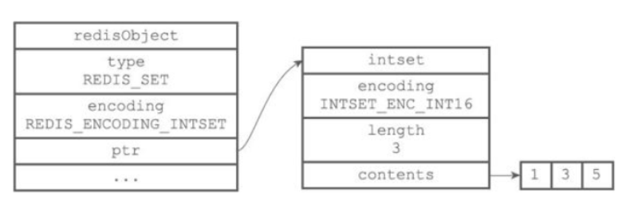
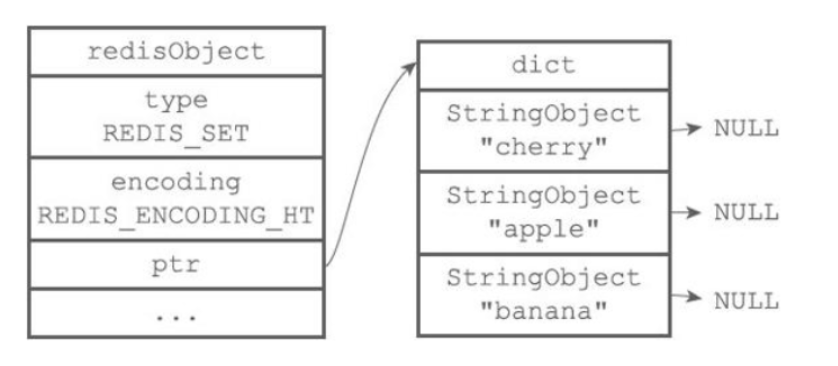

#### **集合对象(set)**
集合对象的编码可以是intset和hashtable之一。
#### （1）intset编码
**intset编码的集合对象底层实现是整数集合，所有元素都保存在整数数组集合中。intset 有三种编码，int16、int32、int64值是数字，编码是从小到大的, 查找复杂度是O(N)，查找方法是2分查找，所以有性能问题，数量小于512或者值并且值小于2的64次方 的时候用 IntSet**

#### （2）hashtable编码
**hashtable编码的集合对象底层实现是字典，字典的每个键都是一个字符串对象，保存一个集合元素，不同的是字典的值都是NULL；可以参考java中的hashset结构。查找复杂度是O(1)**

集合对象编码转换：
* 集合对象使用intset编码需要满足两个条件：一是所有元素都是整数值；二是元素个数小于等于512个；不满足任意一条都将使用hashtable编码。
* 以上第二个条件可以在Redis配置文件中修改et-max-intset-entries选项