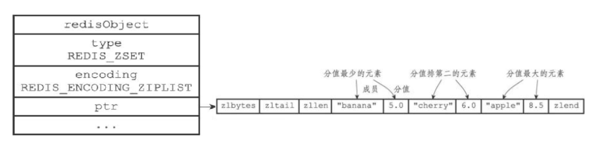
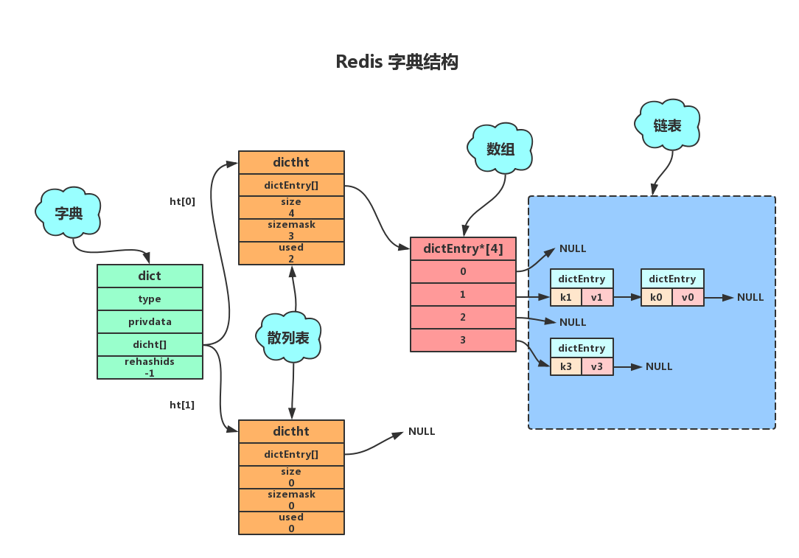
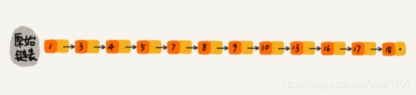
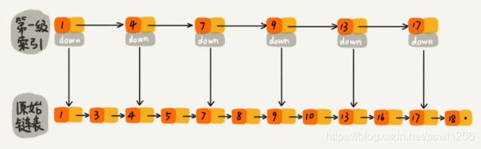
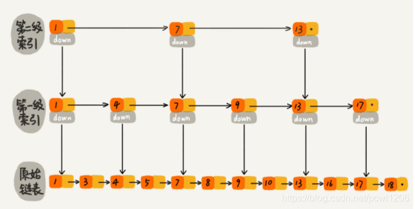
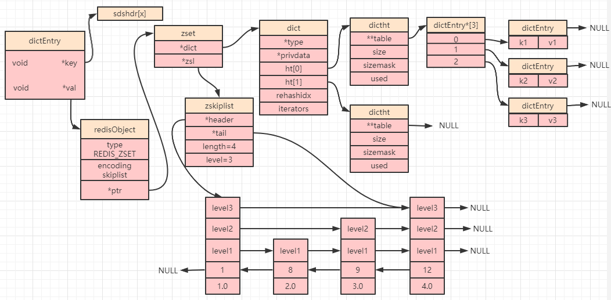

#### 有序集合对象(zset)
* 有序集合的编码可以是ziplist和skiplist之一。

#### （1）ziplist编码
ziplist编码的有序集合对象底层实现是压缩列表，其结构与哈希对象类似，不同的是两个紧密相连的压缩列表节点，第一个保存元素的成员，第二个保存元素的分值，而且分值小的靠近表头，大的靠近表尾。



#### （2）skiplist编码
skiplist编码的有序集合对象底层实现是<span style='color:red'>**跳跃表和字典两种**</span>
* **<span style='color:red'>字典</span>**：底层是hash数组+链表的形式
* **<span style='color:red'>跳表</span>**：是一个随机化的数据结构，实质是一种可以进行二分查找的有序链表【复杂度为O(logn)】。跳表在原有的有序链表上增加了多级索引，通过索引来实现快速查询。跳表不仅能提高搜索性能，同时也可以提高插入和删除操作的性能O(logn)。







<span style='color:red'>底层原始链表是有序的单向链表</span>

每个跳跃表节点都保存集合的一个元素，并按分值从小到大排列；每个节点对象的object属性保存了元素的成员，score属性保存分值；
字典的每个键值对保存集合的一个元素，字典的键保存元素的成员，字典的值保存分值。


```mysql
typedef struct zset {
    dict *dict;//字典对象 根据某一成员对对象操作（增删改查时间复杂度O(1),即快）
    zskiplist *zsl;//跳跃表对象 比如快速查找指定的分值范围，有序遍历
} zset;
//跳跃表的数据结构
typedef struct zskiplist {
    struct zskiplistNode *header, *tail;//跳跃表的头节点和尾结点指针
    unsigned long length;//跳跃表的节点数
    int level;//所有节点中最大的层数
} zskiplist;
typedef struct zskiplistNode {
    sds ele;//元素
    double score;//分值  成员是按评分从低到高存储
    struct zskiplistNode *backward;//后退指针  zset支持分数以从高到低的顺序返回集合元素，这个时候就会用到后退指针
    struct zskiplistLevel {//层
        struct zskiplistNode *forward;//前进指针
        unsigned long span;//当前节点到下一个节点的跨度（跨越的节点数）
    } level[];
} zskiplistNode;
```
**<span style='color:red'>为何skiplist编码要同时使用跳跃表和字典实现？</span>**

跳跃表优点是有序，但是查询分值复杂度为O(logn)；字典查询分值复杂度为O(1) ，但是无序，所以结合连个结构的有点进行实现。
虽然采用两个结构但是集合的元素成员和分值是共享的，两种结构通过指针指向同一地址，不会浪费内存。
举个栗子：
* 只使用字典来实现有序集合， 那么查找某一个成员的分值这一特性优势较大， 但是因为字典以无序的方式来保存集合元素， 所以每次在执行范围型操作， 比如 ZRANK 、 ZRANGE 等命令时， 程序都需要对字典保存的所有元素先进行排序，排序好之后再返回（而跳表本身就是有序）
* 只使用跳跃表来实现有序集合， 那么跳跃表执行范围型操作的所有优点都会被保留， 但因为没有了字典， 所以根据某一个成员查找分值的操作复杂度高

有序集合编码转换：

有序集合对象使用ziplist编码需要满足两个条件：一是所有元素长度小于64字节；二是元素个数小于128个；不满足任意一条件将使用skiplist编码。
以上两个条件可以在Redis配置文件中修改zset-max-ziplist-entries选项和zset-max-ziplist-value选项。