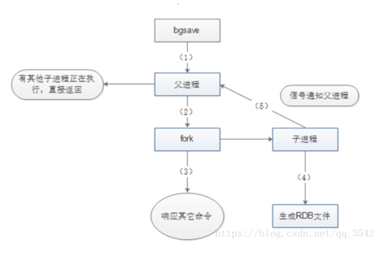
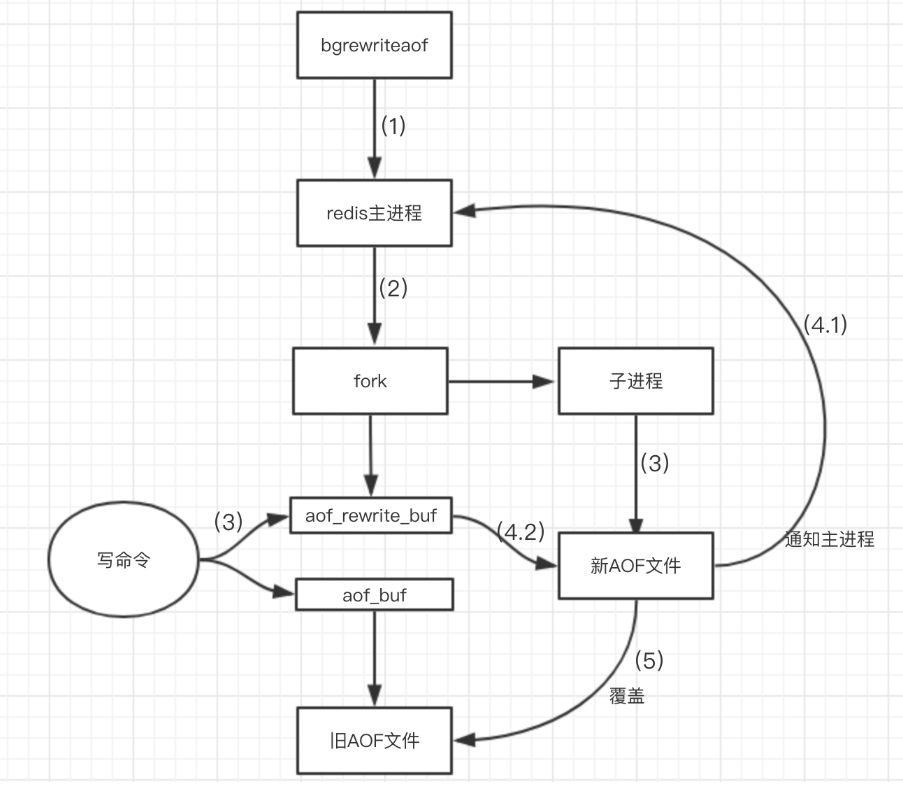
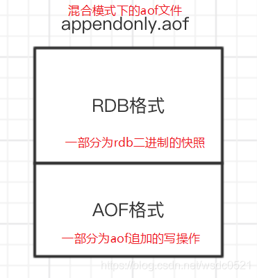
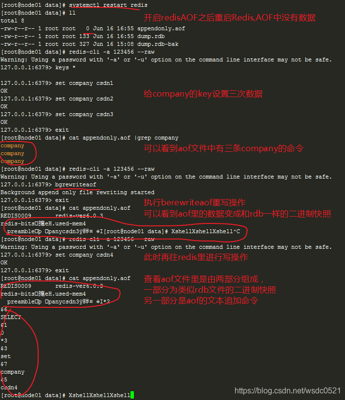

### **一、redis持久化----两种方式**

* redis提供了两种持久化的方式，分别是RDB（Redis DataBase）和AOF（Append Only File）。
* RDB，简而言之，就是在不同的时间点，将redis存储的数据生成快照并存储到磁盘等介质上；
* AOF，则是换了一个角度来实现持久化，那就是将redis执行过的所有写指令记录下来，在下次redis重新启动时，只要把这些写指令从前到后再重复执行一遍，就可以实现数据恢复了。
* 其实RDB和AOF两种方式也可以同时使用，在这种情况下，如果redis重启的话，则会优先采用AOF方式来进行数据恢复，这是因为AOF方式的数据恢复完整度更高。
* 如果你没有数据持久化的需求，也完全可以关闭RDB和AOF方式，这样的话，redis将变成一个纯内存数据库，就像memcache一样。

### **二、redis持久化----RDB**

* RDB方式，是将redis某一时刻的数据持久化到磁盘中，是一种快照式的持久化方法。
* redis在进行数据持久化的过程中，会先将数据写入到一个临时文件中，待持久化过程都结束了，才会用这个临时文件替换上次持久化好的文件。正是这种特性，让我们可以随时来进行备份，因为快照文件总是完整可用的。
* 对于RDB方式，redis会单独创建（fork）一个子进程来进行持久化，而主进程是不会进行任何IO操作的，这样就确保了redis极高的性能。
* 如果需要进行大规模数据的恢复，且对于数据恢复的完整性不是非常敏感，那RDB方式要比AOF方式更加的高效。
* 虽然RDB有不少优点，但它的缺点也是不容忽视的。如果你对数据的完整性非常敏感，那么RDB方式就不太适合你，因为即使你每5分钟都持久化一次，当redis故障时，仍然会有近5分钟的数据丢失。所以，redis还提供了另一种持久化方式，那就是AOF。



### **三、redis持久化----AOF   appendonly yes**

* 如前面介绍的，AOF方式是将执行过的写指令记录下来，在数据恢复时按照从前到后的顺序再将指令都执行一遍，就这么简单。
* 默认的AOF持久化策略是每秒钟fsync一次（fsync是指把缓存中的写指令记录到磁盘中），因为在这种情况下，redis仍然可以保持很好的处理性能，即使redis故障，也只会丢失最近1秒钟的数据。
* 如果在追加日志时，恰好遇到磁盘空间满、inode满或断电等情况导致日志写入不完整，也没有关系，redis提供了redis-check-aof工具，可以用来进行日志修复。
* 因为采用了追加方式，如果不做任何处理的话，AOF文件会变得越来越大，为此，redis提供了AOF文件重写（rewrite）机制，即当AOF文件的大小超过所设定的阈值时，redis就会启动AOF文件的内容压缩，只保留可以恢复数据的最小指令集。举个例子或许更形象，假如我们调用了100次INCR指令，在AOF文件中就要存储100条指令，但这明显是很低效的，完全可以把这100条指令合并成一条SET指令，这就是重写机制的原理。
* 在进行AOF重写时，仍然是采用先写临时文件，全部完成后再替换的流程，所以断电、磁盘满等问题都不会影响AOF文件的可用性
* AOF方式的另一个好处，我们通过一个“场景再现”来说明。某同学在操作redis时，不小心执行了FLUSHALL，导致redis内存中的数据全部被清空了，这是很悲剧的事情。不过这也不是世界末日，只要redis配置了AOF持久化方式，且AOF文件还没有被重写（rewrite），我们就可以用最快的速度暂停redis并编辑AOF文件，将最后一行的FLUSHALL命令删除，然后重启redis，就可以恢复redis的所有数据到FLUSHALL之前的状态了。是不是很神奇，这就是AOF持久化方式的好处之一。但是如果AOF文件已经被重写了，那就无法通过这种方法来恢复数据了。
* 虽然优点多多，但AOF方式也同样存在缺陷，比如在同样数据规模的情况下，AOF文件要比RDB文件的体积大。而且，AOF方式的恢复速度也要慢于RDB方式。
* 如果你直接执行BGREWRITEAOF命令，那么redis会生成一个全新的AOF文件，其中便包括了可以恢复现有数据的最少的命令集。
* 如果运气比较差，AOF文件出现了被写坏的情况，也不必过分担忧，redis并不会贸然加载这个有问题的AOF文件，而是报错退出。这时可以通过以下步骤来修复出错的文件：
1.备份被写坏的AOF文件
2.运行redis-check-aof –fix进行修复
3.用diff -u来看下两个文件的差异，确认问题点
4.重启redis，加载修复后的AOF文件

### **四、redis持久化----AOF重写**
1. 开始bgrewriteaof，判断当前有没有bgsave命令(RDB持久化)/bgrewriteaof在执行，倘若有，则这些命令执行完成以后在执行。
2. 主进程fork出子进程，在这一个短暂的时间内，redis是阻塞的。
3. 主进程fork完子进程继续接受客户端请求。此时，客户端的写请求不仅仅写入aof_buf缓冲区，还写入aof_rewrite_buf重写缓冲区。一方面是写入aof_buf缓冲区并根据appendfsync策略同步到磁盘，保证原有AOF文件完整和正确。另一方面写入aof_rewrite_buf重写缓冲区，保存fork之后的客户端的写请求，防止新AOF文件生成期间丢失这部分数据。
4. 子进程写完新的AOF文件后，向主进程发信号，父进程更新统计信息。
5. 主进程把aof_rewrite_buf中的数据写入到新的AOF文件。
6. 使用新的AOF文件覆盖旧的AOF文件，标志AOF重写完成。


### **五、redis持久化----如何选择RDB和AOF**

* 对于我们应该选择RDB还是AOF，官方的建议是两个同时使用。这样可以提供更可靠的持久化方案。
* redis的备份和还原，可以借助第三方的工具redis-dump。

### **六、Redis的两种持久化方式也有明显的缺点**

* RDB需要定时持久化，风险是可能会丢两次持久之间的数据，量可能很大。
* AOF每秒fsync一次指令硬盘，如果硬盘IO慢，会阻塞父进程；风险是会丢失1秒多的数据；在Rewrite过程中，主进程把指令存到mem-buffer中，最后写盘时会阻塞主进程。

### **七、Redis持久化----混合持久化（RDB+AOF）**

可以发现，使用RDB持久化会有数据丢失的风险，但是恢复速度快，而使用AOF持久化可以保证数据完整性，但恢复数据的时候会很慢。于是从Redis4之后新增了混合AOF和RDB的模式，先使用RDB进行快照存储，然后使用AOF持久化记录所有的写操作，当重写策略满足或手动触发重写的时候，将最新的数据存储为新的RDB记录。这样的话，重启服务的时候会从RDB何AOF两部分恢复数据，即保证了数据完整性，又提高了恢复的性能。
```mysql
vim $REDIS_HOME/bin/redis.conf
aof-use-rdb-preamble yes
```



开启混合模式后，每当bgrewriteaof命令之后会在AOF文件中 **<span style='color:red'>以RDB格式写入当前最新的数据</span>**，之后的新的写操作继续以AOF的追加形式追加写命令。当redis重启的时候，加载 aof 文件进行恢复数据：先加载 rdb 的部分再加载剩余的 aof部分。

#### **RDB的优点：简称“3更”**
* 体积更小：相同的数据量rdb数据比aof的小，因为rdb是紧凑型文件
* 恢复更快：因为rdb是数据的快照，基本上就是数据的复制，不用重新读取再写入内存
缺点：
* 故障丢失:因为rdb是全量的，我们一般是使用shell脚本实现30分钟或者1小时或者每天对redis进行rdb备份，（注，也可以是用自带的策略），但是最少也要5分钟进行一次的备份，所以当服务死掉后，最少也要丢失5分钟的数据。
* 耐久性差:相对aof的异步策略来说，因为rdb的复制是全量的，即使是fork的子进程来进行备份，当数据量很大的时候写Rdb文件时对磁盘的消耗也是不可忽视的，尤其在访问量很高的时候，fork的时间也会延长，导致cpu吃紧，耐久性相对较差。

#### **aof的优点**
* 数据保证：我们可以设置fsync策略，一般默认是everysec，所以即使服务死掉了，咱们也最多丢失一秒数据
* 自动缩小：当aof文件大小到达一定程度的时候，后台会自动的去执行aof重写，此过程不会影响主进程，重写完成后，新的写入将会写到新的aof中，旧的就会被删除掉。但是此条如果拿出来对比rdb的话还是没有必要算成优点，只是官网显示成优点而已。
缺点：
* 性能相对较差：它的操作模式决定了它会对redis的性能有所损耗
* 体积相对更大：尽管是将aof文件重写了，但是毕竟是操作过程和操作结果仍然有很大的差别，体积也毋庸置疑的更大。
* 恢复速度更慢：