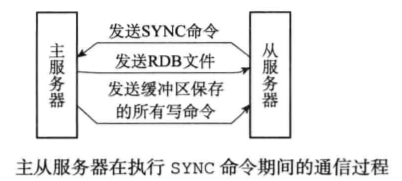
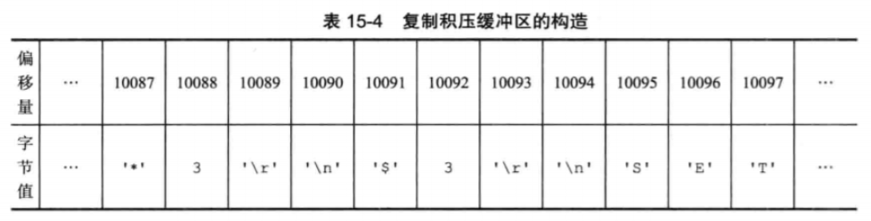
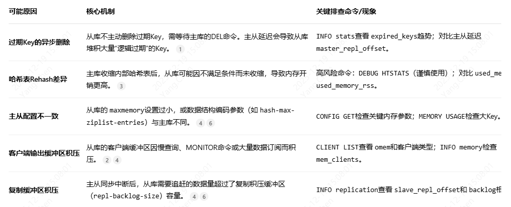

### **1. 主从同步的实现过程**
主从同步分为 2 个步骤：同步和命令传播
同步：将从服务器的数据库状态更新成主服务器当前的数据库状态。
命令传播：当主服务器数据库状态被修改后，导致主从服务器数据库状态不一致，此时需要让主从数据同步到一致的过程。
上面就是主从同步 2 个步骤的作用，下面我打算稍微细说这两个步骤的实现过程。
这里需要提前说明一下：在 Redis 2.8 版本之前，进行主从复制时一定会顺序执行上述两个步骤，而从 2.8 开始则可能只需要执行命令传播即可
#### **1.1 同步**
* 从服务器对主服务的同步操作，需要通过 sync 命令来实现，以下是 sync 命令的执行步骤：
* 从服务器向主服务器发送 sync 命令
* 收到 sync 命令后，主服务器执行 bgsave 命令，用来生成 rdb 文件，并在一个缓冲区中记录从现在开始执行的写命令。
* bgsave 执行完成后，将生成的 rdb 文件发送给从服务器，用来给从服务器更新数据
* 主服务器再将缓冲区记录的写命令发送给从服务器，从服务器执行完这些写命令后，此时的数据库状态便和主服务器一致了。

用图表示就是这样的：



<span style='color:red'>redis2.8 开始就使用 psync 命令来代替 sync 命令去执行同步操作。</span>

#### **psync 具有完整重同步和部分重同步两种模式：**
* 完整重同步：用于初次复制情况，执行过程同 sync，在这不赘述了。
* 部分重同步：用于断线后重复制情况，如果满足一定条件，主服务器只需要将断线期间执行的写命令发送给从服务器即可。

#### **部分重同步的实现：**
部分重同步功能由以下 3 部分组成：
* 主从服务器的复制偏移量
* 主服务器的复制积压缓冲区
* 服务器的运行 id（run id）

#### **<span style='color:red'>复制偏移量</span>**
主从服务器都会分别维护各自的复制偏移量：
* 主服务器每次向从服务器传播 n 个字节数据时，都会将自己的复制偏移量加 n。
* 从服务器接受主服务器传来的数据时，也会将自己的复制偏移量加 n
```mysql
举个例子：
若当前主服务器的复制偏移量为 10000，此时向从服务器传播 30 个字节数据，结束后复制偏移量为 10030。
这时，从服务器还没接收这 30 个字节数据就断线了，然后重新连接上之后，该从服务器的复制偏移量依旧为 10000，说明主从数据不一致，此时会向主服务器发送 psync 命令。
```
#### **<span style='color:red'>复制积压缓冲区</span>**
首先，复制积压缓冲区是一个固定长度，先进先出的队列，默认 1MB。当主服务器进行命令传播时，不仅会将命令发送给从服务器，还会发送给这个缓冲区。因此复制积压缓冲区的构造是这样的：

当从服务器向主服务器发送 psync 命令时，还需要将自己的复制偏移量带上，主服务器就可以通过这个复制偏移量和复制积压缓冲区的偏移量进行对比。若复制积压缓冲区存在从服务器的复制偏移量 + 1 后的数据，则进行部分重同步，否则进行完整重同步。


#### **<span style='color:red'>run id</span>**
运行 id 是在进行初次复制时，主服务器将会将自己的运行 id 发送给从服务器，让其保存起来。当从服务器断线重连后，从服务器会将这个运行 id 发送给刚连接上的主服务器。若当前服务器的运行 id 与之相同，说明从服务器断线前复制的服务器就是当前服务器，主服务器可以尝试执行部分同步；若不同则说明从服务器断线前复制的服务器不是当前服务器，主服务器直接执行完整重同步。

### **2、为什么redis主库内存正常，从库（Slave）内存却爆了？**


#### **<span style='color:red'>过期Key的异步删除机制是导致从库内存更高的最常见原因之一</span>**
Redis采用惰性删除和定期删除组合策略来清理过期Key，且这些操作主要在主库进行。从库为了保持数据一致性，自身不会主动删除过期Key。当客户端在从库访问一个已过期的Key时，从库会返回空值，但数据本身仍占用内存，直到收到主库发来的DEL命令才会真正释放。如果主从复制发生延迟，从库就会积压大量“已过期但未回收”的Key，导致内存使用率高于主库。

临时解决办法：
* 重启从库：这是最直接的方法，让从库重新全量同步数据。但会导致同步期间服务不可用或主库负载增加。
* 手动触发Key过期：如果确定是大量过期Key堆积，可以在主库上执行 scan迭代所有Key并对其访问，触发惰性删除，从而生成DEL命令同步到从库。
优化：
* 确保主从配置一致：特别是 maxmemory-policy（内存淘汰策略）和数据结构编码的相关参数。
* 调整过期Key处理：为Key的过期时间设置一个随机范围，避免同一时间大量Key过期，减轻主库和复制链路的压力。
* 优化复制缓冲区：根据业务写入量，适当调大 repl-backlog-size配置，以减少全量复制的风险。
* 监控与分离：对从库内存进行监控。避免在从库上执行 MONITOR等重命令。对于读写分离场景，确保从库有足够的资源处理读请求。

### **3、redis定期删除过期key工作原理（核心机制）：**

* 定时启动：Redis会定期执行一个任务来清理过期键。这个任务的执行频率由配置文件 redis.conf中的 hz参数决定。默认情况下，hz为10，这意味着Redis每秒会尝试执行10次定期删除任务，平均每100毫秒 一次 。
* 随机抽样，非全量扫描：每次任务执行时，它并不会扫描数据库中所有的键，而是从每个数据库中随机抽取一定数量的键（默认每次检查抽取 20 个）进行检查 。这主要是为了避免一次性检查所有键对 CPU 资源造成过大压力。
* 删除已过期的键：对于抽样出来的键，如果发现已经过期，则立即删除。
* 自适应调整：为了更高效地工作，这个策略非常“聪明”。如果在一次抽样中，发现过期键的比例超过了 25%（即 20 个里超过 5 个过期），那么它会认为当前数据库中有大量过期键，从而立即开始新一轮的随机抽样和删除，直到过期键的比例低于这个阈值为止 。这确保了在过期键密集的情况下能更快地释放内存。
* 时间限制：为了防止这个后台任务长时间运行而阻塞 Redis 处理正常的客户端请求，每次定期删除任务都有一个严格的时间上限（默认是 25 毫秒）。一旦执行时间到达上限，无论是否还有过期键，任务都会中止，等待下一次运行