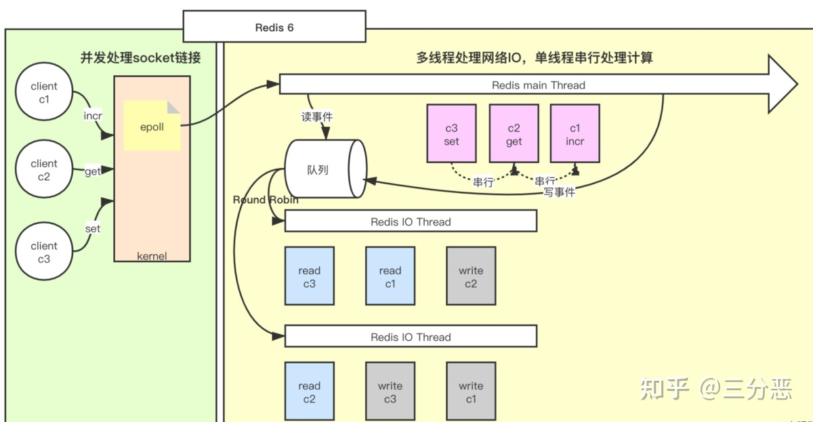
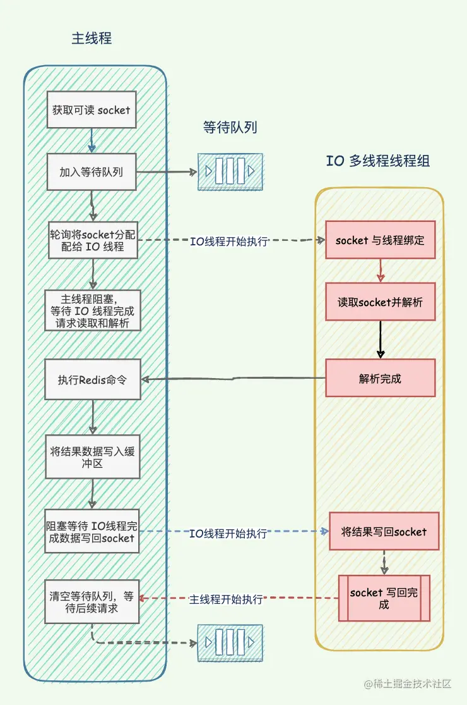

**<span style='color:red'>前言：Redis是通过全局hash表来存储key-value键值对的</span>**

#### **1、redis为什么那么快？**

* **<span style="color:red">操作都是基于内存</span>**
* **<span style="color:red">采用了IO多路复用技术</span>**（epoll事件通知机制，被动的通知处理事件，即当事件准备好的时候，就立刻处理。select和poll是事件准备好了，就触发循环去遍历每个文件描述符fd，去找到准备好的那个fd）
* **<span style="color:red">单线程</span>** 处理命令减少了上下文的不必要切换(单线程避免了线程切换和竞态产生的消耗) `上下文（Context）是指CPU在执行一个任务时，需要保存当前任务的状态（包括程序计数器、寄存器、内存指针等）并加载下一个任务的状态。上下文切换（Context Switch）是指CPU从一个任务切换到另一个任务时，需要保存当前任务的上下文并加载下一个任务的上下文。上下文切换是一种非常耗费CPU资源的操作，会导致系统性能下降。在多线程环境下，由于多个线程共享同一个CPU，当多个线程同时运行时，CPU需要频繁地进行上下文切换，这会导致系统性能下降。而在Redis的单线程模型中，由于只有一个线程在处理请求，所以不需要进行上下文切换，可以充分利用CPU资源，提高系统性能。需要注意的是，虽然Redis采用单线程模型，但是它仍然可以通过多进程或者多实例的方式来实现并发处理请求。`
* **<span style="color:red">渐进式的rehash</span>**（具体实现方式是，①每次执行对哈希表的读写操作时，都会从旧的哈希表中取出一部分键值对，然后将它们 rehash 到新的哈希表中。这个过程可能会持续一段时间，直到旧的哈希表被完全 rehash 并且不再包含任何键值对。②通过定时执行1ms内100个键进行rehash，不会超过1ms。通过渐进式 rehash，Redis 可以在保证服务可用的前提下，逐步将数据迁移到新的哈希表中，避免了一次性 rehash 带来的服务不可用问题。）
* **<span style="color:red">缓存系统时间戳</span>**（不使用系统的时间戳，而是自己缓存一份。每次去系统调用是比较费时间的，所以它需要对于时间戳进行一次缓存，由一个定时任务进行每毫秒更新时间戳，从而获取时间戳都是直接从缓存就取出）

#### **2、redis到底是多线程还是单线程（redis6.0引入多线程）**

* 执行redis命令的时候都是单线程，保证了数据和命令的先后性
* 多线程使用在处理网络IO请求（用来处理网络数据的读写和协议解析），多个客户端同时发起网络请求的时候，多线程的作用就出现了，多线程接收到各个命令，然后交给主线程处理redis命令

那么多并发的线程安全问题存在吗？——当然不存在。



主线程和IO线程通过共享变量数组io_threads_pending来进行通信，
```mysql
_Atomic unsigned long io_threads_pending[IO_THREADS_MAX_NUM]; 
//_Atomic是C11标准中引入的原子操作。被_Atomic修饰的变量被认为是原子变量，对原子变量的操作是不可分割的(Atomicity)，且操作结果对其他线程可见，执行的顺序也不能被重排。 该数组在被IO线程组并发读取时也能保证线程安全，即读取的顺序是固定的。
```