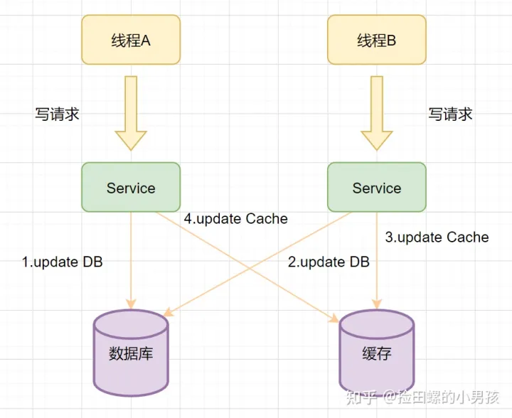

### **1、数据一致性**

数据⼀致可以包含两种情况：
* 缓存中有数据，缓存的数据值 = 数据库中的值
* 缓存中本没有数据，数据库中的值 = 最新值（有请求查询数据库时，会将数据写⼊缓存，则变为上⾯的“⼀ 致”状态）
数据不⼀致：缓存的数据值 ≠ 数据库中的值；缓存或者数据库中存在旧值，导致其他线程读到旧数据

①先删除缓存，再更新数据库（可能会出现数据不一致情况，1写1读并发， 数据库是新数据，缓存是旧数据）

②先更新数据库，再删除缓存（更推荐）

**无并发解决策略：**
* 消息队列+异步重试：⽆论使⽤哪⼀种执⾏时序，可以在执⾏步骤1时，将步骤2的请求写⼊消息队列，当步骤2失败时，就可以使⽤重试策略，对失败操作进⾏“补偿”。
* MQ+Canal策略：将Canal Server接收到的Binlog数据直接投递到MQ进⾏解耦，使⽤MQ异步消费Binlog日志，根据变更信息去更新/删除 Redis 缓存 （e-voucher\voucher-ctl\internal\controller\qpjinvoicecontroller\query_test.go）
* 设置缓存过期时间 + 延时双删：( 缺点先删除缓存可能 会导致⼤量请求落到数据库，⽽且延迟双删的时间很难评估。)
为什么是删除缓存而不是更新缓存呢？看个极端例子：

1. 线程A先发起一个写操作，第一步先更新数据库
2. 线程B再发起一个写操作，第二步更新了数据库
3. 由于网络等原因，线程B先更新了缓存
4. 线程A更新缓存。

这时候，缓存保存的是A的数据（老数据），数据库保存的是B的数据（新数据），数据不一致了，脏数据出现啦。如果是删除缓存取代更新缓存则不会出现这个脏数据问题。
**删除缓存优于更新缓存：**
* 如果你写入的缓存值，是经过复杂计算才得到的话。更新缓存频率高的话，就浪费性能啦。
* 在写数据库场景多，读数据场景少的情况下，数据很多时候还没被读取到，又被更新了，这也浪费了性能呢(实际上，写多的场景，用缓存也不是很划算了)

#### **2、缓存穿透，缓存击穿，缓存雪崩**

* **缓存穿透**：查询一个不存在的数据，不能命中缓存，导致每次请求都要到DB去查询，可能导致数据库崩溃 解决办法：1查询返回的数据为空，仍把这个空结果进行缓存，但过期时间会比较短; 2.布隆过滤器:将所有可能存在的数据哈希到一个足够大的bitmap中，一个一定不存在的数据会被这个bitmap拦截掉，从而避免了对DB的查询
* **缓存击穿**：对于设置了过期时间的key，缓存在某个时间点过期的时候，恰好有大量对这个key的并发请求，可能导致大量并发的请求瞬间把数据库压垮 解决办法：1.使用互斥锁，用Redis的 setnx去设置一个互斥锁，当操作成功返回时再进行数据库操作并回设缓存，否则重试get缓存的方法;
* **缓存雪崩**：设置缓存时采用了相同的过期时间，缓存在某一时刻同时失效，导致大量请求访问数据库。与缓存击穿的区别:雪崩是多key，击穿是单key缓存 解决办法：1.分散缓存失效时间:在原有失效时间基础上增加一个随机值; 2.使用互斥锁，当缓存数据失效时，保证只有一个请求能够访问到数据库，并更新缓存，其他线程等

**“穿透查无”**：指的是缓存穿透查询的是数据库中根本不存在的数据