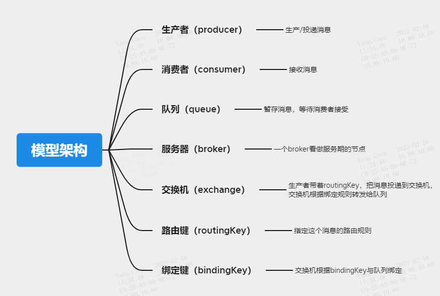
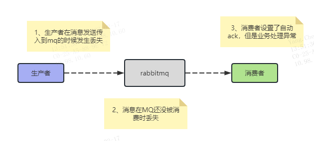

## 2、RabbitMq重点详解
### 2.1、RabbitMQ里的几个重要概念：
* 生产者（Producer）：发送消息的应用。
* 消费者（Consumer）：接收消息的应用。
* 队列（Queue）：存储消息的缓存。
* 消息（Message）：由生产者通过RabbitMQ发送给消费者的信息。
* 连接（Connection）：连接RabbitMQ和应用服务器的TCP连接。
* 通道（Channel）：连接里的一个虚拟通道。当你通过消息队列发送或者接收消息时，这个操作都是通过通道进行的。
* 交换机（Exchange）：交换机负责从生产者那里接收消息，并根据交换类型分发到对应的消息列队里。要实现消息的接收，一个队列必须到绑定一个交换机。
* 绑定（Binding）：绑定是队列和交换机的一个关联连接。
* 路由键（Routing Key）：路由键是供交换机查看并根据键来决定如何分发消息到列队的一个键。路由键可以说是消息的目的地址。


生产者先把消息发送给交换器，再由交换器路由到对应的消息队列，然后消费者消费队列的消息

### 2.2、交换机类型：
#### 2.2.1、Fanout（订阅模式|广播模式）       
Fanout交换器会把所有发送到该交换器的消息路由到所有与该交换器绑定的消息队列中。类似于子网广播，子网内的每台主机都获得了一份复制的消息。Fanout交换机转发消息是最快的。
* 可以理解为路由表的模式
* 这种模式不需要RouteKey
* 这种模式需要提前将Exchange与Queue进行绑定，一个Exchange可以绑定多个Queue，一个Queue可以同多个Exchange进行绑定。
* 如果接受到消息的Exchange没有与任何Queue绑定，则消息会被抛弃。


#### 2.2.2、Direct（路由模式）        
Direct交换器需要消息的Routing Key与 Exchange和Queue 之间的Binding Key完全匹配，如果匹配成功，将消息分发到该Queue，只有当Routing Key和Binding Key完全匹配的时候，消息队列才可以获取消息。
* 一般情况可以使用rabbitMQ自带的Exchange：”"(该Exchange的名字为空字符串，下文称其为default Exchange)。
* 这种模式下不需要将Exchange进行任何绑定(binding)操作
* 消息传递时需要一个“RouteKey”，可以简单的理解为要发送到的队列名字。
* 如果vhost中不存在RouteKey中指定的队列名，则该消息会被抛弃。


#### 2.2.3、Topic（通配符模式）
**Topic交换器按照正则表达式模糊匹配**：

&nbsp;&nbsp;&nbsp;&nbsp;用消息的Routing Key与 Exchange和Queue 之间的Binding Key进行模糊匹配，如果匹配成功，将消息分发到该Queue。
Binding Key与Routing Key一样是以句点号“. ”分隔单词。Binding Key中可以存在两种特殊字符“ * ”与“#”，用于做模糊匹配，
其中“*”用于匹配一个单词，“#”用于匹配多个单词（也可以是零个或一个）。如：上图消息队列1消费的是shenzhen开头的所有消息，
而消息队列2消费所有cars结尾的消息


### 2.3、rabbitmq消息机制
#### 2.3.1、消息确认机制：        
在实际应用中，可能会发生消费者收到Queue中的消息，但没有处理完成就宕机（或出现其他意外）的情况，这种情况下就可能会导致消息丢失。
为了避免这种情况发生，我们可以要求消费者在消费完消息后发送一个回执给RabbitMQ，RabbitMQ收到消息回执（Message acknowledgment）
后才将该消息从Queue中移除；如果RabbitMQ没有收到回执并检测到消费者的                  

RabbitMQ连接断开，则RabbitMQ会将该消息发送给其他消费者（如果存在多个消费者）进行处理。这里不存在Timeout概念，
一个消费者处理消息时间再长也不会导致该消息被发送给其他消费者，除非它的RabbitMQ连接断开。这里会产生另外一个问题，
如果我们的开发人员在处理完业务逻辑后，忘记发送回执给RabbitMQ，这将会导致严重的问题，Queue中堆积的消息会越来越多，
消费者重启后会重复消费这些消息并重复执行业务逻辑。如果我们采用no-ack的方式进行确认，也就是说，每次Consumer接到数据后，
而不管是否处理完成，RabbitMQ会立即把这个Message标记为完成，然后从queue中删除了。（所以一定要确保消费者主动ack确认）

#### 2.3.2、消息持久化机制：       
如果我们希望即使在RabbitMQ服务重启的情况下，也不会丢失消息，我们可以将Queue与Message都设置为可持久化的（durable），
这样可以保证绝大部分情况下我们的RabbitMQ消息不会丢失。但依然解决不了小概率丢失事件的发生（比如RabbitMQ服务器已经接收
到生产者的消息，但还没来得及持久化该消息时RabbitMQ服务器就断电了），如果我们需要对这种小概率事件也要管理起来，那么我 们要用到事务。

#### 2.3.3、事务：       
对事务的支持是AMQP协议的一个重要特性。假设当生产者将一个持久化消息发送给服务器时，因为consume命令本身没有任何Response
返回，所以即使服务器崩溃，没有持久化该消息，生产者也无法获知该消息已经丢失。如果此时使用事务，即通过txSelect()开启一个
事务，然后发送消息给服务器，然后通过txCommit()提交该事务，即可以保证，如果txCommit()提交了，则该消息一定会持久化，
如果txCommit()还未提交即服务器崩溃，则该消息不会服务器接收。当然Rabbit MQ也提供了txRollback()命令用于回滚某一个事务。

#### 2.3.4、RabbitMq常见问题
1. 如果消息达到无人订阅的队列会怎么办？  `消息会一直在队列中等待，RabbitMq默认队列是无限长度的。`
2. 多个消费者订阅到同一队列怎么办？      `消息以循环的方式发送给消费者，每个消息只会发送给一个消费者。`
3. 消息路由到了不存在的队列怎么办？      `一般情况下，RabbitMq会忽略，当这个消息不存在，也就是这消息丢了。`

#### 2.4、消息确认        
消费者收到的每一条消息都必须进行确认（自动确认和消费者自行确认）。消费者在声明队列时，可以指定autoAck参数，
当autoAck=false时，RabbitMQ会等待消费者显式发回ack信号后才从内存(和磁盘，如果是持久化消息的话)中移去消息。
否则autoAck=true时，RabbitMQ会在队列中消息被消费后立即删除它。        

采用消息确认机制后，只要令autoAck=false，消费者就有足够的时间处理消息(任务)，不用担心处理消息过程中消费者进程挂掉后
消息丢失的问题，因为RabbitMQ会一直持有消息直到消费者显式调用basicAck为止。当autoAck=false时，对于RabbitMQ服务器端
而言，队列中的消息分成了两部分：一部分是等待投递给消费者的消息；一部分是已经投递给消费者，但是还没有收到消费者ack信号
的消息。如果服务器端一直没有收到消费者的ack信号，并且消费此消息的消费者已经断开连接，则服务器端会安排该消息重新进入队列。       
**_RabbitMQ不会为未ack的消息设置超时时间_**，它判断此消息是否需要重新投递给消费者的唯一依据是消费该消息的消费者连接
是否已经断开。这么设计的原因是RabbitMQ允许消费者消费一条消息的时间可以很久很久。

#### 2.5、消息堆积
1. 消息堆积的后果
新消息无法进入队列、旧消息无法丢失、消息等待消费时间过长以至于超出了业务容许的范围。
2. 消息堆积的原因
生产者突然大量发布消息、消费者来不及消费或消费失败、消费者出现性能瓶颈、消费者直接挂掉了。
3. 如何解决消息堆积
```
（1）排查生产者，是否突然大量发布消息，限制下
（2）排查消费者，消费性能瓶颈，增加消费者的多线程处理（缩短线程休眠时间等）、部署多个消费者
（3）排查消息队列，可以想办法把消息按顺序的转移到另外一个新的队列，让消费者消费新队列中的消息。
（4）可以通过修改RabbitMQ的两个参数来增大消费消息的并发数：
    concurrentConsumers：对每个listener在初始化的时候设置的并发消费者的个数。
    prefetchCount：每次一次性从broker里面取的待消费的消息的个数，prefetchCount是BlockingQueueConsumer内部维护的
    一个阻塞队列 LinkedBlockingQueue 的大小，其作用就是如果某个消费者队列阻塞，就无法接收新的消息，该消息会发送到其它
    未阻塞的消费者。
```

### 2.6、消息丢失（如何保证不丢失）

#### 2.6.1、消息在生产者丢失        

##### 原因：
生产者发送消息成功，但MQ没收到该消息，一般由网络不稳定造成。       
##### 解决方案：
* 发送方采用消息确认机制，当消息成功被MQ接收到后，会给生产者发送一个确认消息，表示接收成功。RabbitMQ发送方确认模式有三种，
普通确认、批量确认、异步确认。Spring整合RabbitMQ后只使用了异步监听确认模式。
* 开启事务机制
``` 
// 开启事务
channel.txSelect
try {
    // 这里发送消息
} catch (Exception e) {
    channel.txRollback;//回滚事务
    // 这里再次重发这条消息
}
// 提交事务
channel.txCommit
```

#### 2.6.2、消息在队列中丢失        
```
原因：
消息发送到MQ后，消息还没被消费却在MQ中丢失了。比如MQ服务器宕机或者未进行持久化就进行了重启。       
解决方案：
持久化交换机（Exchange）、队列、消息。确保MQ服务器异常重启时仍然能从磁盘恢复对应的交换机，队列和消息。然后我们
把MQ做多台分布式集群，防止出现某一MQ服务器挂掉~
```
#### 2.6.3、消息在消费者丢失        
```
原因：
默认消费者消费消息时，设置的是自动回复MQ收到了消息。MQ会立刻删除自身保存的这条消息，如果消息已经在MQ中被删除，
但消费者的业务处理出现异常或消费者服务宕机，那么就会导致该消息没有处理成功从而导致消息丢失。        
解决方案：
消费者向MQ的回复我们设置成手动回复（配置成手动ACK）。当消费者出现异常或者服务宕机时，MQ服务器不会删除该消息，
而是会把消息重发给绑定该队列的消费者，如果该队列只绑定了一个消费者，则该消息会一直保持在MQ服务器，直到消费者能正常消费
为止。正常业务逻辑应该是本地业务执行成功，手动ack这条消息。如果业务执行完毕，手动ack的时候恰好服务宕机了，重启……这不是
会造成重复消费吗？没错，这就牵扯mq的另一个问题了，mq消息重复消费～
```

#### 2.6.4、重复消费
```
1.场景因消息重发机制会出现消息重复消费的情况
2.解决方案
（1）幂等操作，同一个操作执行N次，结果不变。
（2）若实际业务中用不了幂等，则保存消息id到数据库（Redis）中，每次消费前查看消息是否已经被消费过。
```


#### 2.6.5、有序消费
```
1.场景在work queue模式下，只有一个队列，但存在多个消费者。多个消费者线程的竞争会导致数据乱序。在简单队列模式下，同样的多个消费者线程也会导致数据乱序。
2.解决方案
使用多个队列，对消息的id值做hash。再对队列数取模（hash值%队列数），将结果相同的消息压入同一个队列中去，这就保证了一个队列中有且仅有一个消费者。
在MQ队列后的Java代码中（消费方），再为每一个线程加一个内存队列，根据消息的id求hash值，然后把相同的结果压入同一个内存队列……
```


#### 2.6.6、如何保证消息的顺序消费        
```
思路就是拆分queue，使得一个queue只对应一个消费者，这样消费者一定是按照顺序消费的；如果消息数量较大，那可以按照消息类型拆分队列，消息再多，不可能所有消息都是需要顺序性消费的吧，
可以灵活一点，视情况而定，比如某三个消息ABC的对应的操作是需要顺序消费的，那就把这三个放到同一个队列；如果有多组这样的ABC消息需要保证顺序，那我们就多搞几个队列就哦了；不需要保证顺序的消息就放在其它队列；
```

#### 2.6.7、prefetch与消息投递        
```
prefetch允许为每个consumer指定最大的unacked messages数目。简单来说就是用来指定一个consumer一次可以从Rabbit中获取多少条message
并缓存在client中(RabbitMQ提供的各种语言的client library)。一旦缓冲区满了，Rabbit将会停止投递新的message到该consumer中直到它发出ack。        
假设prefetch值设为10，共有两个consumer。意味着每个consumer每次会从queue中预抓取 10 条消息到本地缓存着等待消费。
同时该channel的unacked数变为20。而Rabbit投递的顺序是，先为consumer1投递满10个message，再往consumer2投递10个message。
如果这时有新message需要投递，先判断channel的unacked数是否等于20，如果是则不会将消息投递到consumer中，message继续呆在queue中。
之后其中consumer对一条消息进行ack，unacked此时等于19，Rabbit就判断哪个consumer的unacked少于10，就投递到哪个consumer中。    
```
总的来说，consumer负责不断处理消息，不断ack，然后只要unacked数少于prefetch * consumer数目，broker就不断将消息投递过去。

### 2.7、RabbitMQ的高级应用
#### 2.7.1、死信队列
死信队列（DLX，Dead-Letter-Exchange），利用DLX，当消息在一个队列中变成无法被消费的消息（dead message）之后，它能被重新publish到另一个Exchange，这个Exchange就是DLX（普通的交换机，只是设置了某个队列的属性）。消息变成死信的几种情况：
* 消息被拒绝（channel.basicReject/channel.basicNack）并且request=false；
* 消息在队列的存活时间超过设置的生存时间（TTL）时间；
* 队列达到最大长度（队列满了，无法再添加数据到队列中）。

死信队列的设置：
* 首先，需要设置死信队列的Exchange和queue，然后进行绑定；
* 然后，我们进行正常声明交换机、队列、绑定，只不过我们需要在队列机上一个参数即可：arguments.put("x-dead-letter-exchange","dlx.exchange")；这样消息在过期、被拒绝、队列在达到最大长度时，消息就可以直接路由到死信队列。

#### 2.7.2、延迟队列
创建交换机时指定type为x-delayed-message，argumens参数设置“x-delayed-type:direct”，表示创建延时队列的交换机。它是一种新的交换类型，该类型消息支持延迟投递机制消息传递后并不会立即投递到目标队列中，而是存储在mnesia（一个分布式数据系统）表中，当达到投递时间时，才投递到目标队列中。应用场景：
* 订单在30分钟之内未支持，则自动取消订单
* 工单在60分钟之内仍未处理，则发送消息提醒
* 预定会议室后，在预定时间前10分钟，通知提醒各参会人员


