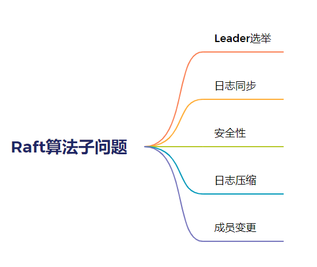
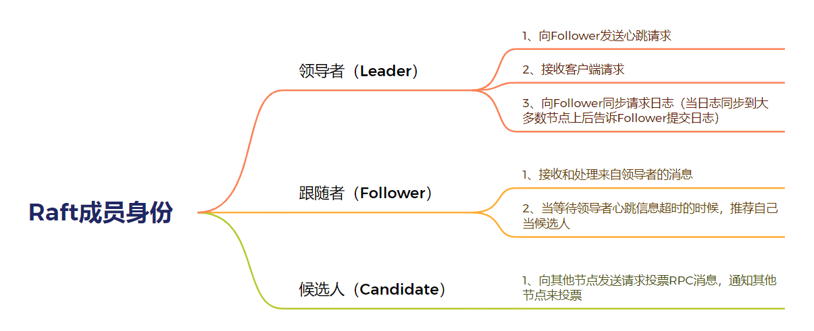
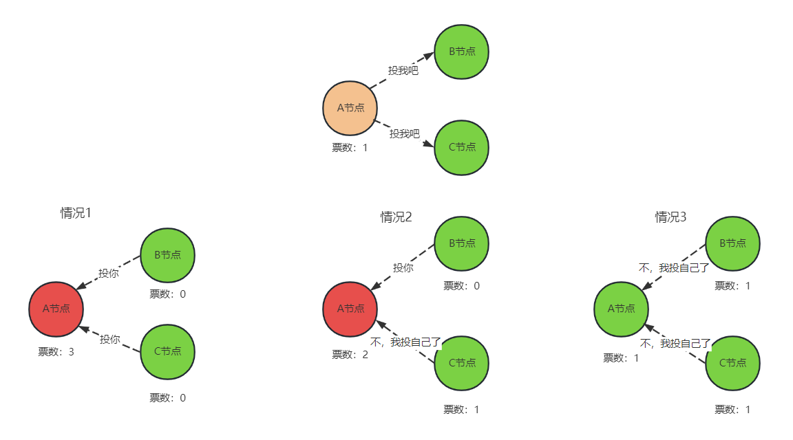
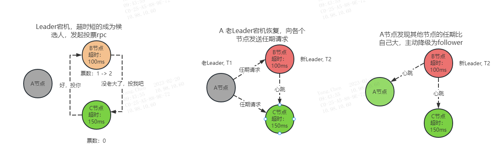
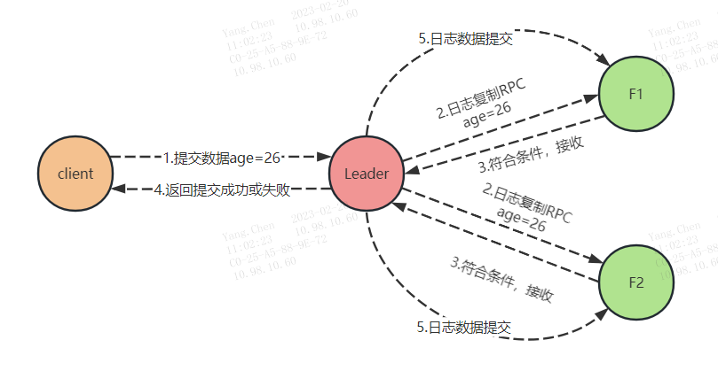

### 1、Raft算法概念
* 属于Multi-Paxos算法，它是在Multi-Paxos思想的基础上，做了一些简化和限制，Raft实现了和Paxos相同的功能，它将一致性分解为多个子问题：Leader选举、日志同步、安全性、日志压缩、成员变更等
* 从本质上说，Raft算法是通过一切以领导者为准的方式，实现一系列值的共识和各节点日志的一致。
    


#### 1.1、随机超时时间
在Raft算法中，随机超时时间有2种含义：
* 跟随者等待领导者心跳信息超时的时间间隔是随机的。一般50ms
* 如果候选人在一个随机时间间隔内，没有赢得过半票数，那么选举就无效了，然后候选人发起新一轮的选举，一般150-300ms
```cgo
根据集群规模、网络环境等因素进行调整。例如，在一个较大的集群中，由于消息的传输时间较长，因此需要设置较长的超时时间，
以避免误判和不必要的选举开销。在一个小规模的集群中，可以设置较短的超时时间，以提高响应速度和可用性。
```

### 2、Leader选举
#### 2.1、成员身份与职责：


Raft使用心跳检测服务器节点的存活状态，阻止其他节点发起选举投票。
* 1、当集群服务器启动时，都初始化为Follower，等待leader的心跳（因为初始化没有leader，所以接受不到心跳请求，就会等待心跳超时），超时后自己将成为候选人角色(把任期+1)，向其他节点发送投票请求RPC.其他节点接收到候选人的投票请求时，同意把票数投给候选人（前提是：该节点没有给其他候选人投票，只能投一票），获得过半数票数后，即可成为Leader
* 2、Leader向所有Followers周期性发送心跳。如果Follower在选举超时时间内没有收到Leader的心跳，就会等待一段随机的时间后发起一次Leader选举。
Follower将其当前任期加一然后转换为候选人，先给自己投票并且给集群中的其他服务器发送投票请求RPC。

#### 2.2、选举过程的3种结果
* 获得过半数的选票，成功选举为Leader；
* 收到了Leader的消息（有其它服务器已经抢先当选了Leader）；
* 没有服务器获得过半数的选票，Leader选举失败，等待选举时间超时后在随机时间后发起下一次选举。



#### 2.3、Leader宕机后恢复
在某一时刻，Leader A节点由于故障宕机，此时Follower收不到心跳消息。（宕机恢复流程如下）
* B节点的超时时间最短，最先转变为Candidate，此时任期加1，并向其他节点请求投票。（A节点接收到投票请求，发现请求的任期比自己的高，投赞成票）
* B节点得到半数以上的票，转变为Leader，并向其他节点发送心跳。
* A节点宕机恢复后，会向各个节点发送一个当前任期（宕机前的那个任期）的请求。
* A节点发现其他节点的任期比自己大，于是主动降级为Follower并同步任期，接收来自B节点的心跳信息。



#### 2.4、脑裂问题
###### 2.4.1、网络故障引起网络分区（导致脑裂）
　　其实和Leader宕机恢复很像，低任期的Leader在发现有高任期的Leader后，会主动降级为Follower。产生网络分区后，有用户请求过来时，是如何处理的？（如何保证数据一致性的）：
* 请求发送给B节点时（set name=chen），数据正常提交（因为过半数节点）过半数的基准都是基于所有节点的，不会基于分区后的小集群节点
* 请求发送给A节点时（set name=tttt），在做日志提交时，符合提交的节点数为1（不符合过半数的标准），所以数据无法提交


###### 2.4.2、经过一段时间后，网络恢复
　　当网络分区结束后，集群内部会短暂的出现两个Leader的情况。两个Leader都会向其他节点发起心跳检查和日志复制rpc
* 1.其中A节点发现自己的任期比B节点的任期小，于是主动降级为Follower，并接收来自B节点的心跳检查。
* 2.节点中的数据“name=tttt”没有提交，并接收新Leader B节点的日志复制请求“ name=chen”，至此所有节点的数据都是一致的


###### 2.4.3、极端情况（5个节点，产生3个或以上的网络分区）
　　如果一个5个节点的集群发生了 3 个或更多的网络分区，那么每个网络分区中的节点数都不足以构成过半数，这将导致 Raft 算法不能保证一致性，从而导致整个系统不能正常工作。
　　在这种情况下，Raft算法并没有提供一个直接的解决方案。通常情况下，处理 F-割裂 的方法是人工介入，通过手动干预集群状态来恢复系统运行。具体方法可以根据具体情况而定，例如增加节点数、改变节点投票方式、调整网络拓扑等。这也是分布式系统设计中需要考虑的一个重要问题。


###　3、日志同步
####　3.1、日志是什么？
　　副本数据是以日志的形式存在的，日志是由日志项组成，日志项是一种数据格式，它主要包含用户指定的数据（指令），还包含一些附加信息，比如索引值、任期编号。
* 指令：可理解成客户端指定的数据
* 索引值：日志项对应的整数索引值，是一个连续的、单调递增的id
* 任期编号：创建这条日志项的领导者的任期编号


#### 3.2、如何日志同步
* 领导者通过日志复制RPC消息，将日志项复制到集群其他节点上；
* 如果领导者接收到大多数的复制成功响应后，它将日志项应用到它的状态机，并返回成功给客户端。如果领导者没有接收到大多数的复制成功响应，那么就返回错误给客户端



#### 3.3、如何保证日志的一致性
###### 领导者通过强制跟随者直接复制自己的日志项，处理不一致日志。
* 领导者通过日志复制RPC的一致性检查，找到跟随者节点上与自己相同日志项的最大索引值。也就是说，这个索引值之前的日志，领导者和跟随者是一致的，之后的日志是不一致的
* 领导者强制跟随者更新覆盖不一致的日志项，实现日志的一致。

