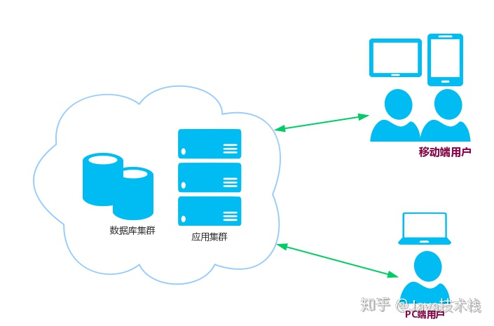
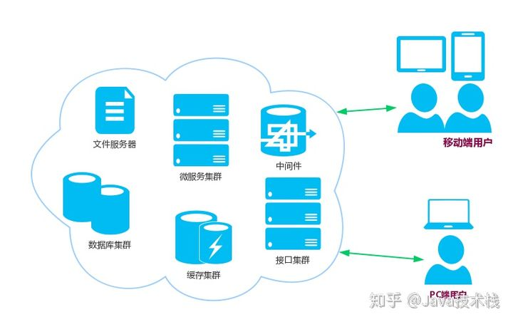
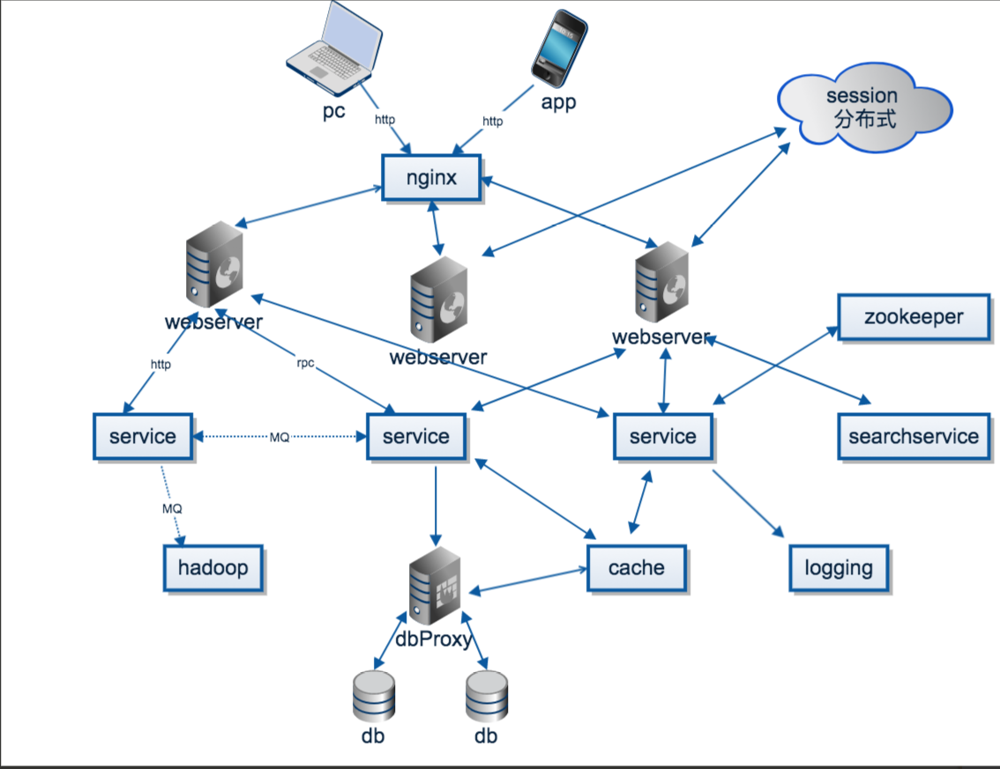

### 什么是分布式系统

分布式入门需要哪些知识（java）
**集中式系统**
分布式系统背景说分布式系统必须要说集中式系统，集中式系统中整个项目就是一个独立的应用，整个应用也就是整个项目，所有的东西都在一个应用里面。
如一个网站就是一个应用，最后是多个增加多台服务器或者多个容器来达到负载均衡的避免单点故障的目的，当然，数据库是可以分开部署的。
优点：就是开发测试运维会比较方便，不用为考虑复杂的分布式环境。
弊端：

#### **1、不易扩展，每次更新都必须更新所有的应用**

#### **2、一个有问题意味着所有的应用都有问题**

#### **什么是分布式系统？**
分布式系统背后是由一系列的计算机组成的，但用户感知不到背后的逻辑，就像访问单个计算机一样。
分布式系统利弊优点：

* **应用可以按业务类型拆分成多个应用，再按结构分成接口层、服务层；我们也可以按访问入口分，如移动端、PC端等定义不同的接口应用；**
* **数据库可以按业务类型拆分成多个实例，还可以对单表进行分库分表；**
* **增加分布式缓存、搜索、文件、消息队列、非关系型数据库等中间件；**

很明显，分布式系统可以解决集中式不便扩展的弊端，我们可以很方便的在任何一个环节扩展应用，就算一个应用出现问题也不会影响到别的应用。
缺点：
* **1、分布式事务、分布式锁、分布式session、数据一致性等都是现在分布式系统中需要解决的难题**
* **2、增加了开发测试运维成本，工作量增加**

分布式系统图：

**一个简化的分布式架构图**

**分布式系统和集群的关系：**
分布式系统和集群从表面上看是很类似的，都是将几台机器通过网络连接，解决某个问题或提供某个服务。
从广义上说，集群是分布式系统的一种类型，即基于P2P架构的分布式系统。
从狭义上说还是可以做一些区分：
* 集群： 同一个业务，部署在多个服务器上。所有节点一起工作，实现同一服务，一个节点挂掉，不会对集群有任何影响。
* 分布式系统： 一个业务分拆多个子业务，部署在不同的服务器上。系统每一个节点，都实现不同的服务，如果一个节点挂了，这个服务就不可访问了。在实际部署中，分布式系统中的每个节点都可以是一个集群，这样可以提高服务的可用性，性能等。
