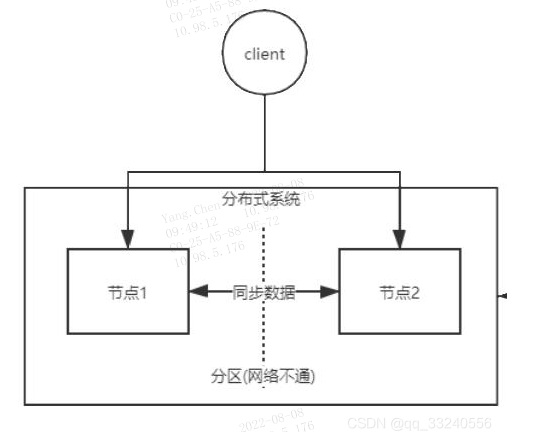

### CAP 定理

#### 1、CAP 的定义

**一致性（Consistency）：** 所有节点同一时间看到是相同的数据；
**可用性（Availability）：** 不管是否成功，确保每一个请求都能接收到响应；
**分区容错性（Partition tolerance）：** 系统任意分区后，在网络故障时，仍能继续运作

#### 2、分布式系统肯定优先保证 P，多数时候再 C、A 之间权衡

**分区（出现网路不通）：** 就是说节点一和节点二没法进行正常的网络通信了。即此时不能进行数据同步了。

**容错：** 就算出现分区，导致数据无法同步，两个节点之间无法正常通信，但是仍然要对外提供服务，不能因为分区导致整个系统宕机无法对外提供服务。

* **举例说明：** 当发生分区时，我们在保证 P 的前提下，对节点1写入数据，{数据段1}；不对节点2做任何操作。

若我们保证 C（一致性），那么此时访问节点1，就会读到{数据段1}，但是如果访问的是节点2，读不到{数据段1}，所以此时为了实现一致性，我们需要让整个服务暂停使用，这也就无法在实现 CP 的同时，实现 A（可用性）。

若我们保证 A（可用性），那么此时访问节点1，就会读到{数据段1}，同时也可以访问节点2，但是不会读到{数据段1}，这就失去了一致性，也就说无法在实现 AP 的同时，实现 C（一致性）。

总的来说就是，数据存在的节点越多，分区容忍性越高，但要复制更新的数据就越多，一致性就越难保证。为了保证一致性，更新所有节点数据所需要的时间就越长，可用性就会降低。

#### 3、CAP 常见模型

**牺牲分区（CA 模型）**
* 单站点数据库
* 集群数据库
* LDAP
* xFS 文件系统

**实现方式：**
* 两阶段提交
* 缓存验证协议

**牺牲可用性（CP 模型）**
* 分布式数据库
* 分布式锁
* 绝大部分协议

**实现方式：**
* 悲观锁
* 少数分区不可用

**牺牲一致性（AP 模型）**
* Coda
* Web 缓存
* DNS

**实现方式：**
* 到期/租赁
* 解决冲突
* 乐观锁

#### 4、理解不同技术栈在 CAP 理论下的倾向至关重要

**CP（Consistency + Partition Tolerance）技术栈：优先保证数据强一致性和分区容错性**

**AP（Availability + Partition Tolerance）技术栈：优先保证高可用性和分区容错性**

