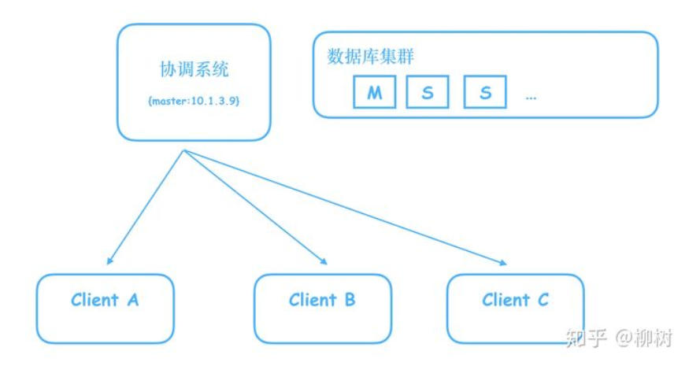
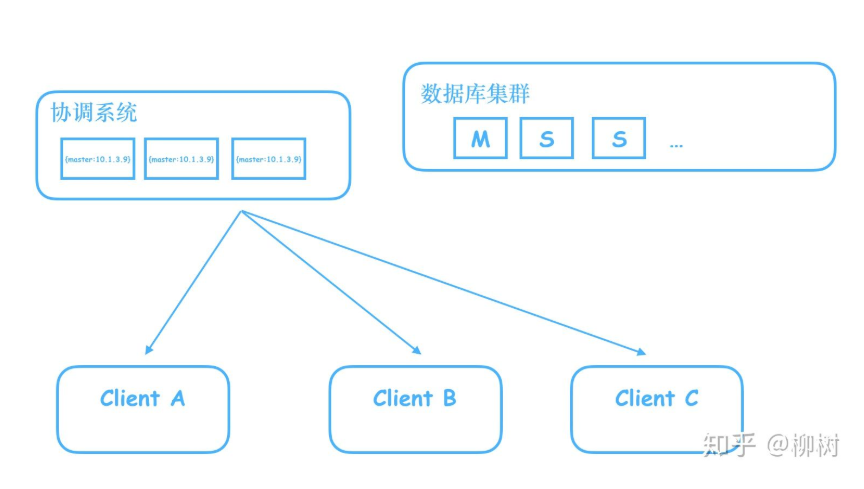
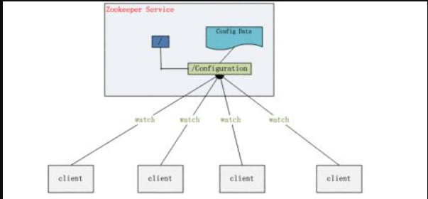

### ZooKeeper 简介

#### 1、为什么需要 ZooKeeper

就是我们需要一个用起来像单机但是又比单机更可靠的东西。

在分布式系统中，也需要这样的协调者，来回答系统下各个节点的提问。比如我们搭建了一个数据库集群，里面有一个 Master，多个 Slave，Master 负责写，Slave 只读，我们需要一个系统，来告诉客户端，哪个是 Master。

有人说，很简单，我们把这个信息写到一个 Java 服务器的内存就好了，用一个 map，key:master，value:master 机器对应的 ip

但是别忘了，这是个单机，一旦这个机器挂了，就完蛋了，客户端将无法知道到底哪个是 Master。于是开始进行拓展，拓展成三台服务器的集群。

这下问题来了，如果我在其中一台机器修改了 Master 的 ip，数据还没同步到其他两台，这时候客户端过来查询，如果查询走的是另外两台还没有同步到的机器，就会拿到旧的数据，往已经不是 master 的机器写数据。

所以我们需要这个存储 master 信息的服务器集群，做到当信息还没同步完成时，不对外提供服务，阻塞住查询请求，等待信息同步完成，再给查询请求返回信息。这样一来，请求就会变慢，变慢的时间取决于什么时候这个集群认为数据同步完成了。

假设这个数据同步时间无限短，比如是 1 微妙，可以忽略不计，那么其实这个分布式系统，就和我们之前单机的系统一样，既可以保证数据的一致，又让外界感知不到请求阻塞，同时，又不会有 SPOF（Single Point of Failure）的风险，即不会因为一台机器的宕机，导致整个系统不可用。

**这样的系统，就叫分布式协调系统。** 谁能把这个数据同步的时间压缩的更短，谁的请求响应就更快，谁就更出色，Zookeeper 就是其中的佼佼者。它用起来像单机一样，能够提供数据强一致性，但是其实背后是多台机器构成的集群，不会有 SPOF。

#### 2、ZooKeeper 能干嘛？

**2.1、配置管理**

分布式系统都有好多机器，比如我在搭建 hadoop 的 HDFS 的时候，需要在一个主机器上（Master 节点）配置好 HDFS 需要的各种配置文件，然后通过 scp 命令把这些配置文件拷贝到其他节点上，这样各个机器拿到的配置信息是一致的，才能成功运行起来 HDFS 服务。

Zookeeper 提供了这样的一种服务：一种集中管理配置的方法，我们在这个集中的地方修改了配置，所有对这个配置感兴趣的都可以获得变更。这样就省去手动拷贝配置了，还保证了可靠和一致性。

配置管理例子：基于 zookeeper 实现统一配置管理

**2.2、命名服务**

这个可以简单理解为一个电话薄，电话号码不好记，但是人名好记，要打谁的电话，直接查人名就好了。

分布式环境下，经常需要对应用/服务进行统一命名，便于识别不同服务；
* 类似于域名与 ip 之间对应关系，域名容易记住；
* 通过名称来获取资源或服务的地址，提供者等信息

**2.3、分布式锁**

碰到分布二字貌似就难理解了，其实很简单。单机程序的各个进程需要对互斥资源进行访问时需要加锁，那分布式程序分布在各个主机上的进程对互斥资源进行访问时也需要加锁。

很多分布式系统有多个可服务的窗口，但是在某个时刻只让一个服务去干活，当这台服务出问题的时候锁释放，立即 fail over 到另外的服务。这在很多分布式系统中都是这么做，这种设计有一个更好听的名字叫 Leader Election(leader 选举)。

举个通俗点的例子，比如银行取钱，有多个窗口，但是呢对你来说，只能有一个窗口对你服务，如果正在对你服务的窗口的柜员突然有急事走了，那咋办？找大堂经理（zookeeper）！大堂经理指定另外的一个窗口继续为你服务！

**2.4、集群管理**

在分布式的集群中，经常会由于各种原因，比如硬件故障，软件故障，网络问题，有些节点会进进出出。有新的节点加入进来，也有老的节点退出集群。这个时候，集群中有些机器（比如 Master 节点）需要感知到这种变化，然后根据这种变化做出对应的决策。

我已经知道 HDFS 中 namenode 是通过 datanode 的心跳机制来实现上述感知的，那么我们可以先假设 Zookeeper 其实也是实现了类似心跳机制的功能吧！

集群模式管理例子： https://www.cnblogs.com/zhangs1986/p/6564839.html

#### 3、ZooKeeper 的特点

* 最终一致性： 为客户端展示同一视图，这是 zookeeper 最重要的功能。
* 可靠性： 如果消息被到一台服务器接受，那么它将被所有的服务器接受。
* 实时性： Zookeeper 不能保证两个客户端能同时得到刚更新的数据，如果需要最新数据，应该在读数据之前调用 sync() 接口。
* 等待无关（wait-free）： 慢的或者失效的 client 不干预快速的 client 的请求。
* 原子性： 更新只能成功或者失败，没有中间状态。
* 顺序性： 所有 Server，同一消息发布顺序一致。
