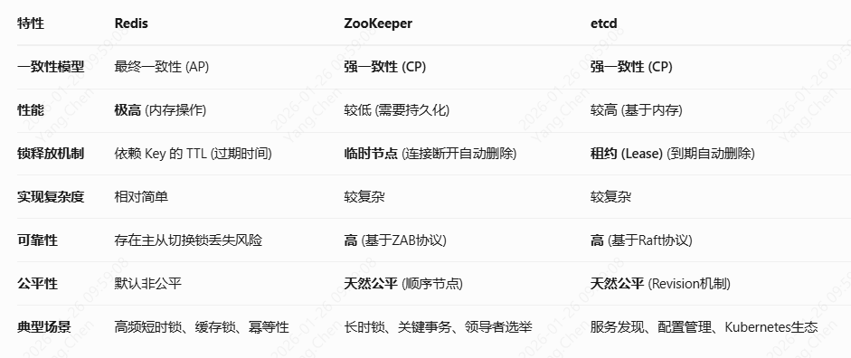

### ZooKeeper 伪集群模式与分布式锁

#### 1、基于 ZooKeeper 实现分布式锁

redis分布式锁以下四个条件：
* 互斥性。在任意时刻，只有一个客户端能持有锁。
* 不会发生死锁。即使有一个客户端在持有锁的期间崩溃而没有主动解锁，也能保证后续其他客户端能加锁。
* 具有容错性。只要大部分的Redis节点正常运行，客户端就可以加锁和解锁。
* 安全性。加锁和解锁必须是同一个客户端，客户端自己不能把别人加的锁给解了

zookeeper和redis实现分布式锁的对比：
* redis分布式锁，其实需要自己不断去尝试获取锁，比较消耗性能；zk分布式锁，获取不到锁，注册个监听器即可，不需要不断主动尝试获取锁，性能开销较小
* 如果是redis获取锁的那个客户端bug了或者挂了，那么只能等待超时时间之后才能释放锁；而zk的话，因为创建的是临时znode，只要客户端挂了，znode就没了，此时就自动释放锁。

#### **Zookeeper分布式锁的原理**
<span style="color:red">Zookeeper分布式锁恰恰应用了临时顺序节点</span>


分别开启三个窗口 php test-zookeeper.php
* **等待顺序执行完。**
* **将第二个ctrl+c 挂掉。（临时znode，只要客户端挂了，znode就会被删除）**

```mysql
<?php
/**
* Created by PhpStorm.
* User: young.chen
* Date: 2021/4/20
* Time: 13:56
*/
class zoo{
   private $root;
   private $subPath;
   public $myNode;
   /**
    * @var Zookeeper
    */
   private $zkServer;
   public $isNotify;
   public function getInstance($conf, $root){
      try{
         if($this->zkServer){
            return $this->zkServer;
         }
         $ipPort = "{$conf['ip']}:{$conf['port']}";
         $this->zkServer = new Zookeeper($ipPort);
         if(!$this->zkServer){
            throw new Exception("connect zookeeper error");
         }
         $this->root = $root;
         return $this->zkServer;
      }catch (\ZookeeperException $e){
         die($e->getMessage());
      }catch (\Exception $e){
         die($e->getMessage());
      }
   }
   /**
    * 尝试获取分布式锁
    * @param $lockKeyPrefix
    * @param $value
    * @return bool
    */
   public function tryGetLock($lockKeyPrefix, $value){
      try{
         $this->createRootPath($value);
         $this->createSubPath($this->root . $lockKeyPrefix, $value);
         return $this->getLock();
      }catch (\ZookeeperException $e){
         return false;
      }catch (\Exception $e){
         return false;
      }
   }
   /**
    * 创建root目录
    * @param $value
    * @return bool
    * @throws @Exception
    */
   public function createRootPath($value){
      if($this->zkServer->exists($this->root)){//这个root已经存在了
         return true;
      }
      $acl = [
         [
            'perms'  => Zookeeper::PERM_ALL,
            'scheme' => 'world',
            'id'     => 'anyone',
         ]
      ];
      $ret = $this->zkServer->create($this->root, $value, $acl);
      if($ret == false){
         throw new Exception("create rootPath failed:{$this->root}");
      }
      echo "create root success: $this->root\n";
      return true;
   }
   /**
    * 创建子目录node
    * @param string $subPath
    * @param string $value
    * @return bool
    * @throws @Exception
    */
   public function createSubPath($subPath, $value){
      $acl = [
         [
            'perms'  => Zookeeper::PERM_ALL,
            'scheme' => 'world',
            'id'     => 'anyone',
         ]
      ];
      //创建临时顺序节点
      $this->myNode = $this->zkServer->create($subPath, $value, $acl, Zookeeper::EPHEMERAL | Zookeeper::SEQUENCE);
      if($this->myNode == false){
         throw new Exception("create subPath -s -e failed:{$this->myNode}");
      }
      $this->subPath = $subPath;
      return true;
   }
   /**
    * 获取锁，监听锁
    * @return bool
    */
   public function getLock(){
      $lastNode = $this->checkCurrentNode();
      if($lastNode === true){
         return true;
      }
      //上一个节点的处理，添加监听
      $this->isNotify = false;
      $lastNodeValue = $this->zkServer->get($lastNode, array($this, 'watcher'));
      ############################大部分情况 此段代码没有执行#####################################
      while (!$lastNodeValue){//极端情况，刚获取数据时，刚好被删除
         $lastNode1 = $this->checkCurrentNode();
         if($lastNode1 === true){
            echo "当前锁为:$lastNode1, 解锁\n";
            return true;
         }else{
            echo "上一个锁node为lastNode1:$lastNode1\n";
            $lastNodeValue = $this->zkServer->get($lastNode1, array($this, 'watcher'));
         }
      }
      #################################################################
      echo "此锁已被其他进程占用，key：$lastNode\n";
      echo "当前进程锁keyNode为：$this->myNode\n";
      echo "正在等待释放锁";
      $thisId = str_replace($this->subPath, "", $this->myNode);
      $lastId = str_replace($this->subPath, "", $lastNode);
      while(!$this->isNotify){//锁获取成功，才退出while
         echo '.';
         usleep(500000);
         if(intval($thisId) - intval($lastId) != 1){//可能中间有进程断线了。可能触发不了watcher
            $lastNode1 = $this->checkCurrentNode();
            if($lastNode1 === true){
               echo "不为1，当前锁key为:$thisId, 解锁\n";
               return true;
            }
         }
      }
      echo "分布式锁获取成功，当前锁key：$this->myNode\n";
      return true;//返回true，表示分布式锁获取成功
   }
   /**
    * 释放分布式锁
    */
   public function releaseLock(){
      echo "$this->myNode";//直接删除
      if($this->zkServer->delete($this->myNode) === true){
         return true;
      }
      return false;
   }
   /**
    * 监听事件
    * @param $type
    * @param $state
    * @param $key
    */
   public function watcher($type, $state, $key){
      echo "\n事件发生：type:$type, state:{$state}, key:$key\n";
      switch ($type){
         case Zookeeper::CREATED_EVENT:
            echo "事件发生：{$key}被创建\n";
            break;
         case Zookeeper::DELETED_EVENT:
            echo "事件发生：{$key}被删除\n";
            break;
         case Zookeeper::CHANGED_EVENT:
            echo "事件发生：{$key}被修改\n";
            break;
         default:
            echo "事件发生：{$key}其他事件\n";
            break;
      }
      $this->isNotify = true;//标记锁获取成功
      $this->getLock();
   }
   /**
    * @return bool|string  true时表示当前节点轮到了自己， 否则就是上一个节点的node
    */
   public function checkCurrentNode(){
      $list = $this->zkServer->getChildren($this->root);
      sort($list);
      $root = $this->root;
      array_walk($list, function (&$value) use ($root){
         $value = $root ."/{$value}";
      });
      if($list[0] == $this->myNode){
         return true;
      }else{//否则找到上一个节点
         $index = array_search($this->myNode, $list);
         $lastNode = $list[$index - 1];
         return $lastNode;
      }
   }
}
function testLock($val){
   if(empty($val)){
      echo "锁的值不能为空！";
      return false;
   }
   $server = [
      'ip' => '127.0.0.1',
      'port' => '2183',
   ];
   $root = "/testZookeeper";
   $lockPrefix = "/lock_";
   $zookeeperServer = new zoo();
   $zookeeperServer->getInstance($server, $root);
   $lockRet = $zookeeperServer->tryGetLock($lockPrefix, $val);
   if($lockRet){
      echo "get lock success:{$zookeeperServer->myNode}\n";
   }else{
      echo "get lock failed:{$zookeeperServer->myNode}\n";
      return false;
   }
   try{
      doCode();
   }catch (Exception $exception){
      echo $exception->getMessage() . PHP_EOL;
   }finally{
      $ret = $zookeeperServer->releaseLock();
      if($ret){
         echo "releaseLock success:{$zookeeperServer->myNode}\n";
      }else{
         echo "releaseLock failed:{$zookeeperServer->myNode}\n";
         return false;
      }
   }
   return false;
}
function doCode(){
   sleep(15);
};
testLock(2);
```
分别在3个ssh客户端同时执行：模拟抢占锁的情况
```mysql
php zoo.php           #
```
客户端1：一开始创建锁key > 抢到锁 > 代码sleep()模拟代码运行
```mysql
root@/media/wwwroot/home_backend/app/demo#php zoo.php
get lock success:/testZookeeper/lock_0000000097       #获取到锁
/testZookeeper/lock_0000000097
releaseLock success:/testZookeeper/lock_0000000097    #释放锁
root@/media/wwwroot/home_backend/app/demo#
```
客户端2：一开始创建锁key > 锁被别人占用 > 监听锁的动态（等待锁释放） > 强制退出
```mysql
www@/media/wwwroot/home_backend/app/demo#php zoo.php
此锁已被其他进程占用，key：/testZookeeper/lock_0000000097    #当前的锁key被别的占用
当前进程锁keyNode为：/testZookeeper/lock_0000000098
正在等待释放锁.........^C
www@/media/wwwroot/home_backend/app/demo#  退出进程
```
客户端3：一开始创建锁key > 锁被别人占用 > 监听锁的动态 > 别的进程锁删除后，通知watcher,获得锁  > 代码sleep()模拟代码运行
```mysql
root@/media/wwwroot/home_backend/app/demo#php zoo.php
此锁已被其他进程占用，key：/testZookeeper/lock_0000000098
当前进程锁keyNode为：/testZookeeper/lock_0000000099
正在等待释放锁..........................
事件发生：type:2, state:3, key:/testZookeeper/lock_0000000098
事件发生：/testZookeeper/lock_0000000098被删除
此锁已被其他进程占用，key：/testZookeeper/lock_0000000097
当前进程锁keyNode为：/testZookeeper/lock_0000000099
正在等待释放锁..不为1，当前锁key为:0000000099, 解锁
.
事件发生：type:2, state:3, key:/testZookeeper/lock_0000000097
事件发生：/testZookeeper/lock_0000000097被删除
分布式锁获取成功，当前锁key：/testZookeeper/lock_0000000099
get lock success:/testZookeeper/lock_0000000099
/testZookeeper/lock_0000000099releaseLock success:/testZookeeper/lock_0000000099
root@/media/wwwroot/home_backend/app/demo#
```

#### 3、Redis 分布式锁

全面剖析redis分布式锁：https://zhuanlan.zhihu.com/p/359370762
3.1、使用redis分布式锁的时候，锁超时了，但是任务还没执行完，怎么办？
```mysql
##使用线程定时续约（看门狗）
package main
import (
    "context"
    "fmt"
    "log"
    "time"
    "github.com/go-redis/redis/v8"
)
var ctx = context.Background()
type RedisLock struct {
    client    *redis.Client
    lockKey   string
    lockValue string
    expiry    time.Duration
    cancel    context.CancelFunc
}
func NewRedisLock(client *redis.Client, lockKey string, expiry time.Duration) *RedisLock {
    return &RedisLock{
        client:  client,
        lockKey: lockKey,
        expiry:  expiry,
    }
}
// AcquireLock 尝试获取锁
func (r *RedisLock) AcquireLock() bool {
    r.lockValue = fmt.Sprintf("%d", time.Now().UnixNano()) // 生成一个唯一的锁值
    // 使用 SETNX 方式获取锁
    ok, err := r.client.SetNX(ctx, r.lockKey, r.lockValue, r.expiry).Result()
    if err != nil {
        log.Fatalf("Failed to acquire lock: %v", err)
    }
    if ok {
        // 启动看门狗续期
        r.startWatchdog()
    }
    return ok
}
// startWatchdog 启动看门狗
func (r *RedisLock) startWatchdog() {
    ctx, cancel := context.WithCancel(context.Background())
    r.cancel = cancel
    go func() {
        ticker := time.NewTicker(r.expiry / 3) // 每 1/3 的过期时间续期
        defer ticker.Stop()
        for {
            select {
            case <-ticker.C:
                // 续期
                _, err := r.client.Expire(ctx, r.lockKey, r.expiry).Result()
                if err != nil {
                    log.Printf("Failed to renew lock: %v", err)
                }
            case <-ctx.Done():
                return
            }
        }
    }()
}
// ReleaseLock 释放锁
func (r *RedisLock) ReleaseLock() {
    // 确保只有持有锁的客户端才能释放锁
    val, err := r.client.Get(ctx, r.lockKey).Result()
    if err != nil && err != redis.Nil {
        log.Fatalf("Failed to get lock value: %v", err)
    }
    if val == r.lockValue {
        _, err := r.client.Del(ctx, r.lockKey).Result()
        if err != nil {
            log.Fatalf("Failed to release lock: %v", err)
        }
        log.Println("Lock released")
    }
    // 取消续期，ctx.Done()
    if r.cancel != nil {
        r.cancel()
    }
}
func main() {
    // 创建 Redis 客户端
    client := redis.NewClient(&redis.Options{
        Addr: "localhost:6379", // Redis 地址
    })
    lock := NewRedisLock(client, "my_lock_key", 10*time.Second)
    if lock.AcquireLock() {
        defer lock.ReleaseLock()
        // 模拟任务处理
        time.Sleep(15 * time.Second) // 任务执行超过锁的过期时间
        fmt.Println("Task completed")
    } else {
        fmt.Println("Failed to acquire lock")
    }
}
```
